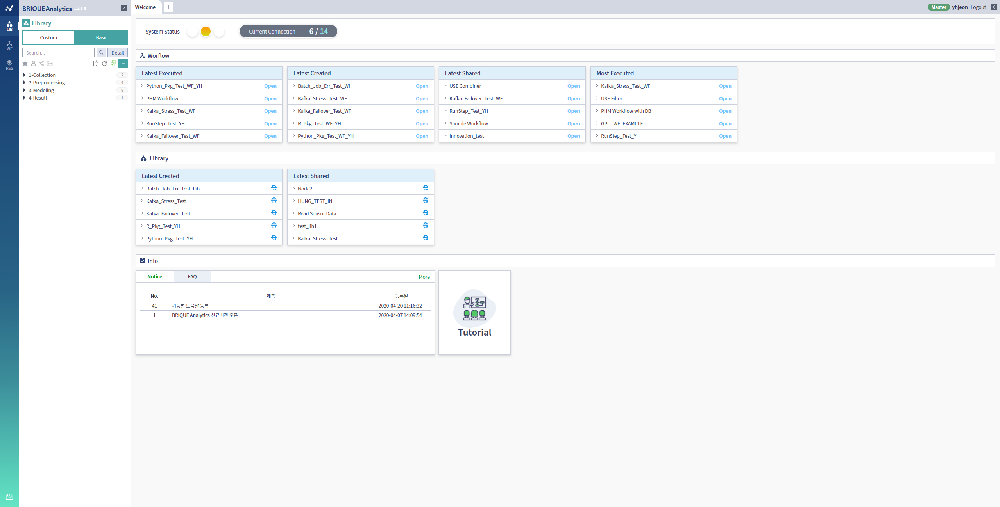
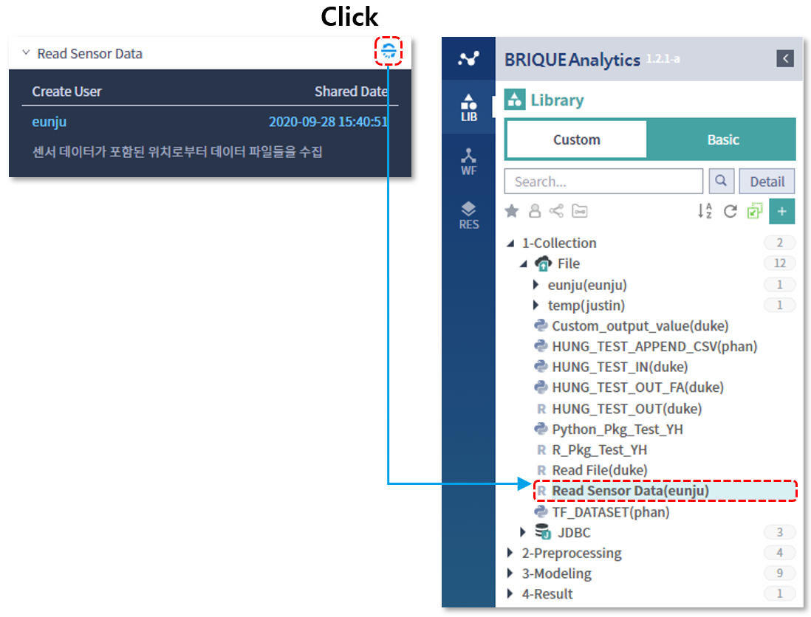

### 기본기능 > 대시보드

-----

#### 목록

-----

1. 대시보드 구성
2. Platform 상태
3. 접속자 현황
4. Workflow Top5 목록
5. Library Top5 목록
6. Notice 확인
7. FAQ 확인
8. 매뉴얼 다운로드

-----

#### 1. 대시보드 구성

대시보드는 BRIQUE Analytics에 로그인하면 처음으로 보이는 페이지로써, 시스템의 상태, 워크플로우 현황, 라이브러리 현황 및 공지사항 등의 정보영역으로 구분됩니다

- System Status 영역

  Platform의 현재상태와 접속자 현황이 표시되며, 관리자의 경우, 접속자 현황을 클릭하면 현재 접속된 사용자의 목록을 확인 할 수 있습니다

  

  

- Workflow 영역

  최근 실행, 최근 생성, 최근 공유, 실행 빈도수 별로 사용율이 높은 워크플로우 Top5의 목록을 제공합니다

  

  

- Library 영역

  최근 생성, 최근 공유 별로 사용율이 높은 라이브러리 Top5의 목록을 제공합니다

  

  

- Info

  공지사항 및 자주묻는 질문에 대한 게시판과, 사용자 및 개발자 가이드를 다운로드 받을 수 있는 기능을 제공합니다

  

  

-----

#### 2. Platform 상태

현재 Platform의 사용량에 따른 상태를 색으로 표현해주는 영역입니다

* Normal

  Platform의 사용량이 60% 이하임을 의미

* Busy

  Platform의 사용량이 60% 초과했음을 의미

* Unknown

  Platform의 사용량 정보 확인이 불가함을 의미

-----

#### 3. 접속자 현황

  * Current Connection을 통해서 현재 BRIQUE Analytics를 사용하고 있는 사용자의 수를 알 수 있습니다

  * 관리자의 경우 Current Connection을 클릭하면 현재 접속된 사용자 목록을 확인 할 수 있습니다

  * 현재 접속 중인 User Id, name, 최근 로그인 날짜와 시간이 출력됩니다

    

-----

#### 4. Workflow Top5 목록

최근 실행, 최근 생성, 최근 공유, 실행 빈도수 별로 사용율이 높은 워크플로우 Top5의 목록을 보여주며, 특정 워크플로우를 선택해 해당 워크플로우의 메타정보를 확인하고, **Open** 버튼을 클릭함으로써, 워크플로우 편집영역으로 해당 워크플로우를 불러올 수 있습니다

  

- Latest Executed

  전체 사용자를 대상으로, 가장 최근에 실행된 5개의 워크플로우 목록을 보여주며, 목록 중 하나를 클릭하면 생성자, 실행일, 워크플로우 설명을 확인할 수 있습니다

  

- Latest Created

  현재 접속된 사용자 기준으로, 가장 최근에 생성된 5개의 워크플로우 목록 보여주며, 목록 중 하나를 클릭하면 생성일 및 워크플로우 설명을 확인할 수 있습니다

  

  

- Latest Shared

  전체 사용자를 대상으로, 가장 최근에 공유된 5개의 워크플로우 목록을 보여주며, 목록 중 하나를 클릭하면 생성자, 공유일, 워크플로우 설명을 확인할 수 있습니다

  

- Most Executed

  전체 사용자를 대상으로, 가장 많이 실행된 5개의 워크플로우 목록을 보여주며, 목록 중 하나를 클릭하면 생성자, 총 실행 횟수, 워크플로우 설명을 확인할 수 있습니다

  

-----

#### 5. Library Top5 목록

최근 생성 및 최근 공유 별로 사용율이 높은 라이브러리 Top5의 목록을 보여주며, 특정 라이브러리를 선택해 해당 라이브러리의 메타정보를 확인하고, 버튼을 클릭함으로써 좌측의 라이브러리 목록으로 직접 접근이 가능합니다

- Latest Created

  현재 접속된 사용자 기준으로, 가장 최근에 생성된 5개의 라이브러리 목록을 보여주며, 목록 중 하나를 클릭하면 생성일 및 라이브러리 설명을 확인할 수 있습니다

  

- Latest Shared

  전체 사용자를 대상으로, 가장 최근에 공유된 5개의 라이브러리 목록을 보여주며, 목록 중 하나를 클릭하면 생성자, 공유일 및 라이브러리 설명을 확인할 수 있습니다

  

-----

#### 6. Notice 확인

관리자로부터 등록된 최근 5개의 공지사항을 목록을 확인 할 수 있으며, 목록 중 하나를 클릭하면 해당 공지사항의 상세 내용을 확인할 수 있습니다

More 버튼을 클릭하면, 최근 5개 목록 이외의 전체 공지사항을 확인할 수 있으며, 마찬가지로 공지사항의 제목을 클릭해 해당 공지사항의 상세 내용을 확인할 수 있습니다

-----

#### 7. FAQ 확인

관리자로부터 등록된 최근 5개의 FAQ를 확인할 수 있으며, 목록 중 하나를 클릭하면, 해당 FAQ의 상세 내용을 확인할 수 있습니다

More 버튼을 클릭하면, 최근 5개 목록 이외의 전체 FAQ를 확인할 수 있으며, 마찬가지로 FAQ의 제목을 클릭하면, 해당 FAQ의 상세 내용을 확인할 수 있습니다

-----

#### 8. 매뉴얼 다운로드

BRIQUE Analytics에서 제공하는 사용자 가이드와 개발자 가이드를 다운로드 받을 수 있습니다.

- User Guide

  User Guide 버튼을 클릭하면, 다운로드 폴더로부터 user_guide.pdf 파일을 확인할 수 있습니다

  

  

- Developer

  Developer 버튼을  클릭하면, 다운로드 폴더로부터 dev_guide.pdf 파일을 확인할 수 있습니다

  

