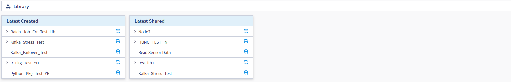
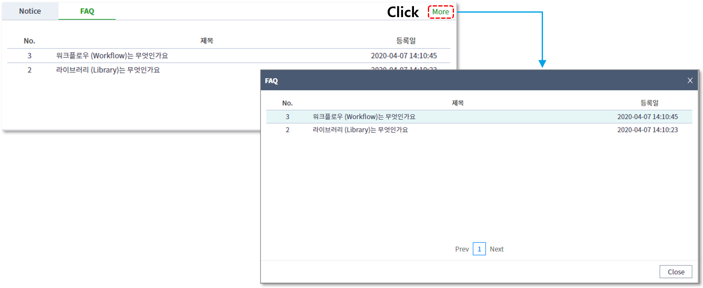
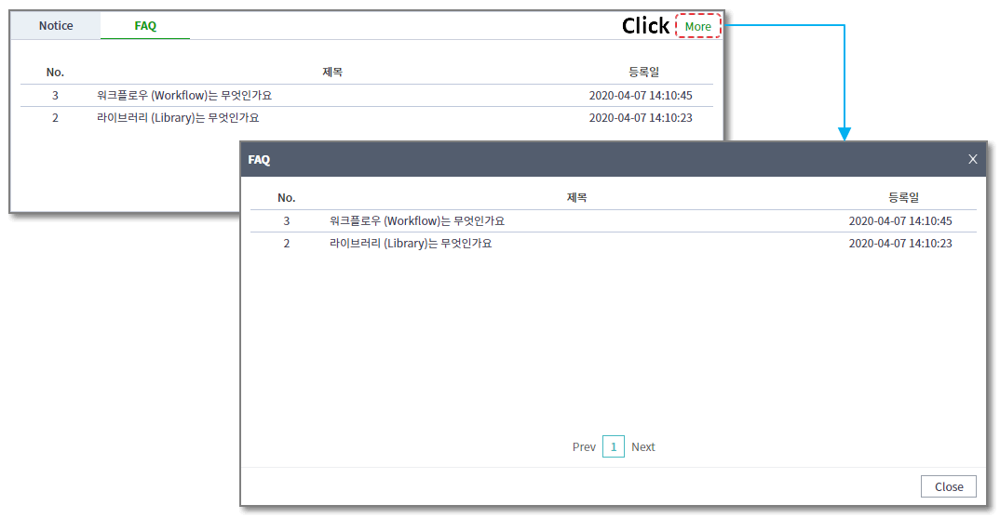
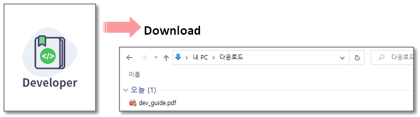

### 기본기능 > 대시보드

-----

#### 목록

-----

1. 대시보드 구성
2. 사용 가이드
3. Platform 상태
4. 접속자 현황
5. Recent Workflow Top3
6. Recent Shared Workflow, Library, Resource Top6
7. Notice, FAQ
8. 워크플로우 실행 이력

-----

#### 1. 대시보드 구성

대시보드는 로그인 성공 후 처음으로 보이는 페이지로써, 사용가이드, 플랫폼의 상태, 접속자 현황, 아이템 생성 및 공유 정보, 워크플로우 실행이력 및 공지사항의 정보영역으로 구분됩니다

- 사용가이드

  각 제목별로 사용 가이드 영상을 확인 하실 수 있습니다.

  

- Status

  Platform의 현재 상태를 확인할 수 있습니다

  

  

- Current Users

  전체 유저중 현재 접속중인 사용자수를 확인할 수 있습니다

  

  

- Recent Workflow

  가장 최근 로그인 유저가 생성 및 수정한 워크플로우 TOP3의 목록을 제공합니다

  

  

- Recent Shared Workflow, Library, Resource

  가장 최근에 로그인 유저에게 공유된 워크플로우, 라이브러리, 리소스 별로 Top6의 목록을 제공합니다

  

  

- Updates

  공지사항 및 자주묻는 질문에 대한 게시판을 제공합니다

  

  

- Request History

  로그인 유저가 최근에 실행한 워크플로우의 이력 목록을 제공합니다 

  

  

-----

#### 2. 사용 가이드

제목별로 클릭을 통해 새 창에서 사용 가이드 영상을 확인 하실 수 있습니다

#### 3. Platform 상태

현재 Platform의 사용량에 따른 상태를 색으로 표현해주는 영역입니다

* Good

  Platform의 사용량이 60% 이하임을 의미

* Busy

  Platform의 사용량이 60% 초과했음을 의미

* Delay

  Platform의 사용량 정보 확인이 불가함을 의미

-----

#### 4. 접속자 현황

  * Current Users를 통해서 접속자 현황을 알 수 있습니다
  * 관리자의 경우 Current Users를 클릭해 현재 접속된 사용자 목록을 확인 할 수 있습니다
  * 현재 접속 중인 User Id, name, 최근 로그인 날짜와 시간/이 출력됩니다

    

-----

#### 5. Recent Workflow Top3

- 로그인 유저를 기준으로 최근에 생성한 워크플로우 Top3의 목록을 확인할 수 있습니다
- ID, Share 현황, 워크플로우 설명과 같은 간단한 메타정보를 확인할 수 있습니다 
- 워크플로우를 선택해, 워크플로우 편집영역으로 해당 워크플로우를 불러올 수 있습니다

-----

#### 6. Recent Shared Workflow, Library, Resource Top6

- 로그인 유저를 기준으로 최근에 공유된 워크플로우, 라이브러리, 리소스 Top6의 목록을 각각 확인할 수 있습니다
- 상단의 탭을 클릭해 워크플로우, 라이브러리, 리소스 정보를 열람할 수 있습니다
- ID, Share 현황, 아이템 설명과 같은 간단한 메타정보를 확인할 수 있습니다

- 아이템을 선택해, 편집영역으로 해당 아이템을 불러올 수 있습니다 

-----

#### 7. Notice, FAQ

- 관리자로부터 등록된 공지사항 혹은 FAQ를 각각 4건의 최신 목록을 확인할 수 있습니다
- 상단의 탭을 클릭해 Notice, FAQ의 정보를 열람할 수 있습니다

- 상단의 more를 클릭하면 검색 가능한 게시판을 확인할 수 있습니다

- 목록 중 하나를 클릭하면 해당 공지사항 혹은 FAQ의 상세 내용을 확인할 수 있습니다

-----

#### 8. 워크플로우 실행 이력

- 로그인 유저를 기준으로 최근에 실행한 워크플로우의 실행 이력 5건을 확인할 수 있습니다
- 상단의 탭을 클릭해 Request, Batch의 실행 이력을 열람할 수 있습니다

- Report 버튼을 클릭해, 해당 이력을 리포트 서식으로 열람할 수 있습니다

- Link 버튼을 클릭해, 워크플로우 편집영역으로 해당 워크플로우를 불러올 수 있습니다

