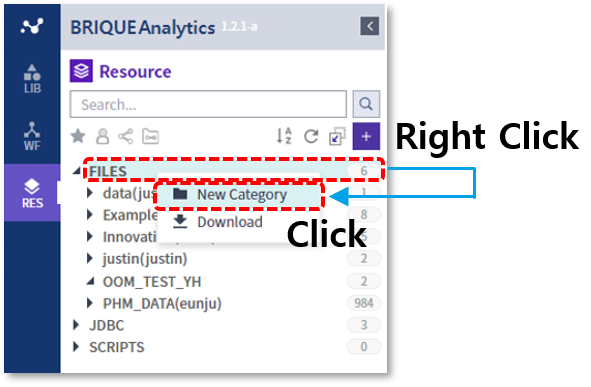
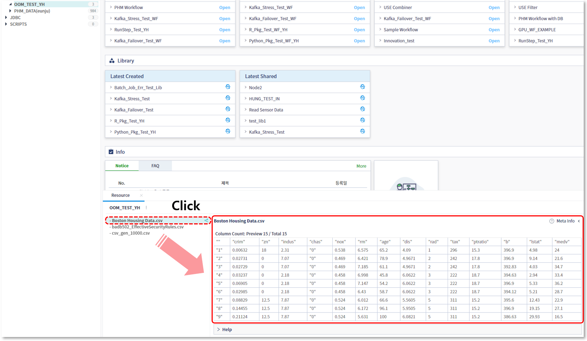
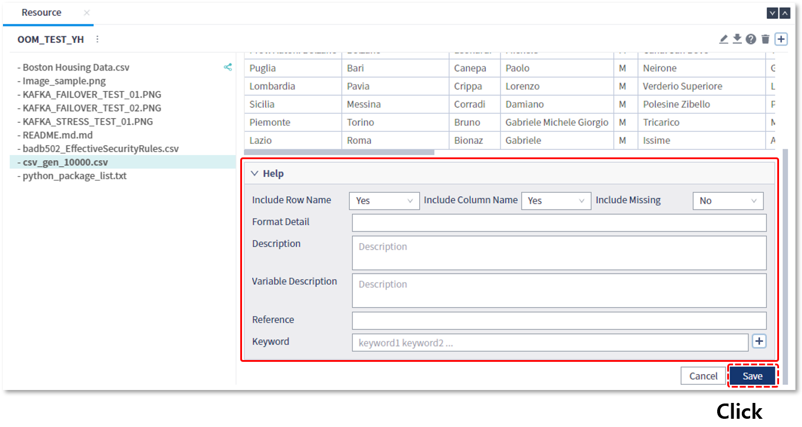
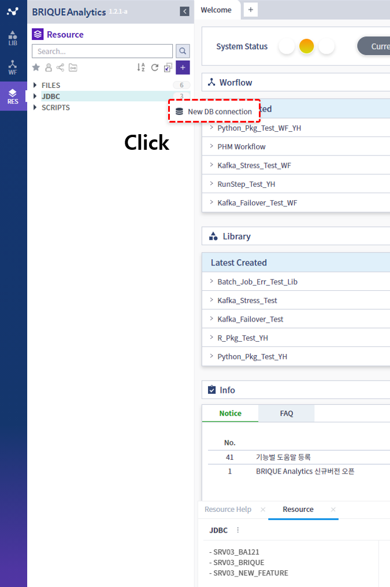
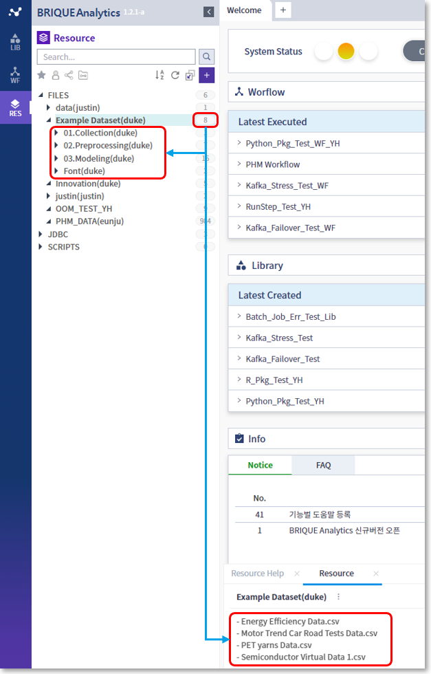
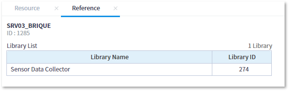
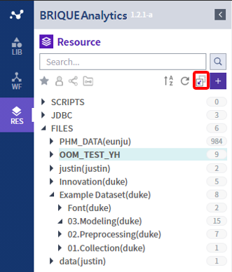

### 기본기능 > 리소스

------

#### 목록

------

1. 리소스 개념
2. 리소스 카테고리
3. 리소스 업로드
4. 리소스 미리보기
5. 리소스 다운로드
6. 리소스 압축해제 업로드
7. 리소스 도움말 작성
8. JDBC연결
9. 카테고리별 항목 개수 조회
10. 특정 리소스를 참조하는 라이브러리 조회
11. 검색
12. 단축버튼

------

#### 1. 리소스 개념

리소스(Resource)란 데이터 분석에 사용되는 자원으로써, 분석가의 로컬 PC 내에 존재하는 텍스트 및 이미지 파일이나 데이터베이스에 존재하는 다양한 형태의 데이터를 의미합니다.

분석 알고리즘 수행에 필요한 이러한 데이터들은 수행 전에 BRIQUE Analytics의 리소스 형태로 등록되어야만 사용할 수 있으며,

파일의 경우, 업로드 기능을 이용해서 리소스로 등록할 수 있고, 데이터베이스에 존재하는 데이터의 경우, DB 커넥션 정보를 이용하여 리소스로 등록할 수 있습니다

------

#### 2. 리소스 카테고리 

리소스는 FILES, JDBC, SCRIPTS 세가지 유형의 카테고리로 나뉩니다

- **FILES**: 분석에 사용되는 파일 유형의 리소스를 등록하는 영역으로, 분석가 로컬 PC의 파일을 등록하거나 분석 실행의 결과물이 위치하게 되며, 필요에 따라 서브 카테고리를 생성하여 관리할 수 있습니다

  

- **JDBC**: 데이터베이스에 존재하는 데이터를 수집하기 위한 DB 접속정보를 등록하는 영역으로, 해당 접속 정보를 이용하여 데이터베이스로부터 데이터를 추출하는 노드를 작성하게 되며, 데이터 노드는 관리자만 작성할 수 있습니다

- **SCRIPTS**: 라이브러리 내에서 사용되는 R 또는 Python으로 작성된 사용자정의 패키지를 등록하는 영역으로, 이 곳에 등록된 패키지들은 라이브러리 내에서 import를 통해 사용되어지며, 관리자만 등록할 수 있습니다. 

------

#### 3. 리소스 업로드

리소스 업로드 기능을 통해서 분석가 로컬PC에 존재하는 파일을 업로드 할 수 있으며, 업로드 가능 용량은 2GB로 제한됩니다

- RES > FILES에서 기존 생성했던 카테고리를 선택하거나 새 카테고리를 생성합니다

- 리소스를 등록할 카테고리를 선택하면 하단의 정보 영역에 카테고리에 포함된 내용들이 표현되는데, 여기서 마우스 오른쪽 버튼을 클릭하여 New Resource 메뉴를 선택합니다

  

- Select File 버튼을 클릭하여 로컬 PC로부터 등록하고자 하는 파일을 선택한 후 Upload 버튼을 클릭합니다

     

- 선택된 카테고리 내에 신규 리소스가 등록된 것을 확인 할 수 있습니다

  

------

#### 4. 리소스 미리보기

등록된 파일 유형에 따라 리소스의 전체 또는 일부 내용을 확인할 수 있습니다

- **csv**: 헤더 포함 최대 10행 까지의 데이터 내용이 표현됩니다

  

- **png, jpg**: 이미지의 내용이 표현됩니다

  

- **txt**: 최대 10행 까지의 데이터 내용이 표현됩니다

   

- **zip, xml, pkl, r 등 Binary 파일**: 생성자, 생성일, 저장 위치 등의 메타정보가 표현됩니다

  

------

#### 5. 리소스 다운로드

등록된 리소스를 로컬 PC로 다운로드 받을 수 있는 기능을 제공합니다

- 다운로드 받을 리소스를 선택한 후, 마우스 오른쪽 버튼을 클릭하여 Download 메뉴를 선택하거나, 우측 화면의 다운로드 아이콘을 클릭합니다

  

- Download 폴더에서 다운로드 받은 파일을 확인 할 수 있습니다

  

------

#### 6. 리소스 압축해제 업로드

등록하고자 하는 파일이 압축된 경우, 리소스로 등록하는 과정에서 압축을 해제하여 등록할 수 있습니다

- Upload Resource에서 zip파일을 선택하고 하단의 Unzip에 체크합니다

  

- 압축을 해제하여 리소스로 등록된 것을 확인 할 수 있습니다

  

------

#### 7. 리소스 도움말 작성

리소스에 대한 자세한 설명을 도움말로 등록할 수 있으며, 이는 검색에 활용되므로 가급적 자세하게 입력하는 것을 권장합니다

- **기존 리소스의 도움말 수정**

  - 수정하고자 하는 리소스를 선택한 후, 오른쪽 하단의 Edit 버튼을 클릭합니다
  
    

  
  
  
  - Help 영역을 클릭하면 도움말을 입력할 수 있습니다
  
    
  
    
  
    
  
    
  
  - 작성된 도움말은, 리소스를 선택한 후 오른쪽 상단의 물음표(?) 아이콘을 클릭하여 확인 할 수 있습니다

    
  
    
  
    

- **리소스 등록 시 도움말 작성**

  - Upload Resource에서 Help 영역을 클릭한 후 도움말을 작성할 수 있습니다

    

    

    

------

#### 8. JDBC연결

Oracle, DB2, MySql 등의 데이터베이스에 존재하는 데이터를 수집하기 위한 DB 접속정보를 리소스로 등록할 수 있으며, 이 기능은 관리자만 사용이 가능합니다

- RES탭에서 JDBC를 선택한 후, 마우스 우측버튼을 클릭하고 New DB connection 메뉴를 선택합니다

  

- Database Connection 창에서, 접속에 필요한 정보를 입력한 후 Test Connection 버튼을 클릭하여 접속 테스트를 거친 후, 성공하면 OK로 해당 연결을 등록합니다

  

------

#### 9. 카테고리별 항목 개수 조회

리소스 영역의 각 카테고리 우측에는 카테고리별 항목의 개수가 표현되는데, 이는 해당 카테고리의 한 단계 하위에 등록되어 있는 카테고리와 파일 개수의 합을 의미합니다

------

#### 10. 특정 리소스를 참조하는 라이브러리 조회

선택된 리소스를 참조하고 있는 전체 라이브러리 목록을 확인할 수 있습니다

 

------

#### 11. **검색**

RES 영역의 상단에 위치한 검색창을 통해서 리소스를 검색할 수 있습니다

검색하고자 하는 단어를 입력하고 검색 버튼을 클릭하면, 입력된 단어를 포함하는 카테고리나 파일이 표시되며, 리소스가 등록되어 있지 않은 빈 카테고리는 검색결과에서 제외됩니다

------

#### 12. 단축버튼

* Sort By Name: 카테고리를 알파벳 순으로 오름차순하여 정렬합니다

  

  

- Reload All: 리소스 목록을 새로고침 합니다

  

- Collapse All: 열려있는 카테고리를 한번에 닫습니다.

