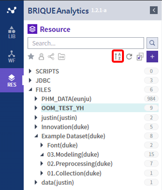
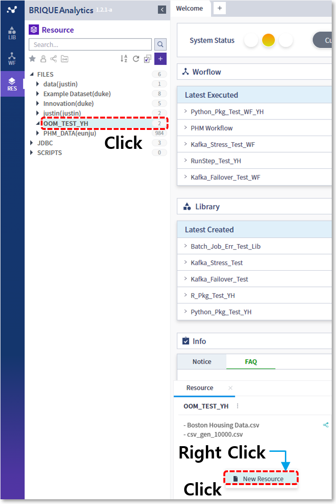
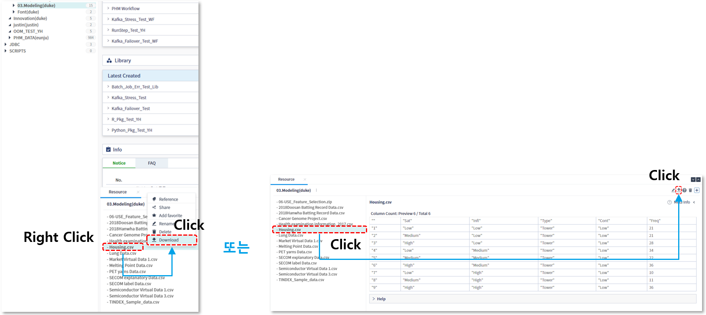
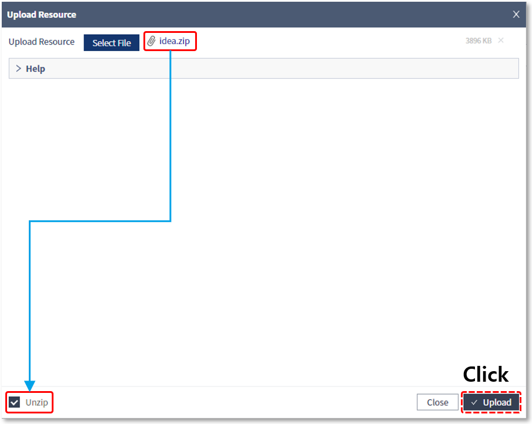
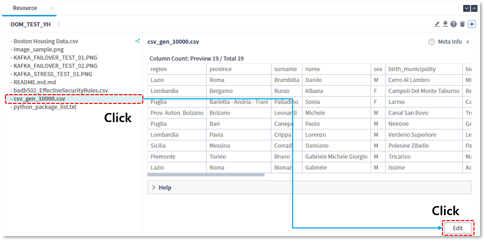
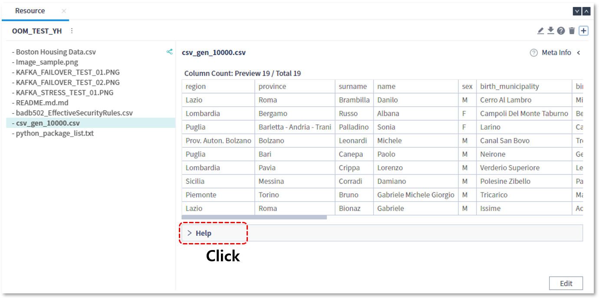
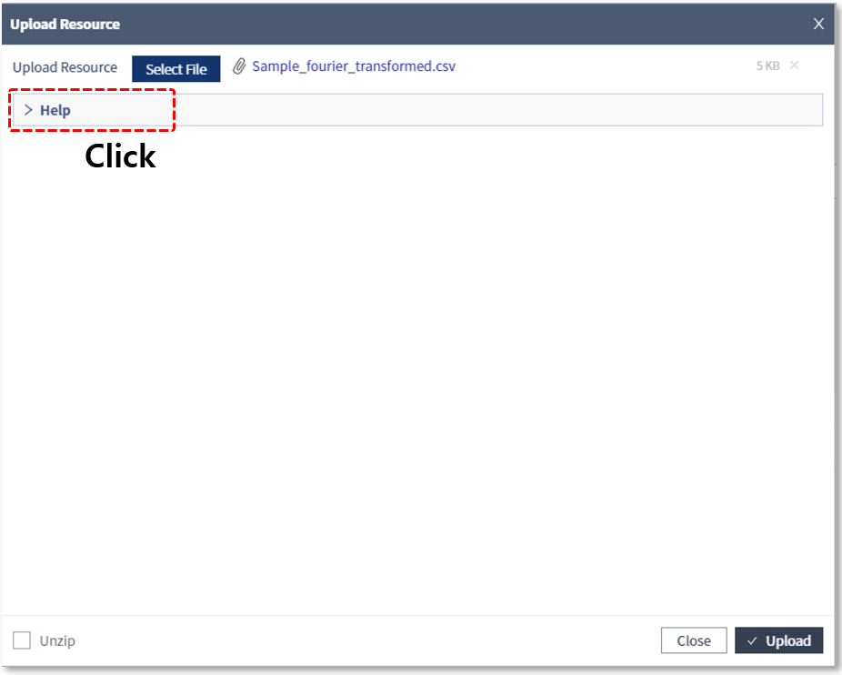
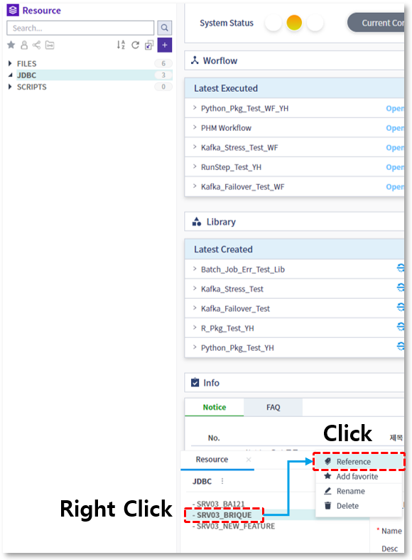

### 기본기능 > 리소스

---

#### 목록

---

1. 리소스 개념
2. 리소스 카테고리
3. 리소스 FILES 하위 카테고리 삭제
4. 리소스 FILES 하위 카테고리 이름 변경
5. 리소스 업로드
6. 리소스 미리보기
7. 리소스 다운로드
8. 리소스 압축해제 업로드
9. 리소스 삭제
10. 리소스 수정
11. 즐겨찾기 등록 / 해제
12. 공유 지정 / 해제
13. 일괄 공유 지정 / 해제
14. JDBC연결
15. 스크립트 업로드
16. 카테고리별 항목 개수 조회
17. 특정 리소스를 참조하는 라이브러리 조회
18. 검색
19. 필터
20. 단축버튼

---

#### 1. 리소스 개념

리소스(Resource)란 데이터 분석에 사용되는 자원으로써, 분석가의 로컬 PC 내에 존재하는 텍스트 및 이미지 파일이나 데이터베이스에 존재하는 다양한 형태의 데이터를 의미합니다

분석 알고리즘 수행에 필요한 이러한 데이터들은 수행 전에 리소스 형태로 등록되어야만 사용할 수 있으며,

파일의 경우, 업로드 기능을 이용해서 리소스로 등록할 수 있고, 데이터베이스에 존재하는 데이터의 경우, DB 커넥션 정보를 이용하여 리소스로 등록할 수 있습니다

---

#### 2. 리소스 카테고리

리소스는 FILES, JDBC, SCRIPTS 세가지 유형의 카테고리로 나뉩니다

- **FILES**: 분석에 사용되는 파일 유형의 리소스를 등록하는 영역으로, 분석가 로컬 PC의 파일을 등록하거나 분석 실행의 결과물이 위치하게 되며, 필요에 따라 서브 카테고리를 생성하여 관리할 수 있습니다

  

- **JDBC**: 데이터베이스에 존재하는 데이터를 수집하기 위한 DB 접속정보를 등록하는 영역으로, 해당 접속 정보를 이용하여 데이터베이스로부터 데이터를 추출하는 노드를 작성하게 되며, 데이터 노드는 관리자만 작성할 수 있습니다

- **SCRIPTS**: 라이브러리 내에서 사용되는 R 또는 Python으로 작성된 사용자정의 패키지를 등록하는 영역으로, 이 곳에 등록된 패키지들은 라이브러리 내에서 import를 통해 사용되어지며, 관리자만 등록할 수 있습니다

---

#### 3. 리소스 FILES 하위 카테고리 삭제

직접 생성한 리소스 카테고리의 경우만 삭제 메뉴가 보이고 카테고리를 삭제하면 하위 리소스도 함께 삭제됩니다

---

#### 4. 리소스 FILES 하위 카테고리 이름 변경

직접 생성한 리소스 카테고리의 경우만 이름 변경이 가능합니다

---

#### 5. 리소스 업로드

리소스 업로드 기능을 통해서 분석가 로컬PC에 존재하는 파일을 업로드 할 수 있으며, 업로드 가능 용량은 2GB로 제한됩니다

- RES > FILES에서 기존 생성했던 카테고리를 선택하거나 새 카테고리를 생성합니다

  

- 리소스를 등록할 카테고리를 선택하면 하단의 정보 영역에 카테고리에 포함된 내용들이 표현되는데, 여기서 마우스 오른쪽 버튼을 클릭하여 New Resource 메뉴를 선택합니다

  

- Drag & Drop 영역에 파일을 끌어 놓거나 Browse 버튼을 클릭하여 로컬 PC로부터 등록하고자 하는 파일을 선택한 후 Upload 버튼을 클릭합니다. 파일은 다중 선택 업로드가 가능합니다

  

- 선택한 파일들의 추가 상세 정보를 입력할 수 있는데 CSV 파일의 경우 입력 항목을 더 세분화 했습니다. 추가 정보 입력은 선택 사항이지만 해당 리소스에 대한 도움말 또는 검색에 활용될 수 있으므로 가급적 자세하게 입력하는 것을 권장합니다
  
- Save 버튼을 클릭하여 업로드를 마칩니다

- 선택된 카테고리 내에 신규 리소스가 등록된 것을 확인 할 수 있습니다

  

---

#### 6. 리소스 미리보기

아래 파일 유형에 해당하는 리소스는 전체 또는 일부 내용을 확인할 수 있습니다

- **csv**: 헤더 포함 최대 10행 까지의 데이터 내용이 표현됩니다

  

- **png, jpg**: 이미지의 내용이 표현됩니다

  

- **txt**: 최대 10행 까지의 데이터 내용이 표현됩니다

  

---

#### 7. 리소스 다운로드

등록된 리소스를 로컬 PC로 다운로드 받을 수 있는 기능을 제공합니다

- 다운로드 받을 리소스를 선택한 후, 마우스 오른쪽 버튼을 클릭하여 Download 메뉴를 선택하거나, 우측 화면의 다운로드 아이콘을 클릭합니다

  

---

#### 8. 리소스 압축해제 업로드

등록하고자 하는 파일이 압축된 경우, 리소스로 등록하는 과정에서 압축을 해제하여 등록할 수 있습니다

- Upload Resource에서 zip파일을 선택하고 하단의 Unzip에 체크합니다

  

- 압축을 해제하여 리소스로 등록된 것을 확인 할 수 있습니다

  

---

#### 9. 리소스 삭제

삭제 기능을 통해서 사용되지 않는 리소스를 삭제할 수 있으며, 참조하고 있는 라이브러리가 없는 경우에만 삭제가 가능합니다

---

#### 10. 리소스 수정

WRITE 권한이 있는 리소스에 한해 리소스 이름 변경 및 Description 수정이 가능합니다

- Edit 버튼 클릭하여 편집 모드로 진입합니다

  

  

- 수정 후 Save 버튼을 클릭하면 수정한 내용이 반영됩니다

  

---

#### 11. 즐겨찾기 등록 / 해제

자주 사용하는 리소스를 즐겨찾기에 등록하고, 필터링을 통해서 쉽게 찾아볼 수 있습니다

- 즐겨찾기로 등록할 리소스를 선택한 뒤, 마우스 우측 버튼을 클릭하여 Add Favorite 메뉴를 선택합니다

- 리소스 이름 오른쪽에 즐겨찾기 표시가 생긴것을 확인할 수 있습니다

  

- 즐겨찾기된 항목을 선택한 뒤, 마우스 우측 버튼을 클릭하여 Remove Favorite을 선택하면, 즐겨찾기가 해제됩니다

  

---

#### 12. 공유 지정 / 해제

내가 업로드한 리소스를 공유하여 다른 사람이 조회할 수 있도록 허용할 수 있습니다

- 공유할 리소스를 선택한 뒤, 마우스 우측 버튼을 클릭하여 Share 메뉴를 선택합니다

  

- 리소스 이름 오른쪽에 Share 아이콘이 표시되는걸 확인할 수 있습니다

- Share Setting 팝업에서 공유해줄 아이디를 선택 한 후, Reader 또는 Writer 권한을 선택하여 공유할 수 있습니다

  

  - Read 권한 : 읽기 및 실행 권한 부여
  - Write 권한 : 읽기 및 실행이 포함된 모든 편집 권한 부여

- 공유된 리소스의 Share Setting 팝업에서 권한을 해제할 수 있습니다

  

---

#### 13. 일괄 공유 지정 / 해제

사용자가 생성한 리소스 카테고리의 하위 리소스를 일괄 공유 지정 또는 일괄 공유 해제할 수 있습니다

- Share All

  

  Share Setting 팝업의 설정은 12번 항목과 동일합니다

- Unshare All

  

---

#### 41. JDBC연결

Oracle, DB2, MySql 등의 데이터베이스에 존재하는 데이터를 수집하기 위한 DB 접속정보를 리소스로 등록할 수 있으며, 이 기능은 관리자만 사용이 가능합니다

- RES탭에서 JDBC를 선택한 후, 마우스 우측버튼을 클릭하고 New DB connection 메뉴를 선택합니다

  

- New DB Connection 탭에서, 접속에 필요한 정보를 입력한 후 Test Connection 버튼을 클릭하여 접속 테스트를 거친 후, 성공하면 Save로 해당 연결을 등록합니다

  

---

#### 15. 스크립트 업로드

스크립트 파일을 리소스로 등록할 수 있고 이 기능은 관리자만 사용 가능합니다

업로드 방법은 5번 항목인 리소스 업로드와 동일하지만 확장자가 'py'인 파일만 업로드 가능합니다

---

#### 16. 카테고리별 항목 개수 조회

리소스 탭에서 선택한 카테고리의 리소스 목록 우측 상단에는 해당 카테고리 소속 리소스 총 개수가 표시됩니다

---

#### 17. 특정 리소스를 참조하는 라이브러리 조회

선택된 리소스를 참조하고 있는 전체 라이브러리 목록을 확인할 수 있습니다

---

#### 18. **검색**

Resource 탭의 우측 상단에 위치한 검색창을 통해서 리소스를 검색할 수 있습니다

검색하고자 하는 단어를 입력하고 검색 버튼을 클릭하면, 입력된 단어를 포함하는 파일이 표시됩니다. 검색 대상은 전체 리소스입니다

---

#### 19. 필터

- Favorites

  즐겨찾기 등록한 리소스 목록만 보여줍니다. 즐겨찾기의 경우는 다른 필터와 중복으로 적용 가능합니다

  

- My

  직접 업로드한 리소스만 보여줍니다

  

- Sharing

  직접 업로드하고 공유한 리소스만 보여줍니다

  

- Shared

  공유를 받은 리소스만 보여줍니다

  

---

#### 20. 단축버튼

- Sort By Name: 카테고리를 알파벳 순으로 정렬합니다

  
  

* Reload All: 리소스 목록을 새로고침 합니다

  
