### 기본기능  > 라이브러리

------
#### 목록

----

1. 라이브러리 개념
2. 라이브러리 카테고리
3. 라이브러리 생성
4. 라이브러리 편집
5. 특정 라이브러리를 참조하는 워크플로우 조회
6. 라이브러리 도움말 작성
7. 라이브러리 GPU 사용
8. 언어 및 버전 선택
9. 라이브러리 Script 내부 검색 및 바꾸기
10. 라이브러리 복사 / 붙여넣기
11. 즐겨찾기 등록 / 해제
12. 공유 지정 / 해제
13. Export / Import
14. 라이브러리 삭제
15. 카테고리 별 항목 개수 조회
16. 검색
17. 상세검색
18. 필터

------

#### 1. 라이브러리 개념

라이브러리란 데이터 분석을 위한 수집, 전처리, 모델링, 결과 시각화 등의 과정에서 사용되는 필수 요소 알고리즘을 모듈화 한 것으로써, 입력(Input), 속성(Attribute), 실행 스크립트, 출력(Output)으로 구성됩니다

##### Library 구성 요소

*  필수 입력 요소

  * Library Name: 라이브러리 이름

  * Language: 실행 스크립트에 사용되는 언어(R 또는 Python)와 버전

  * Input: 라이브러리 실행 시 필요한 입력 데이터

  * Output: 라이브러리의 실행 후, 결과로 반환 할 데이터
  
  * Script: R 또는 Python으로 작성된 실행 스크립트

    

* 선택 입력 요소

  * Using GPU: 해당 라이브러리를 GPU서버에서 실행할 지의 여부

  * Share: 해당 라이브러리를 다른 사용자와 공유할 지의 여부 (편집 권한을 제외한 조회 기능만 부여)

  * Attribute: 라이브러리 실행 시 사용되는 속성 데이터

    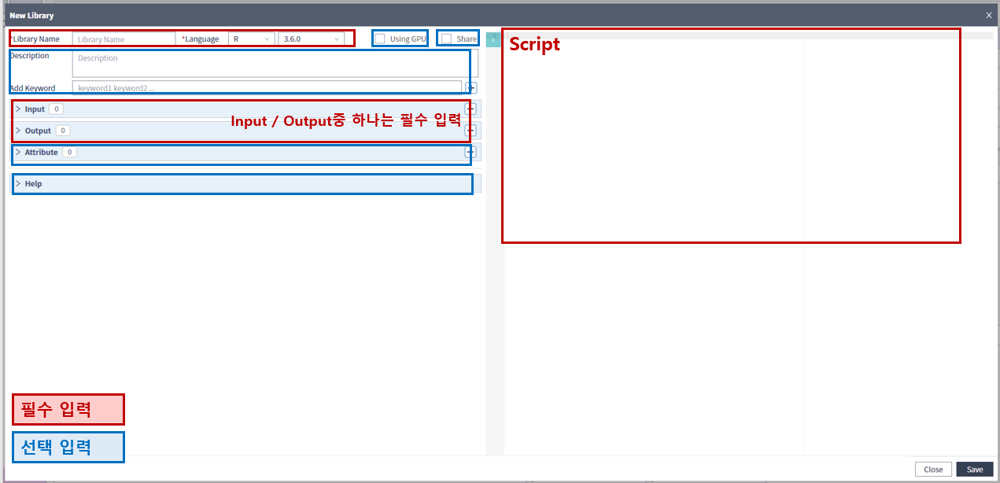

    

##### 자료형

- Input / Output

|           |           | Description | Python | R |
| :----- | --------- | ---- | ---- | ---- |
| Primitive | int   | 정수형 | int | integer |
|           | double | 실수형 | float | numeric |
|           | string | 문자 | string | character |
|           | boolean | 논리형 | bool | logical |
|           | resource | 파일경로 | File Directory | File Directory |
| Container | vector | 벡터 | List | vector |
|           | DataFrame | 데이터프레임 | pandas.DataFrame | data frame |
|           | Object | 객체(이종언어 호환안됨) | Object | Object |
|           | Map   | Key - Value | dictionary | list |

-  Attribute

|           |          | Description                                                  | Python              | R              |
| --------- | -------- | ------------------------------------------------------------ | ------------------- | -------------- |
| Primitive | int      | 정수형                                                       | int                 | integer        |
|           | double   | 실수형                                                       | float               | numeric        |
|           | string   | 문자                                                         | string              | character      |
|           | boolean  | 논리형                                                       | bool                | logical        |
|           | resource | 파일경로                                                     | File Directory      | File Directory |
|           | json     | json                                                         | json                | json           |
| Container | Vector   | 벡터                                                         | list                | vector         |
|           | Sequence | min, max, step값을 할당 후 생성되는 리스트 ex)min1: / max:10 / step:2 | list(range(1,10,2)) | seq(1,10,2)    |
|           | Select   | 몇 가지 보기 변수 중 사용자가 실행 시 마다 선택 가능 (보기 변수의 타입은 int/double/string/bool만 가능) |                     |                |

- Attribute 속성

  

  - Mandatory: 라이브러리 실행에 필요한 필수 속성
  - Optional: 라이브러리 실행에 사용되는 선택적인 속성

----

#### 2. 라이브러리 카테고리

관리자에 의해 지정된 분류체계로써 루트와 서브 카테고리로 나뉠 수 있으며, 이렇게 지정된 분류 체계는 관리자 이외의 사용자가 변경하는 것을 허용하지 않고, 사용자는 서브 카테고리 하위로 자유롭게 카테고리를 생성할 수 있습니다

##### 카테고리 설명

- 1-Collection

  분석에 필요한 데이터를 수집하는데 사용되는 라이브러리들을 위한 분류

  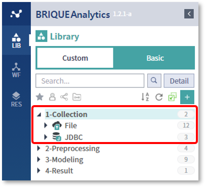

  

  - File: 파일로부터 데이터를 수집하는데 사용되는 라이브러리
  - JDBC: 데이터베이스로부터 데이터를 수집하는데 사용되는 라이브러리

  

- 2-Preprocessing

  분석에 필요한 데이터의 전 처리에 사용되는 라이브러리들을 위한 분류

  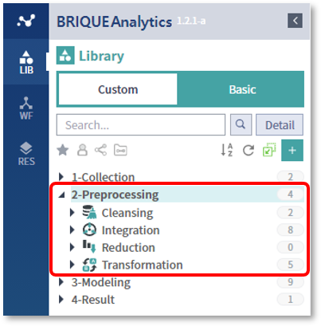

  

  - Cleansing: 데이터 정제를 위한 라이브러리
  - Integration: 데이터 통합을 위한 라이브러리
  - Reduction: 차원축소 및 데이터 삭제를 위한 라이브러리
  - Transformation: 데이터 변환을 위한 라이브러리

  

- 3-Modeling

  모델링 알고리즘을 포함하는 라이브러리들을 위한 분류

  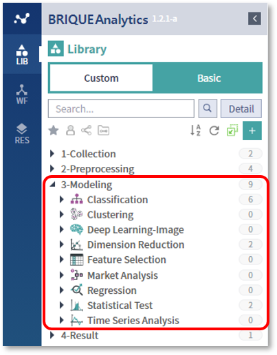

  

  - Classification: 분류 알고리즘을 위한 라이브러리
  - Clustering: 군집 알고리즘을 위한 라이브러리
  - Deep Learning-Image: 딥러닝 이미지 분석을 위한 라이브러리
  - Dimension Reduction: 차원축소를 위한 라이브러리
  - Feature Selection: 피쳐 선택을 위한 라이브러리
  - Market Analysis: 시장 분석을 위한 라이브러리
  - Regression: 회귀 분석을 위한 라이브러리
  - Statistical Test: 통계 검증을 위한 라이브러리
  - Time Series Analysis: 시계열 분석을 위한 라이브러리

  

##### 사용자 카테고리 생성

* 카테고리를 생성할 서브 카테고리를 선택한 후, 마우스 우측 버튼을 클릭하여 New Category를 선택합니다

  

  

* 생성하고자 하는 카테고리의 이름을 입력하고 OK 버튼을 클릭한 후, 생성된 카테고리를 확인합니다

  

  

----

#### 3. 라이브러리 생성

- LIB 탭 오른쪽 상단의 + 버튼을 누르거나, 라이브러리를 저장할 카테고리를 선택한 후, 마우스 우측 버튼을 클릭하여 New Library를 선택합니다

  

  

- 라이브러리 편집 창을 통해서 라이브러리의 기본정보, 입력, 출력, 속성 및 실행 스크립트를 입력하여 신규 라이브러리를 생성할 수 있습니다

  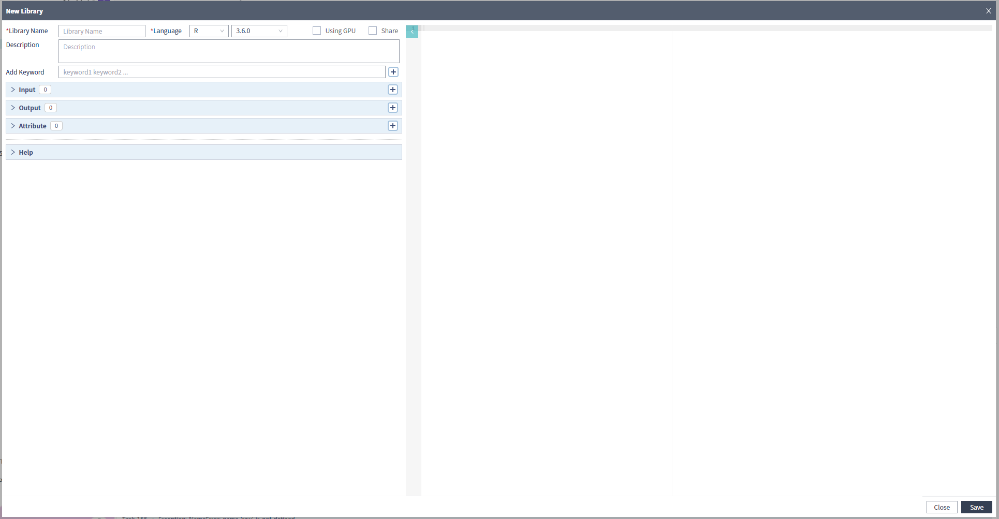

  

----

#### 4. 라이브러리 편집

- 편집하고 싶은 라이브러리를 선택한 뒤, 마우스 우측 버튼을 클릭하여 Detail을 선택합니다

  

  

- 하단 영역에 선택된 라이브러리의 정보가 표시되며, Edit 버튼을 클릭하여 편집을 시작합니다

  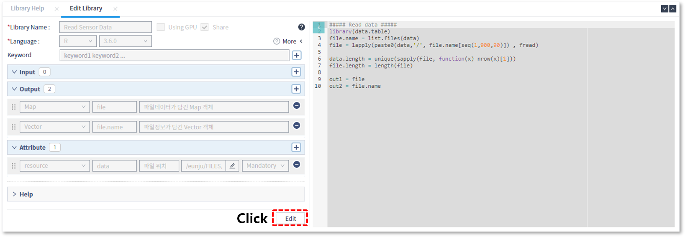

  

----

#### 5. 특정 라이브러리를 참조하는 워크플로우 조회

각 라이브러리별로 참조하고 있는 워크플로우를 조회할 수 있으며, 워크플로우에서 사용되고 있는 라이브러리는 삭제가 허용되지 않기 때문에 참조하고 있는 워크플로우의 삭제가 선행되어야만 합니다

- 조회하고 싶은 라이브러리를 선택한 뒤, 마우스 우측 버튼을 클릭하여 Reference를 선택합니다

  

  

- 하단에 해당 라이브러리가 포함된 워크플로우의 목록이 표시되며, Open을 클릭하여 해당 워크플로우를 편집 창에 불러 올 수 있습니다

  

  

  

  

----

#### 6. 라이브러리 도움말 작성

- 라이브러리 편집창에서 Input / Output / Attribute를 입력한 후, 화면을 스크롤하여 내립니다

  

  

- 도움말 입력을 위해 Help 버튼을 클릭합니다

  

  

- 라이브러리 관련 설명을 작성할 수 있고, 추가한 Input / Output / Attribute가 자동으로 추가되어 이에 대한 설명을 입력할 수 있습니다

  - 입력창 오른쪽의  Y / N은 필수입력의 여부로써 Y 는 필수, N은 선택을 뜻합니다

    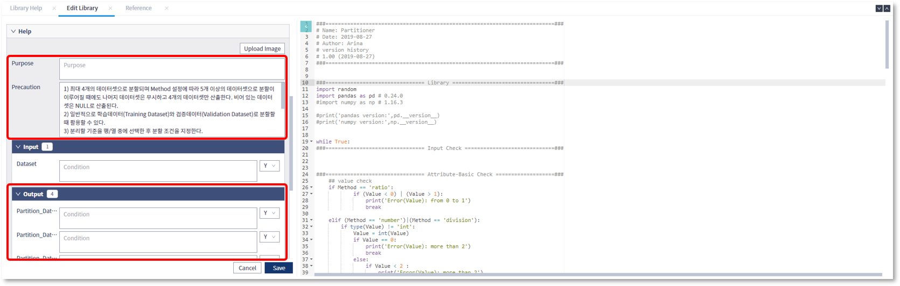

    

  - 참조할 이미지가 있는 경우, Upload Image 버튼을 클릭하여 이미지를 업로드 할 수 있습니다

    

    

    

    

- 저장된 도움말은 ? 버튼을 클릭하여 확인 할 수 있습니다

  

  

  

  

----

#### 7. 라이브러리 GPU사용

라이브러리 생성 또는 편집 시, Using GPU 항목을 선택하면, 해당 라이브러리는 GPU를 이용해서 실행됩니다

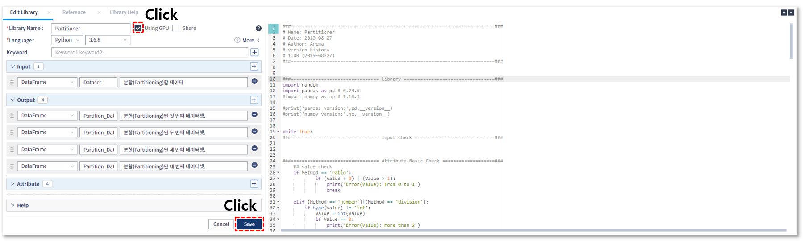

----

#### 8. 언어 선택 및 버전 선택

라이브러리에 포함된 실행 스크립트의 언어(R / Python) 및 버전을 선택할 수 있으며, 선택된 언어 및 버전의 환경에 따라 라이브러리가 실행되게 됩니다

----

#### 9. 라이브러리 Script 내부 검색 및 바꾸기

- 라이브러리 상세정보가 표현되는 하단영역의 Edit 버튼을 클릭한 후, Script 영역을 클릭하여 포커스가 Sctipt영역으로 오도록 합니다

  

  

- Ctrl+F 키를 누르면 오른쪽 상단 영역에 찾기 메뉴가 생기는 것을 확인 할 수 있습니다

  

  

- 찾아진 단어를 바꾸려는 경우, + 버튼을 클릭합니다

  

  

----

#### 10. 라이브러리 복사 / 붙여넣기

라이브러리 복사/붙여넣기 기능을 사용하여 기존에 작성된 라이브러리로부터 손쉽게 새로운 라이브러리를 작성할 수 있습니다

- 복사할 라이브러리를 선택한 후, 마우스 우측 버튼을 클릭하여 Copy를 선택합니다

  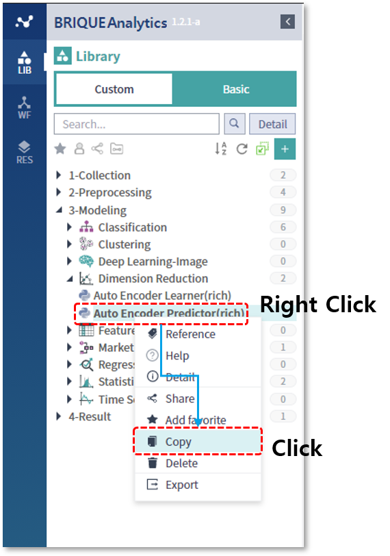

  

- 복사한 라이브러리를 붙여넣을 카테고리를 선택한 후, 마우스 우측 버튼을 클릭하여 Paste를 선택합니다

  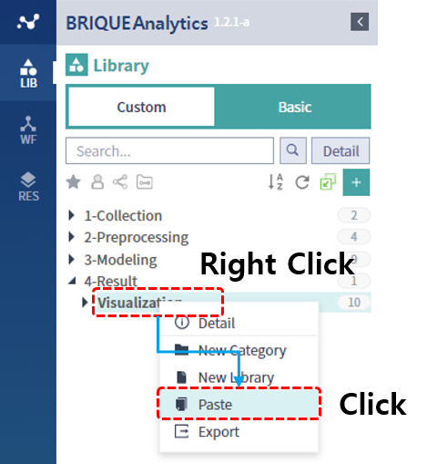

  

- 이름에 Postfix가 추가된 새로운 라이브러리가 생성되었음을 확인할 수 있습니다

  

  

----

#### 11. 즐겨찾기 등록 / 해제

자주 사용하는 라이브러리를 즐겨찾기에 등록하고, 필터링을 통해서 쉽게 찾아볼 수 있습니다

- 즐겨찾기로 등록할 라이브러리를 선택한 뒤, 마우스 우측 버튼을 클릭하여 Add Favorite 메뉴를 선택합니다

  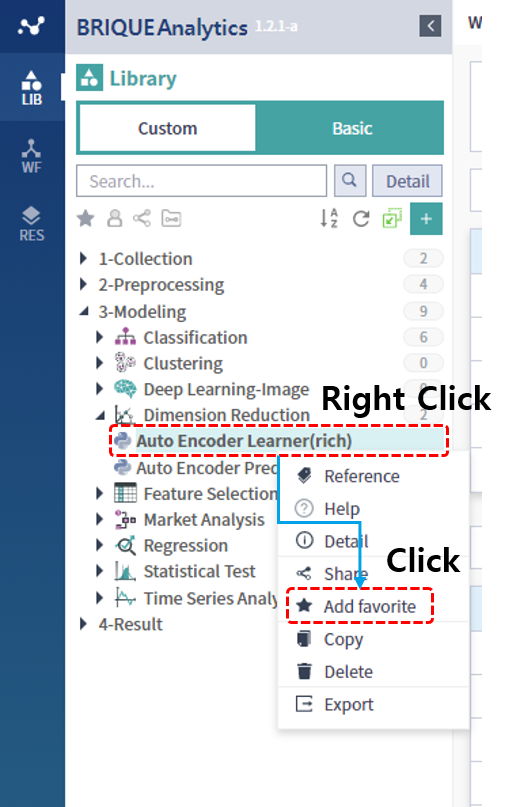

  

- 라이브러리 이름 오른쪽에 즐겨찾기 표시가 생긴것을 확인할 수 있습니다

  

  

- 상단의 Filter Favorite 아이콘을 선택하면, 즐겨찾기로 등록된 라이브러리들만 목록에 표시되며, 해당 아이콘을 한 번 더 클릭하면 필터가 해제됩니다

  

  

- 즐겨찾기된 항목을 선택한 뒤, 마우스 우측 버튼을 클릭하여 Remove Favorite을 선택하면, 즐겨찾기가 해제됩니다

  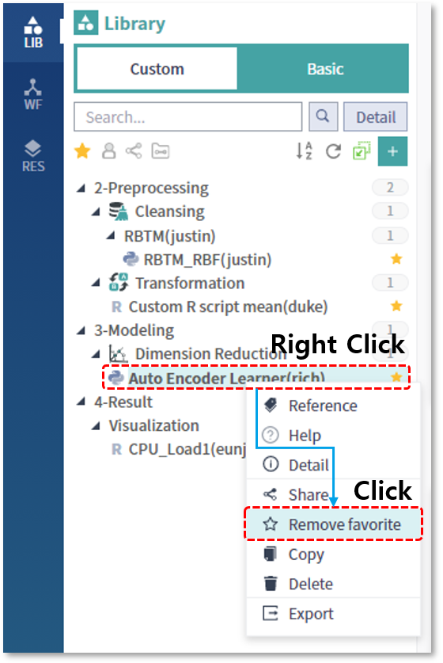

  

----

#### 12. 공유 지정 / 해제

내가 작성한 라이브러리를 공유하여 다른 사람이 조회 또는 복사할 수 있게 허용할 수 있으며, 다른 사람이 공유한 라이브러리를 활용하여 워크플로우를 작성할 수 있습니다

- 공유할 라이브러리를 선택한 뒤, 마우스 우측 버튼을 클릭하여 Share 메뉴를 선택합니다

  

  

- 라이브러리 이름 오른쪽에 Share 아이콘이 표시되는걸 확인할 수 있습니다

  

  

- 공유된 라이브러리를 선택한 뒤, 마우스 우측 버튼을 클릭하여 Unshare 메뉴를 선택하면 공유를 해제할 수 있습니다

  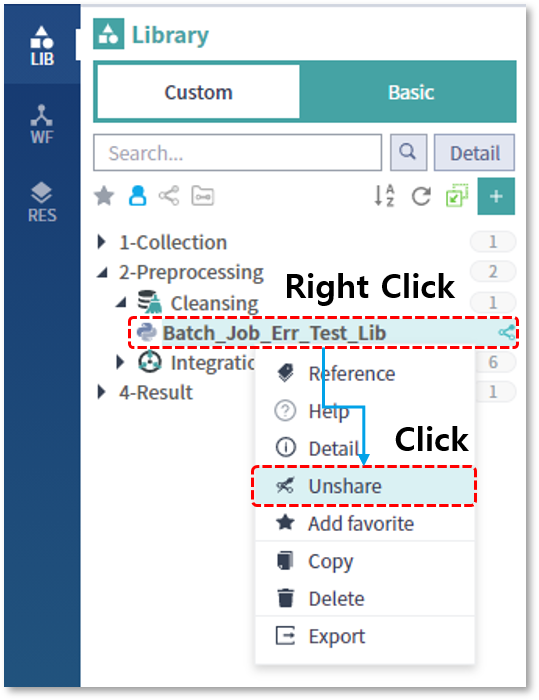

  

----

#### 13. Export / Import

작성된 라이브러리를 백업하거나 다른 설치 위치로 복사하는 것을 지원하기 위해 관리자에게만 제공되는 기능입니다

##### Export (내보내기)

- 내보낼 라이브러리 또는 카테고리를 선택한 뒤, 마우스 우측 버튼을 클릭하여 Export 메뉴를 선택합니다

  

  

- 웹 브라우저 하단의 표시줄을 통해 다운로드 되었음을 확인할 수 있습니다

  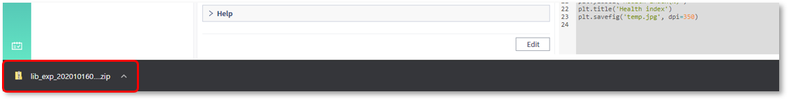

  

##### Import (가져오기)

- Export된 라이브러리를 가져오기 위해서는 LIB 탭의 빈 공간에서 마우스 우측 버튼을 클릭하여 Import를 선택합니다

  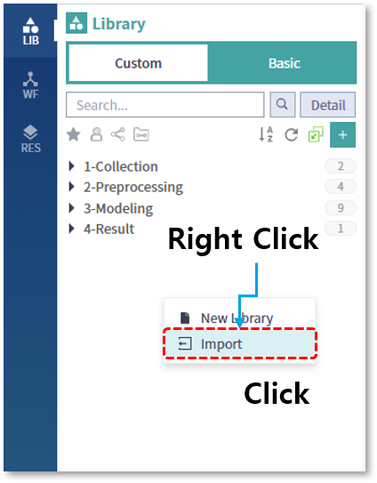

  

- Export(내보내기)로 저장했던 파일을 선택합니다

  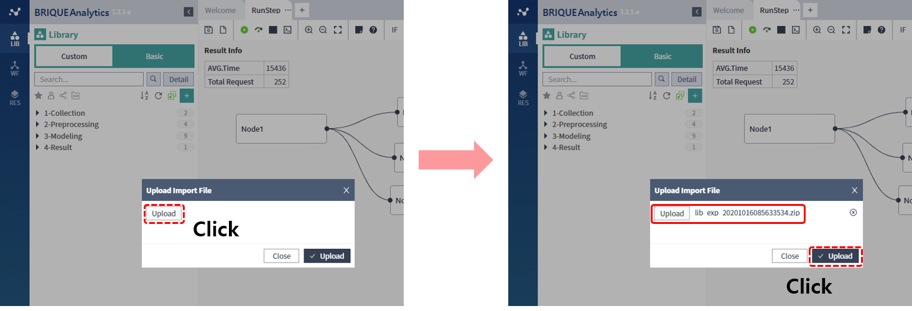

  

- Import(가져오기)를 통해서 카테고리와 라이브러리가 생성되었음을 확인할 수 있습니다

  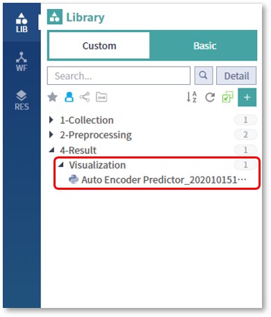

  

----

#### 14. 라이브러리 삭제

삭제 기능을 통해서 사용되지 않는 라이브러리를 삭제할 수 있으며, 참조하고 있는 워크플로우가 없는 경우에만 삭제가 가능합니다

- 삭제할 라이브러리를 선택한 뒤, 마우스 우측 버튼을 클릭하여 Remove를 선택합니다

  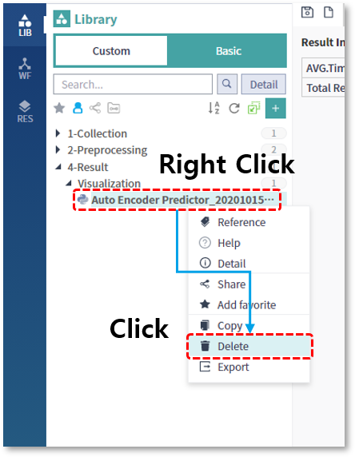

  

  

  

- 삭제하려는 라이브러리가 워크플로우에서 사용중일 경우, 삭제가 허용되지 않습니다

  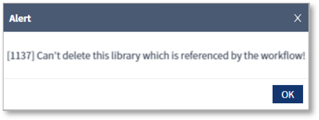

  

  

  

----

#### 15. 카테고리 별 항목 개수 조회

카테고리 이름 우측에 표시되는 숫자는, 해당 카테고리의 바로 하위에 등록되어 있는 서브 카테고리의 건수와 라이브러리 건수의 합을 의미합니다

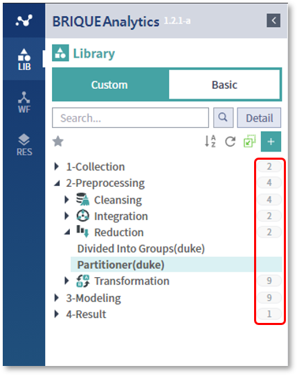

----

#### 16. 검색

LIB 탭의 상단에 위치한 검색 기능을 통해서, 라이브러리 이름이나 ID를 조건으로 검색을 수행할 수 있습니다

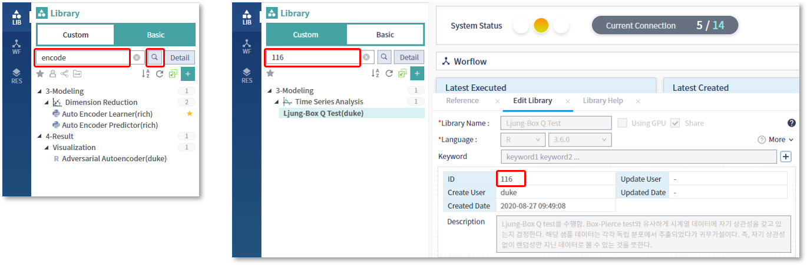

----

#### 17. 상세검색

상세검색을 통해서 좀 더 다양한 조건의 검색을 수행할 수 있습니다

- LIB 탭 상단의 오른쪽에 위치한 Detail 버튼을 클릭합니다

  

  

- 상세검색 화면에서 라이브러리 ID, 라이브러리 이름, 생성자, 키워드를 이용한 상세검색을 수행합니다

  

  

----

#### 18. 필터

필터 기능을 통해서 보기 원하는 항목들만 표시할 수 있습니다

* My

  내가 작성한 라이브러리 목록만 표시됩니다

  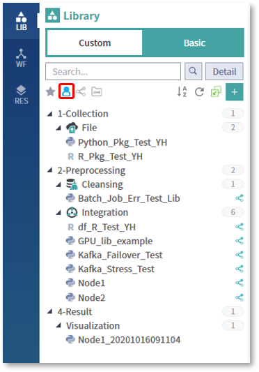

  

* Sharing

  내가 공유한 라이브러리 목록만 표시됩니다

  

  

* Shared

  다른 사람이 공유한 라이브러리 목록만 표시됩니다

  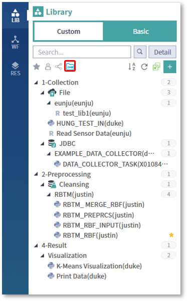

