### 기본기능  > 워크플로우

------
#### 목록

----

1. 워크플로우 개념
2. 워크플로우 카테고리 설명
3. 워크플로우 복사 / 붙여넣기
4. 즐겨찾기 등록 / 해제
5. 공유지정 / 해제
6. Export / Import
7. 카테고리 별 항목 개수 조회
8. 검색 
9. 필터
10. 단축버튼

------

#### 1. 워크플로우 개념

데이터 분석을 위한 일련의 과정을 표현하는 흐름의 단위로써, 라이브러리들의 조합으로 구성됩니다

워크플로우를 구성하는 라이브러리의 최소 개수는 1개이며, 두 개 이상의 라이브러리를 연결하여 하나의 워크플로우를 작성할 수 있는데 이 때, 첫 번재 라이브러리 Output의 Data Type과 두 번재 라이브러리 Input의 Data Type은 일치해야 합니다

------

#### 2. 워크플로우 카테고리 설명

관리자에 의해 지정된 분류체계로써 시스템(루트)과 카테고리(서브)로 나뉠 수 있으며, 이렇게 지정된 분류 체계는 관리자 이외의 사용자가 변경하는 것을 허용하지 않고, 사용자는 Bookmark탭을 이용해 자유롭게 카테고리를 생성할 수 있습니다

##### 서브 카테고리 설명

* 1-Prediction

  예측 목적의 워크플로우를 위한 분류

  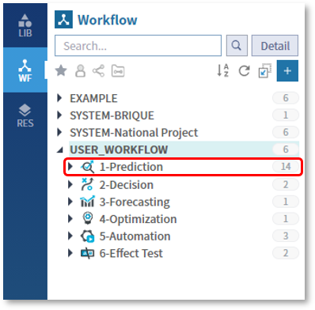

  

- 2-Decision

  판단 목적의 워크플로우를 위한 분류

  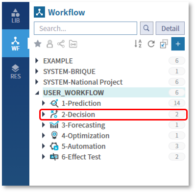

  

- 3-Forecasting

  추세예측 목적의 워크플로우를 위한 분류

  

  

- 4-Optimization

  최적화 목적의 워크플로우를 위한 분류

  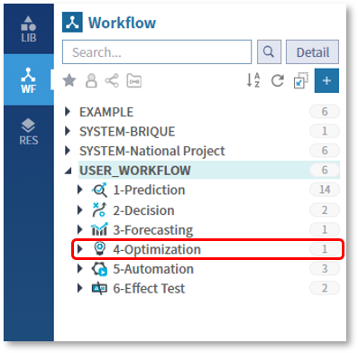

  

- 5-Automation

  자동화 목적의 워크플로우를 위한 분류

  

  

- 6-Effect Test

  효과검정 목적의 워크플로우를 위한 분류

  

  

##### 사용자 카테고리 생성

- Bookmark 탭으로 이동한 후, 마우스 우측 버튼을 클릭하여 New Category를 선택합니다

  생성하고자 하는 카테고리의 이름을 입력하고 OK 버튼을 클릭합니다

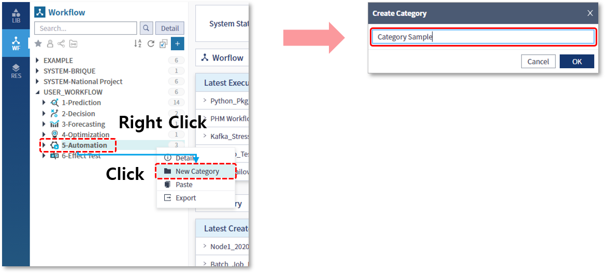

- 카테고리가 생성된 것을 확인할 수 있습니다

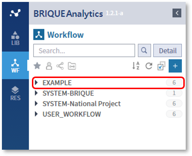

------

#### 3. 워크플로우 복사 / 붙여넣기

- 복사할 워크플로우를 선택한 후, 마우스 우측 버튼을 클릭하여 Copy를 선택합니다

  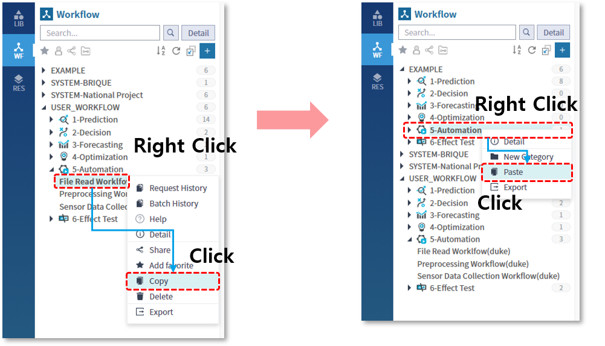

  
- 복사한 워크플로우를 붙여넣을 카테고리를 우클릭 하거나, 카테고리 선택 후 워크플로우 목록 영역에서 마우스 우측 버튼을 클릭하여 Paste를 선택합니다

  

- 워크플로우가 복사 되었음을 확인할 수 있습니다

  

  

- 주의사항

  워크플로우의 복사 기능은, 워크플로우를 구성하고 있는 라이브러리들까지 복사되는 것이 아니기 때문에 복사된 워크플로우에서 라이브러리를 수정할 경우, 해당 라이브러리를 참조하고 있는 기존 워크플로우에도 영향을 줄 수 있습니다

  

  때문에 특정 워크플로우만을 위한 라이브러리의 수정이 필요한 경우, 해당 라이브러리를 복사한 뒤 활용해야 합니다

  

  

------

#### 4. 즐겨찾기 등록 / 해제

자주 사용하는 워크플로우를 즐겨찾기에 등록하고, 필터링을 통해서 쉽게 찾아볼 수 있습니다

- 즐겨찾기 등록

  즐겨찾기를 등록할 워크플로우를 선택한 뒤, 마우스 우측 버튼을 클릭하여 Add Favorite를 선택합니다

  

  

- 즐겨찾기 해제

  즐겨찾기된 항목을 선택한 뒤, 마우스 우측 버튼을 클릭하여 Remove Favorite을 선택하면, 즐겨찾기가 해제됩니다

  

  

- 목록 확인

  상단의 Filter Favorite 아이콘을 선택하면, 즐겨찾기로 등록된 워크플로우들만 목록에 표시되며, 해당 아이콘을 한 번 더 클릭하면 필터가 해제됩니다

  

------

#### 5. 공유지정 / 해제

내가 작성한 워크플로우를 공유하여 다른 사람이 조회 또는 복사할 수 있게 허용할 수 있으며, 다른 사람이 공유한 워크플로우를 실행하여 분석 결과를 도출할 수 있습니다

* 공유할 워크플로우를 선택한 뒤, 마우스 우측 버튼을 클릭하여 Share 메뉴를 선택합니다

  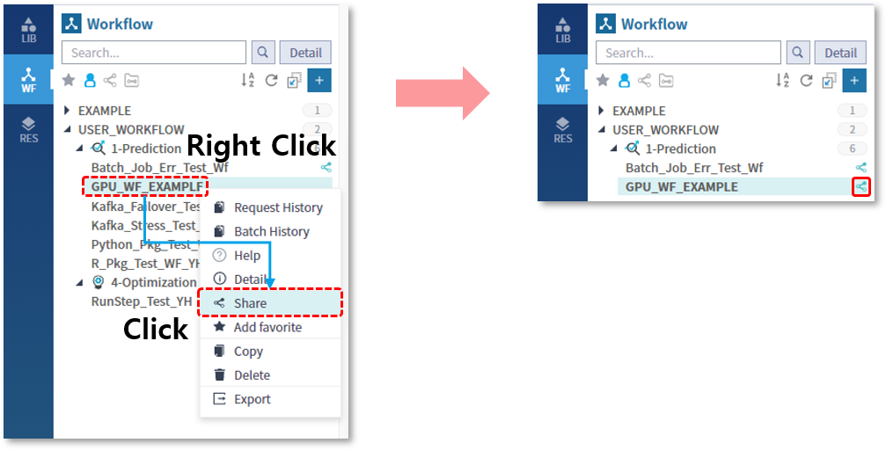

  

* Share Setting 팝업에서 공유해줄 아이디를 선택 한 후, Reader 또는 Writer 권한을 선택하여 공유할 수 있습니다

  

  

*  다른 사람이 공유한 워크플로우의 경우, 워크플로우 이름 옆으로 공유 권한이 표시됩니다

   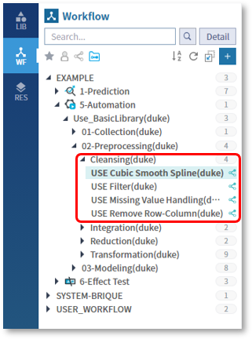

* 공유된 워크플로우는 다른 사용자에 의해 조회되고 실행될 수 있으며, 각 라이브러리의 Attribute 값을 변경해가면서 실행 결과를 확인할 수 있습니다

  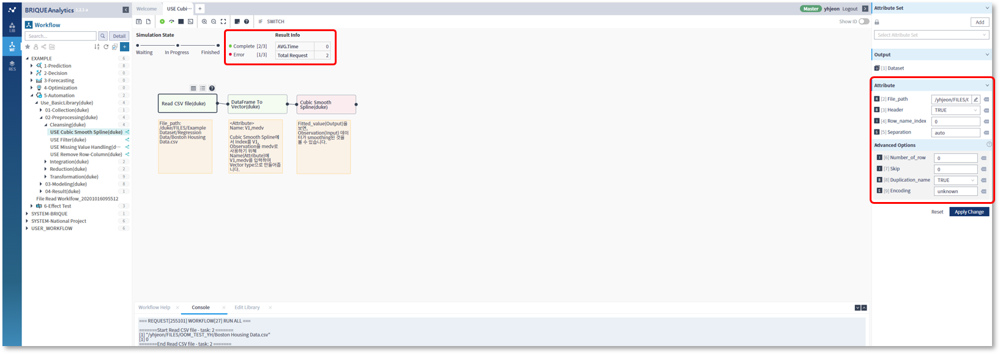

------

#### 6. Export / Import

작성된 워크플로우를 백업하거나 다른 설치 위치로 복사하는 것을 지원하기 위해 관리자에게만 제공되는 기능입니다

##### Export (내보내기)

- 내보낼 워크플로우 또는 카테고리를 선택한 뒤, 마우스 우측 버튼을 클릭하여 Export 메뉴를 선택합니다

  

- 웹 브라우저 하단의 표시줄을 통해 다운로드 되었음을 확인할 수 있습니다

  

##### Import (가져오기)

- Export된 워크플로우를 가져오기 위해서는 WF 탭의 빈 공간에서 마우스 우측 버튼을 클릭하여 Import를 선택합니다

  

- Export(내보내기)로 저장했던 파일을 선택합니다

  
  

- Import(가져오기)를 통해서 카테고리와 워크플로우가 생성되었음을 확인 할 수 있습니다

  

  

- 워크플로우가 참조하고 있는 라이브러리와 리소스도 함께 생성된 것을 확인 할 수 있습니다

  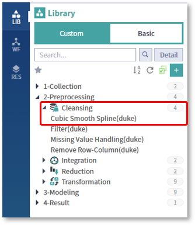

  

------

#### 7. 카테고리 별 항목 개수 조회

워크플로우 목록 상단에 표시되는 숫자는, 해당 카테고리 하위의 워크플로우 건수를 의미합니다

------

#### 8. 검색

WF 탭의 상단에 위치한 검색 기능을 통해서, 워크플로우 이름이나 ID를 조건으로 검색을 수행할 수 있습니다

------

#### 9. 필터

필터 기능을 통해서 보기 원하는 항목들만 표시할 수 있습니다

* My

  내가 작성한 워크플로우 목록만 표시됩니다

  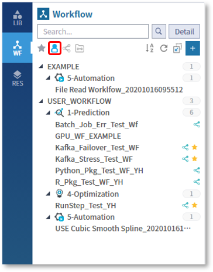

  

* Sharing

  내가 공유한 워크플로우 목록만 표시됩니다

  

  

* Shared

  다른 사람이 공유한 워크플로우 목록만 표시됩니다

  

------

#### 10. 단축버튼

* Reload
  워크플로우 목록을 새로고침 합니다
  
    

* Sort By Name
  목록을 알파벳 순으로 오름차순하여 정렬합니다

    

