### 기본기능  > 워크플로우 작성

------
#### 목록

----

1. 워크플로우 생성
2. 워크플로우 편집
3. 워크플로우 리셋
4. 결과 노드 지정
5. Run All

------

#### 1. 워크플로우 생성

- 워크플로우 편집화면의 좌측에 있는 + 버튼이나 좌측 위에 있는 Welcome 탭 옆의 + 버튼을 클릭하여 빈 편집 창을 생성합니다

  

  

- 워크플로우에 사용될 라이브러리를 LIB 탭에서 선택한 후, 드래그 앤 드랍으로 편집 화면에 끌어다 놓습니다

  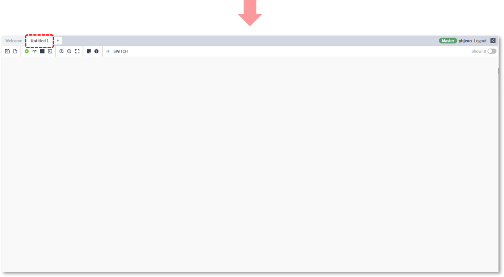

  

- 작성된 워크플로우의 실행을 위해서는 저장이 선행되어야만 하며, 상단 우측의 Save 버튼을 클릭하여 워크플로우를 저장할 수 있습니다

  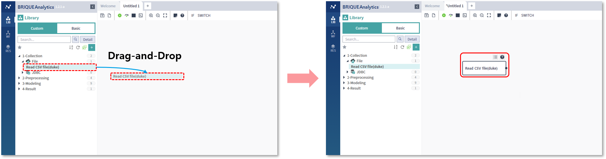

  

- 작성된 워크플로우를 저장하기 위해서는 저장될 카테고리의 위치, 워크플로우 이름, 검색에 사용될 키워드 및 도움말 등을 입력해야 하며, 이름과 저장될 카테고리의 지정은 필수 입력 사항입니다

  

  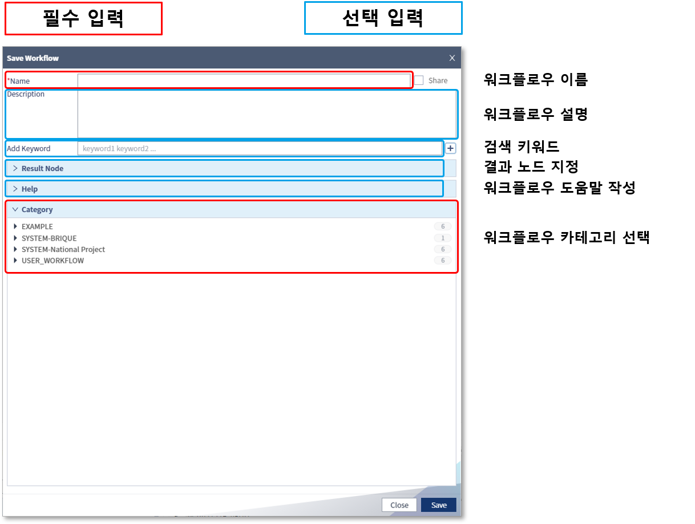

  

- 저장된 워크플로우는 편집 화면 상단의 Run All 버튼을 클릭하여 실행 및 실행 결과를 확인 할 수 있습니다

  
  
  

------

#### 2. 워크플로우 편집

- 워크플로우 목록에서 편집할 워크플로우를 선택한 뒤, 편집 영역으로 드래그 앤 드랍하여 열어줍니다

  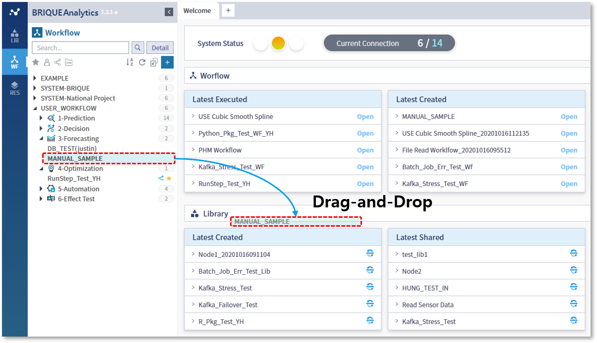

  

- 추가할 라이브러리를 드래그 앤 드랍으로 편집 화면에 끌어다 놓습니다

  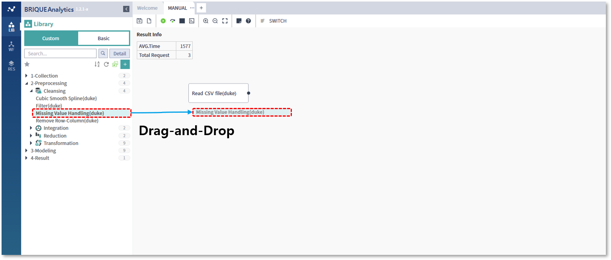

  

- 두 라이브러리의 연결을 위해, 첫 번째 라이브러리 Output 부분을 클릭하여 두 번째 라이브러리로 드래그 앤 드랍 합니다

  

  

- 라이브러리간 연결이 이뤄지면  하단의 정보영역에 Input과 Output의 목록이 표시되며, 첫 번째 라이브러리의 연결할 Output을 선택한 뒤, 두 번째 라이브러리의 연결될 Input 부분으로 드래그 앤 드랍하여 연결 해 줍니다 (이때, 연결되는 데이터의 타입은 동일해야 합니다)

  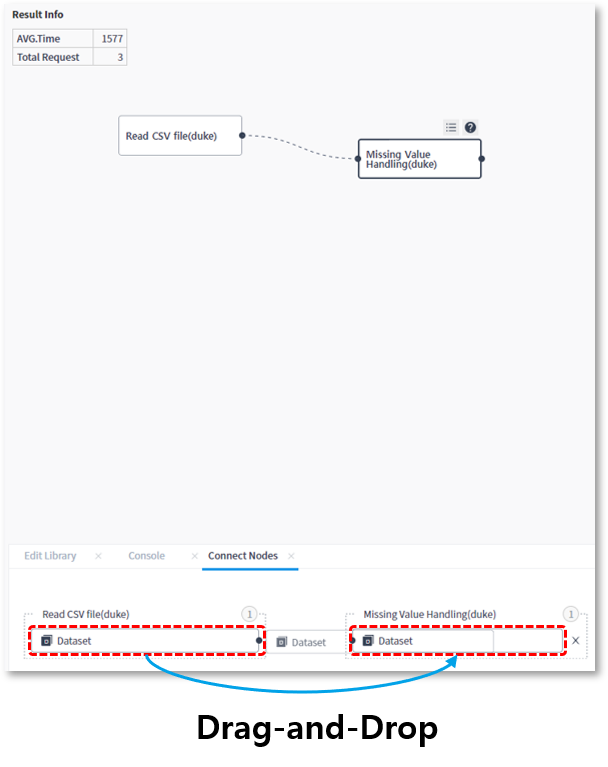

  

- 수정된 워크플로우는 실행하기 전에 저장해야만 변경된 내용으로 실행되기 때문에, 편집 화면 상단의 저장 버튼을 클릭하여 수정된 내용을 저장합니다

  

  

- 실행 버튼을 클릭하여, 수정된 워크플로우를 실행하고, 하단 정보 영역에서 실행 결과를 확인 합니다

  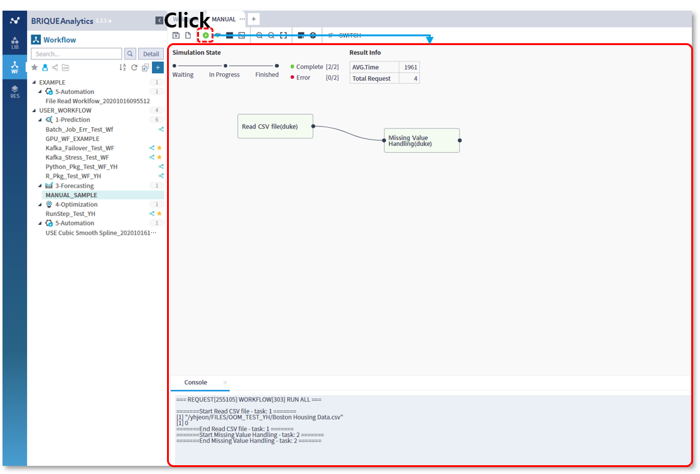

  

------

#### 3. 워크플로우 리셋

워크플로우를 수정하고 마지막 저장 상태로 원복하고 싶은 경우 워크플로우 리셋 아이콘을 클릭합니다

- 마지막으로 워크플로우가 저장된 상태입니다

  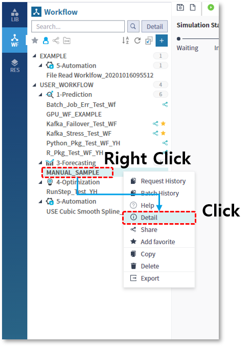

  

- 워크플로우를 수정합니다

  

  

- 워크플로우 리셋 아이콘을 클릭하면 마지막으로 저장된 상태로 원복이 됩니다

  

  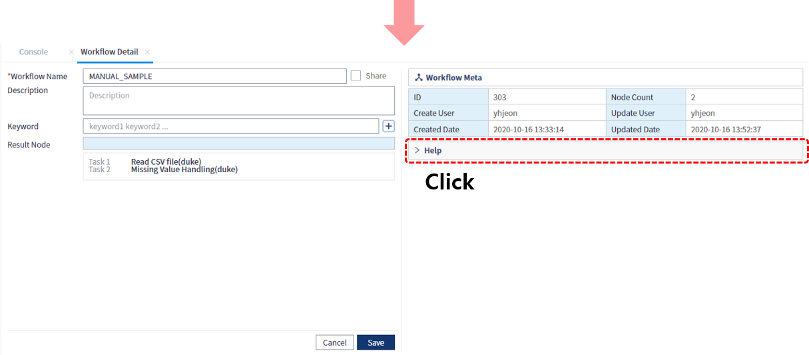

  

  

  

------

#### 4. 결과 노드 지정

워크플로우를 실행하고 난 뒤 워크플로우를 구성하고 있는 각각의 라이브러리들을 선택하여 결과를 확인할 수도 있지만, 최종적인 결과를 포함하는 라이브러리의 결과만을 즉시 확인하고 싶은 경우 사용되는 기능입니다

워크플로우를 구성하는 라이브러리들 중 하나를 선택하여 결과노드로 지정하면, 워크플로우의 실행이 완료된 직후 해당 라이브러리의 실행 결과가 하단 정보영역에 표시됩니다

##### 워크플로우 생성 시 결과 노드를 지정하는 경우

- 워크플로우 저장 시, Result Node를 클릭하면 해당 워크플로우에 포함된 전체 라이브러리 목록이 펼쳐집니다

  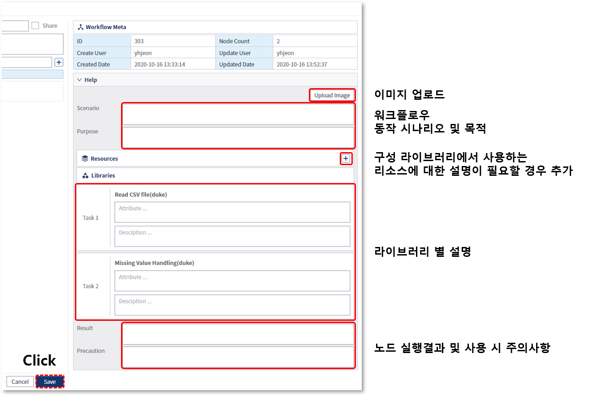

  

- 라이브러리 목록에서 결과노드로 지정할 라이브러리를 선택합니다

  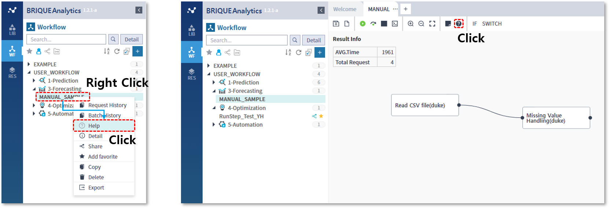

  

- 지정된 결과노드는 워크플로우의 Detail 메뉴를 선택하여 표시되는 하단의 정보 영역에서 확인할 수 있습니다

  

##### 워크플로우가 생성된 이후, 지정 및 변경하는 경우

- 지정할 워크플로우를 선택한 뒤, 마우스 우측 버튼을 클릭하여 Detail을 선택하고, Edit 버튼을 클릭합니다

  

  

- 구성하고 있는 라이브러리 목록 중 결과 노드로 지정할 라이브러리를 선택한 뒤, 저장합니다

  

  

- 워크플로우 상세 정보를 통해 지정된 것을 확인 할 수 있습니다

  

  

- 결과노드로 지정된 것을 삭제하기 위해서는, Result Node 영역의 우측 상단에 위치한 X 버튼을 클릭합니다

  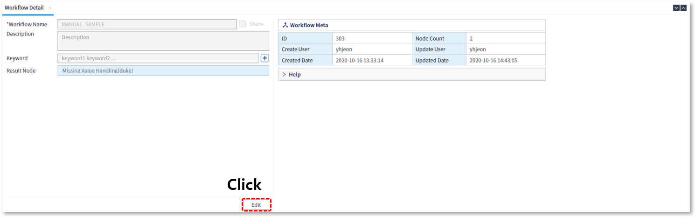

##### 결과노드의 활용

- 워크플로우의 실행이 완료되면 하단 정보 영역에 결과노드의 실행 결과가 바로 표시 됩니다

  

  

------

#### 5. Run All

작성된 워크플로우는 편집 화면의 상단에 위치한 실행 아이콘을 클릭하여 온라인 상으로 실행해 볼 수 있습니다

- 실행할 워크플로우를 오픈합니다

  

  

- 편집 화면에 워크플로우가 열리면 왼쪽 상단에 해당 워크플로우의 실행 통계 정보가 표시되며, 상단의 Run All 버튼을 클릭하면 실행이 시작됩니다

  

  

- 워크플로우가 실행되면 편집 화면 상단에 진행 상태가 표시되고, 정상적으로 실행 완료된 라이브러리와 실행 중인 라이브러리가 색깔로 구분되어 표시되며, 하단의 정보 영역에는 실행 중 발생되는 로그메시지가 표시됩니다

  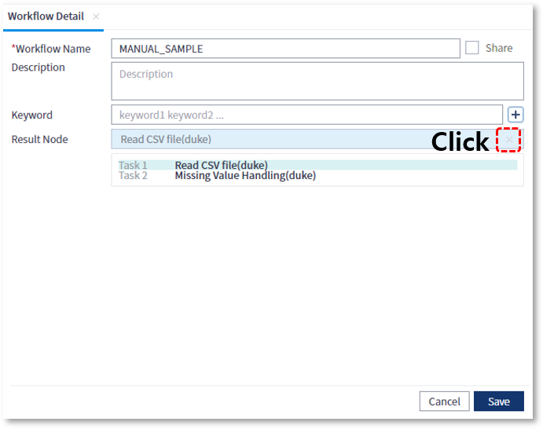

