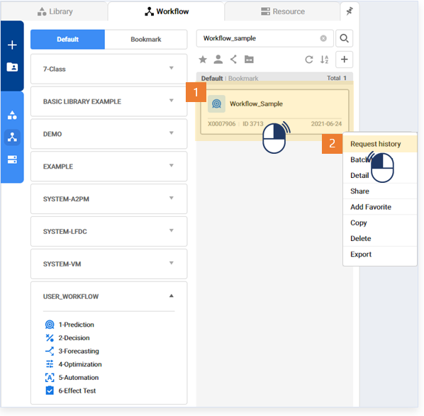
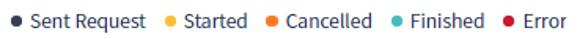
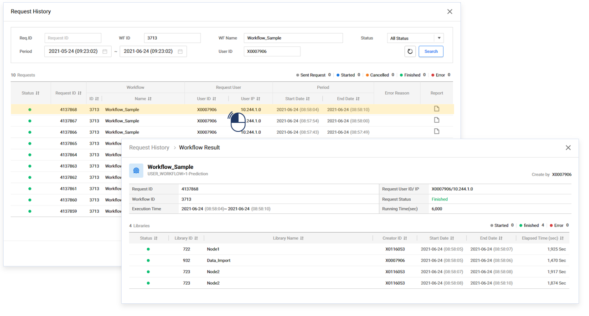
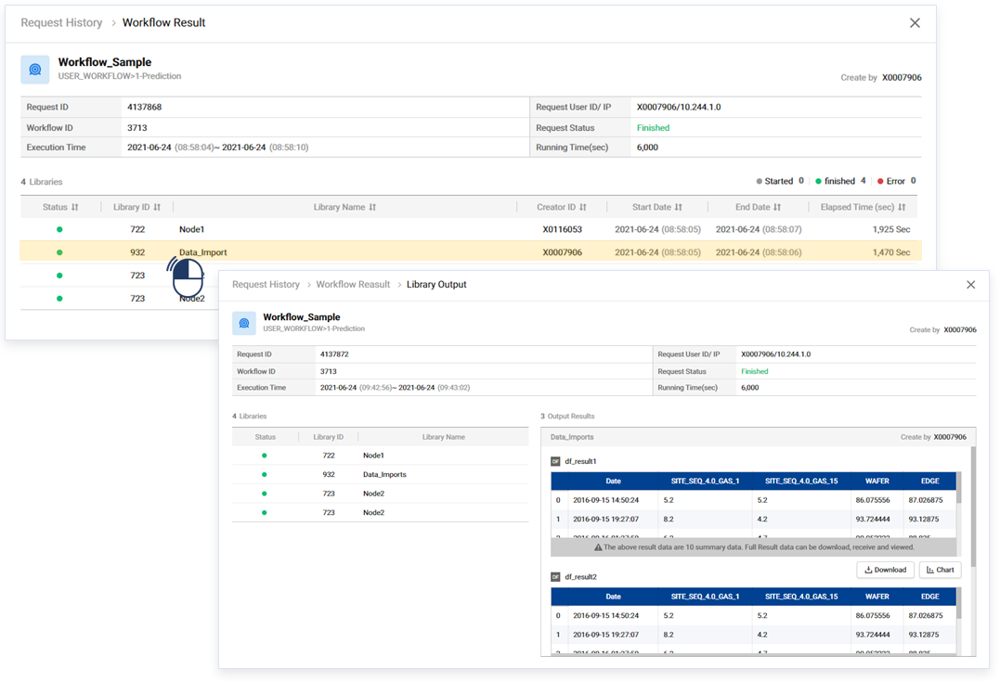

### 기본 기능 >  워크플로우 실행이력

------

#### 목록

------

1. 워크플로우 실행 이력 조회
2. Request Report

------

#### 1.워크플로우 실행 이력 조회

내가 실행한 워크플로우의 실행 이력과 결과 값을 확인 할 수 있는 기능입니다

- 실행 이력의 조회를 위한 워크플로우를 선택한 후, 마우스 우측 버튼을 클릭하여 Request History를 선택합니다

  

  

- 실행 이력 팝업이 열리고, 조회된 이력 목록이 표시됩니다

  

  

  - Status 아이콘의 의미는 다음과 같습니다

    

    

    - Send Request: 실행 요청 전송
    - Started: 워크플로우 실행 시작 또는 Run Step 실행
    - Cancelled: 워크플로우 실행 중지
    - Finished: 워크플로우 실행 정상 종료
    - Error: 워크플로우 실행 시 에러 발생

    

- 실행 이력 목록에서 특정 이력을 클릭하면, 해당 워크플로우를 구성하고 있는 라이브러리 별 세부 실행 정보가 표시됩니다

  

  

- 라이브러리 목록에서 특정 라이브러리의 Output 버튼을 클릭하면, 각 라이브러리 별 실행 결과를 확인 할 수 있습니다 (1일 이내의 결과 데이터만 확인 할 수 있습니다)

  

------

#### 2. Request Report

워크플로우 실행 당시의 라이브러리 별 Input / Output / Attribute 설정 값을 확인 할 수 있는 기능으로써, Input / Output의 경우, 1일 이내의 데이터만 확인할 수 있습니다

- 실행 이력(Request History) 목록에서 확인하고자 하는 항목의 Report 버튼을 클릭하면 Request Report 팝업이 열립니다

  

  

- 확인하고자 하는 라이브러리 이름을 클릭하면 Input / Output 데이터와, 실제 적용된 Attribute 값을 확인할 수 있습니다

  

