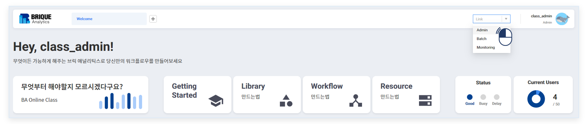
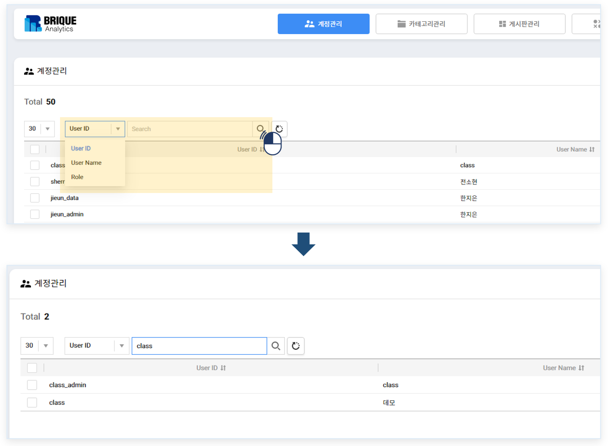
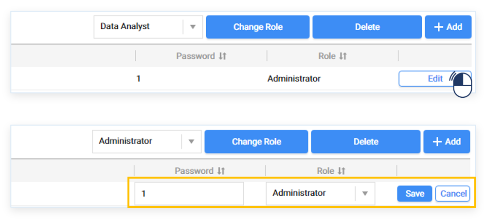
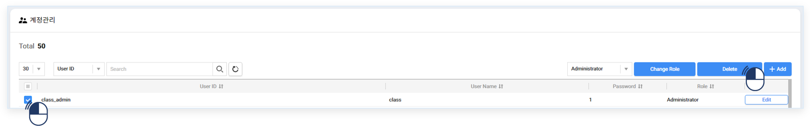
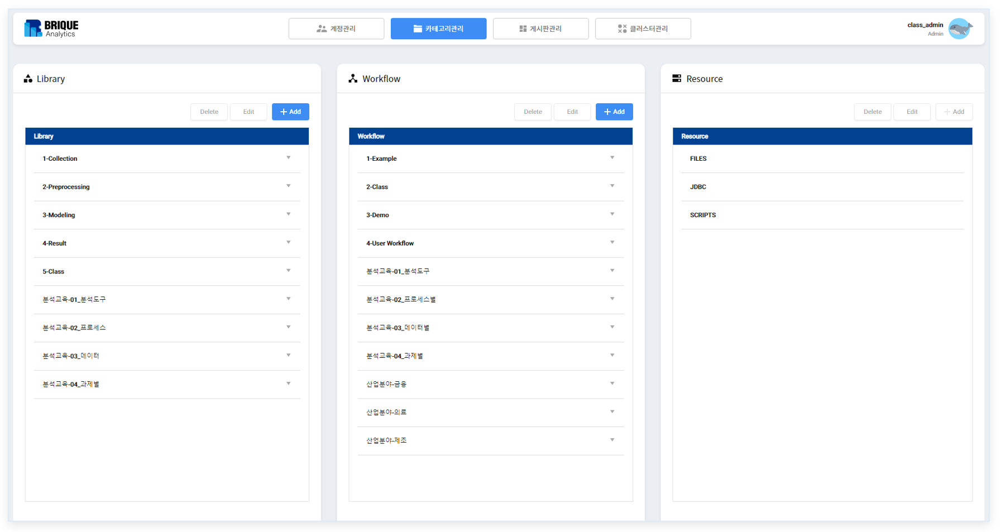
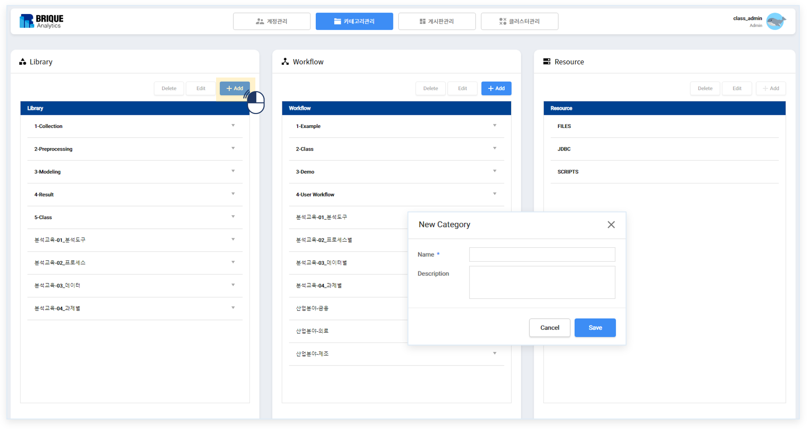
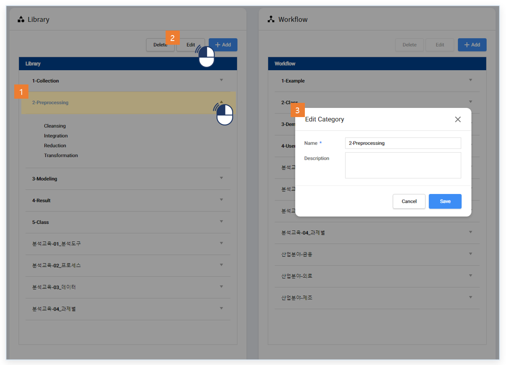
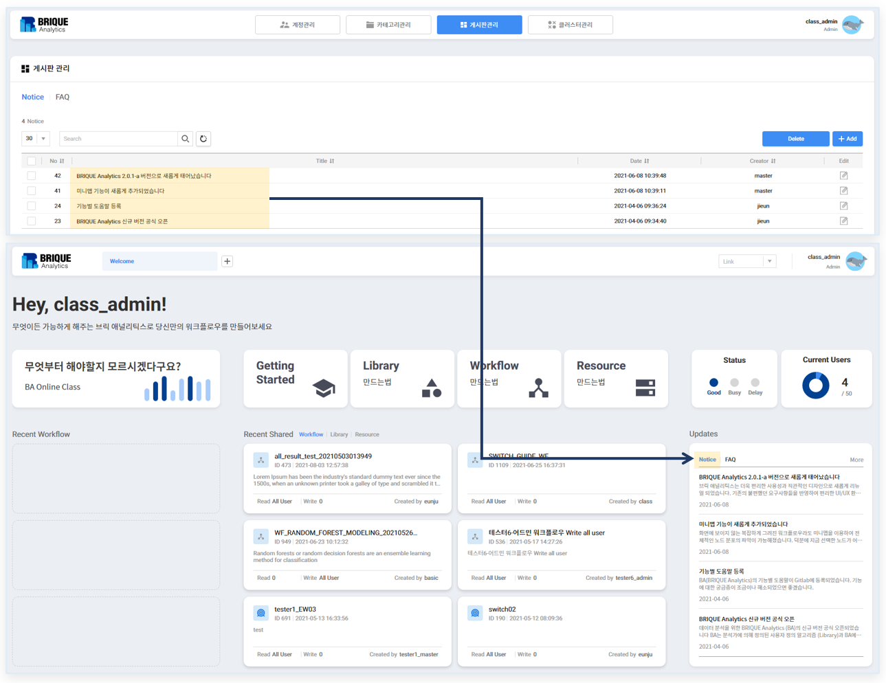
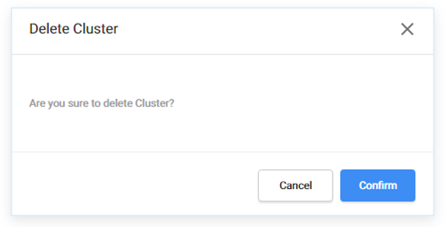
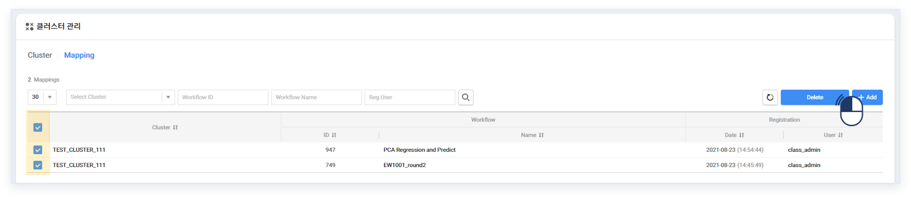

### 기본기능 > 관리

------

#### 목록

------

1. 관리 페이지 접근
2. 계정 관리
3. 카테고리 관리
4. 게시판 관리
5. 클러스터 관리

------

#### 1. 관리 페이지 접근

관리자 계정으로 접속 시, 오른쪽 상단의 아이콘을 클릭하여 관리 페이지로 접근할 수 있습니다

------

#### 2. 계정 관리

계정관리 기능을 이용해서 계정 추가, 삭제, 역할 수정 등의 사용자 정보 관리를 할 수 있습니다

- 사용자 조회

  ID, 이름, 역할로 등록된 사용자를 조회할 수 있습니다

  

  

- 사용자 정보 추가

  Add 버튼을 클릭하여, 새로운 사용자를 등록할 수 있습니다

  

  

- 계정 정보 수정

  Edit 버튼을 클릭하여, 선택된 사용자의 비밀번호, 역할을 수정할 수 있습니다

  

  

- 사용자 정보 제거

  Delete 버튼을 클릭하여, 선택된 사용자의 정보를 삭제할 수 있습니다

  

------

#### 3. 카테고리 관리

카테고리 관리 기능을 이용해서 워크플로우와 라이브러리의 기본 카테고리를 설정할 수 있습니다

워크플로우는 시스템(루트)과 카테고리(서브)로 나뉘며, 카테고리 분류 체계에 따라 루트 카테고리만 또는 하위 카테고리까지 자유롭게 사용할 수 있습니다

라이브러리는 분석절차에 따라 상위(루트) 카테고리를 등록한 후, 각 카테고리의 하위(서브) 카테고리를 등록하도록 하며, 상위와 하위 2단계 까지 카테고리의 등록이 가능합니다

리소스는 현 카테고리 체계를 확인할 수 있지만, 추가/삭제/수정이 불가합니다

- 새 카테고리 생성

  각 카테고리 상단의 New 버튼을 클릭하여, 새로운 카테고리를 추가할 수 있습니다

  

- 카테고리 이름 변경

  이름을 변경할 카테고리를 선택한 후,  상단의 Rename 버튼을 클릭하여 이름을 변경할 수 있습니다

  

  

- 카테고리 삭제

  삭제할 카테고리를 선택한 후,  상단의 Delete 버튼을 클릭하여 카테고리를 삭제할 수 있습니다

  

  

------

#### 4. 게시판 관리

- Notice

  공지사항을 등록, 수정 및 삭제할 수 있는 관리 기능으로써, 등록 및 삭제된 내역은 BRIQUE Analytics의 첫 화면에 반영되어 표시됩니다

  

  

- FAQ

  자주묻는 질문을 등록, 수정 및 삭제할 수 있는 관리 기능으로써, 등록 및 삭제된 내역은 BRIQUE Analytics의 첫 화면에 반영되어 표시됩니다

  

---

#### 5. 클러스터 관리

- Cluster

  클러스터 신규 등록, 수정 및 삭제할 수 있는 관리 기능
  

  - 클러스터 등록
  
  
  필수 입력 사항을 기입하고 Save 버튼 클릭
  
  
  
    - 클러스터 수정
  
      수정하고자 하는 클러스터 우측에 Edit 버튼 클릭
  
      수정 사항을 기입하고 Save
  
    - 클러스터 삭제
  
      삭제하고자 하는 클러스터 우측에 Delete 버튼 선택
  
    - 클러스터에 맵핑되어 있는 워크플로우 목록 확인
  
      해당 클러스터 우측에 Mapping 버튼 클릭
  
- Mapping

  클러스터와 워크플로우를 연동시키는 맵핑 목록을 신규 등록 및 삭제할 수 있는 관리 기능

  - 맵핑 등록

    연동하고자 하는 워크플로우와 클러스터를 선택 후 Save 버튼 클릭

  - 맵핑 삭제

    삭제하고자 하는 맵핑을 선택 후 우측 상단 Delete 버튼 클릭

  - 맵핑 조회

    특정 속성에 해당하는 맵핑을 조회할 수 있다

