### 기본기능  > 배치

------
#### 목록

----

1. 배치 개념
2. 배치 잡 생성 및 삭제
3. 배치 실행 및 중지
4. 배치 잡 수정
5. 배치 잡 수행이력 및 결과 조회

------

#### 1. 배치 개념

* 배치

  등록한 워크플로우를 주기적으로 실행 하는 것을 의미합니다

  

* 배치 잡

  특정 워크플로우에 대해 시작, 종료, 주기 설정을 하여 배치로 실행될 수 있도록 등록한 것으로, 하나의 워크플로우를 다른 조건으로 하여 여러 배치 잡으로 등록할 수 있습니다

  

  

* 워크플로우를 배치잡으로 등록 시 주기적 실행을 고려하여야 하며, 이에 따라 수정이 필요할 수 있습니다

  

* 배치 활용 예시

  * 주기적으로 DB에서 데이터를 수집해서 가공하고 싶은 경우
  * 주기적으로 모델링을 하여 업데이트 하고 싶은 경우
  
  

- 배치 결과 확인

  - 워크플로우 목록에서 결과 확인을 위한 항목을 선택한 후, 마우스 우측 버튼을 클릭하고 Batch History를 선택합니다

    

    

  - 선택된 워크플로우에 해당하는 전체 배치실행 이력이 조회됩니다

    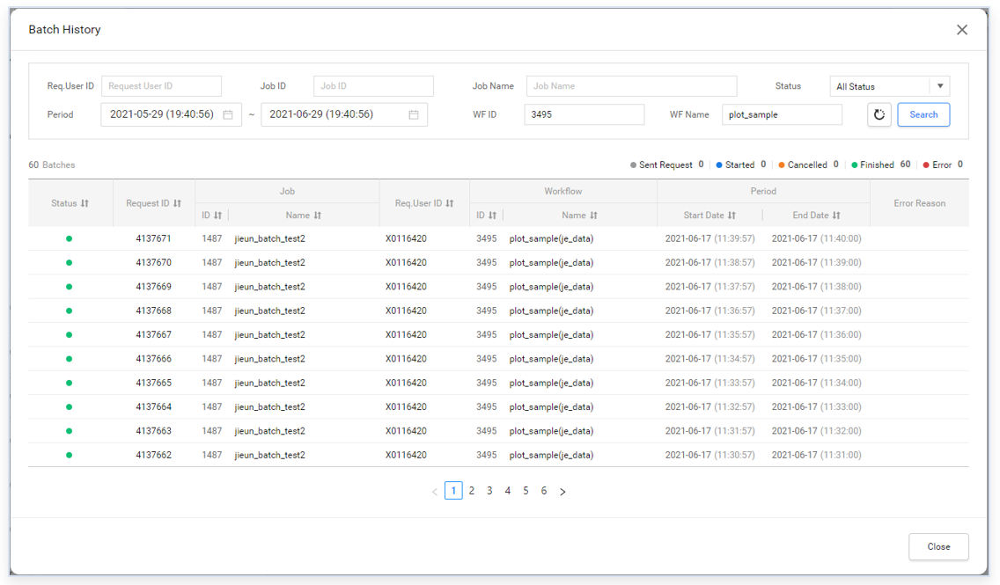

    

  - 신청했던 배치 잡 이름으로 검색할 수 있습니다

    

    

  - 개별 실행 목록을 클릭하여 세부 결과를 확인할 수 있습니다.

    

    

    

    

------

#### 2. 배치 잡 생성

배치 잡의 관리는 관리자에게만 허용된 기능으로, 관리자 페이지 내에서 생성이 가능합니다

* 관리자로 로그인 한 후, 왼쪽 하단의 Admin Page 버튼을 클릭하여 관리자 페이지로 접속하고, 상단 왼쪽의 배치관리 메뉴를 선택합니다

  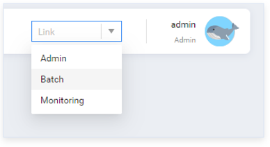

  

* 배치 잡 생성

  * 오른쪽 상단의 Add Job메뉴를 선택하면 Batch Job Registration영역이 활성화가 됩니다

    

    

  * Batch Job 이름과 설명을 입력합니다

    

    

  * Select Workflow 버튼을 클릭하여 배치로 실행할 워크플로우를 선택하고, 변경하고자 하는 Attribute 값을 변경한 뒤, Save 버튼을 클릭하여 저장합니다

    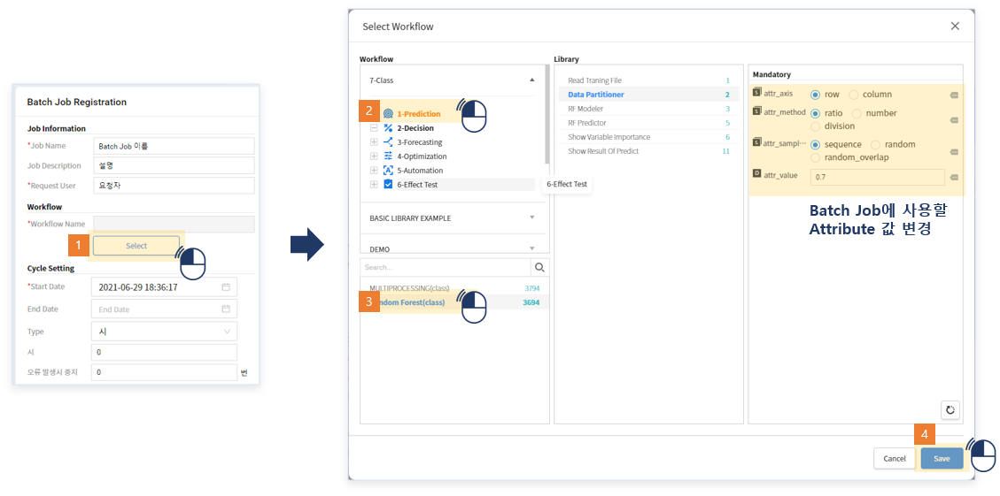

    

  * 배치 실행을 위한 주기 및 실행 조건을 입력한 뒤 저장합니다

    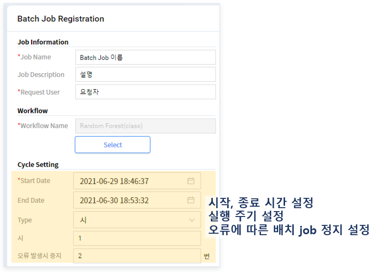

    

  * 배치 잡 목록에 신규로 등록된 항목을 확인 할 수 있습니다

    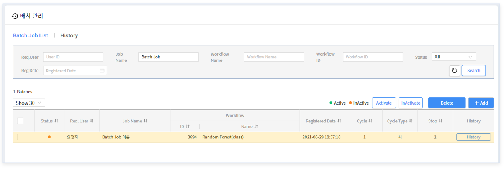

    

------

#### 3. 배치 실행 및 중지

- 활성화시킬 배치잡을 선택한 후 상단의 Activate 버튼을 클릭합니다

  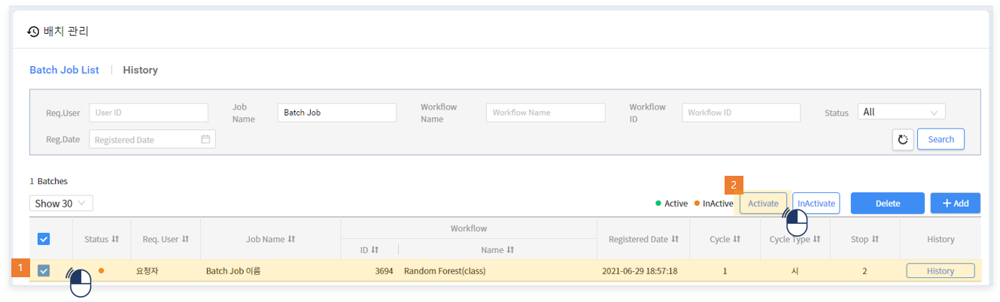

  

- 배치 잡의 상태가 Active로 바뀐 것을 확인 할 수 있습니다

  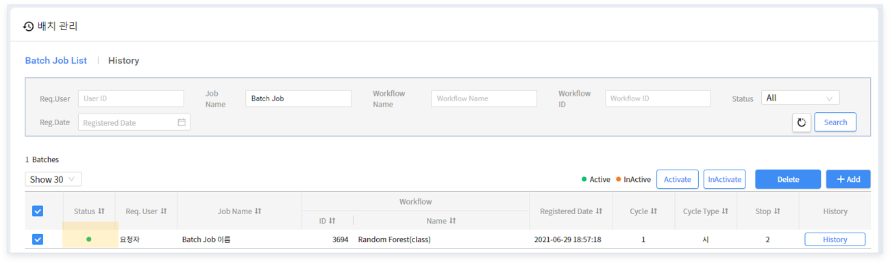

  

- 배치 잡의 상태가 Active 일때는 배치 잡 수정을 할 수 없으며, DeActivate 버튼을 클릭하여 비활성화 상태로 변경한 후에만 수정 및 삭제가 가능합니다

  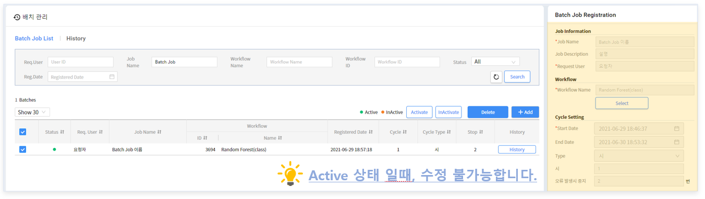

  

------

#### 4. 배치 잡 수정

- InActive 상태인 잡을 선택하면 오른쪽 Batch Job Registration부분이 활성화됩니다

  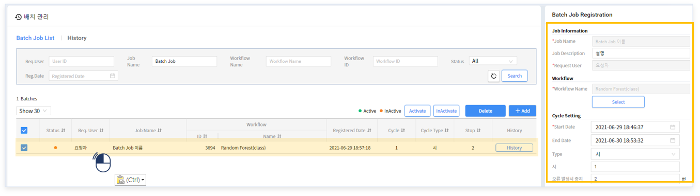

  

- 배치 잡 이름과 워크플로우는 변경할 수 없으며, 각 라이브러리의 Attribute 값만 수정이 가능합니다

  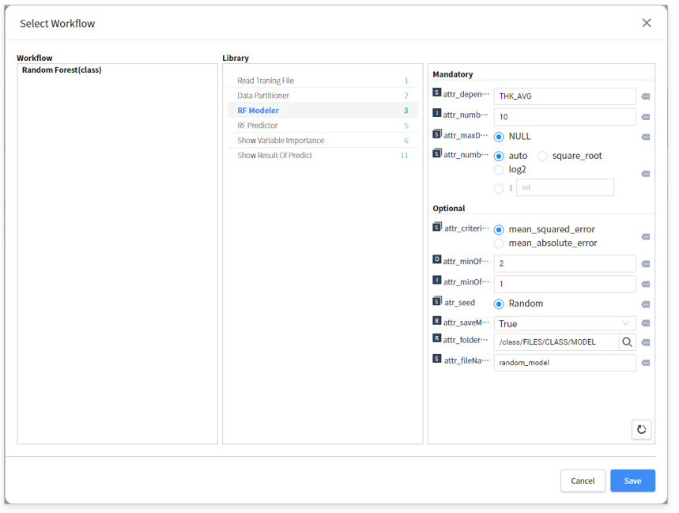

  

- 수정할 부분을 반영 후 Save 버튼을 클릭하여 배치 잡을 수정합니다

  

  

------

#### 5. 배치 잡 수행이력 및 결과 조회

- 상단의 History를 선택하면 모든 배치 잡의 실행 이력을 조회할 수 있습니다

  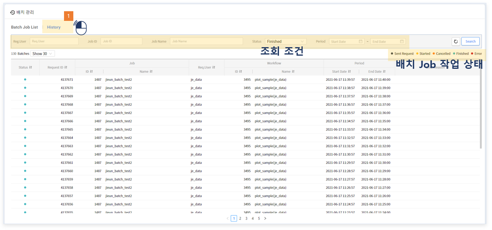

  

  

  

- 특정 배치 잡의 히스토리만 보고싶을 경우, 목록 우측의  History 버튼을 클릭하면 해당 잡에 대해 필터링 된 결과를 확인 할 수 있습니다

  

  

  

  

- 개별 실행 목록을 클릭하면 라이브러리 별 결과를 확인 할 수 있습니다

  

  

  

