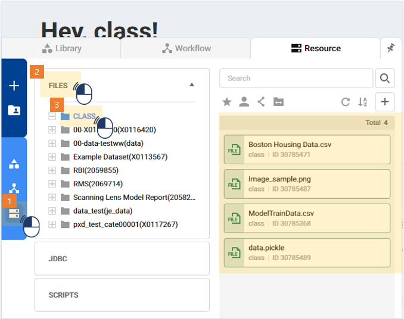
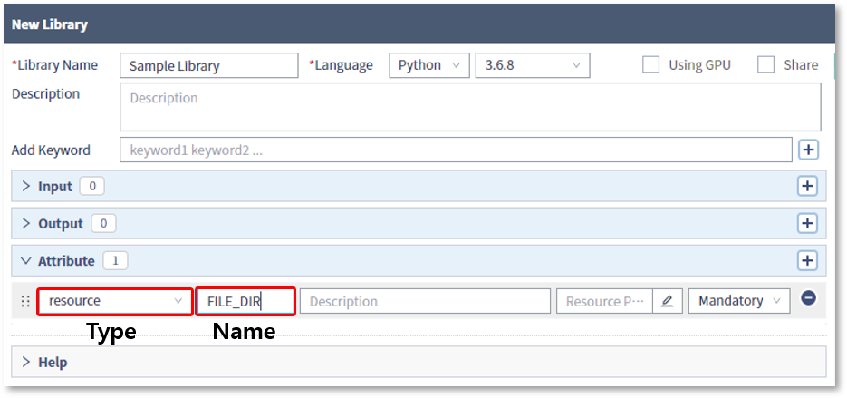
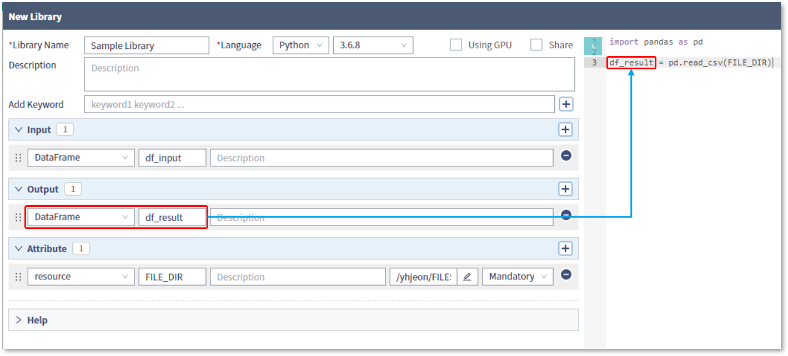
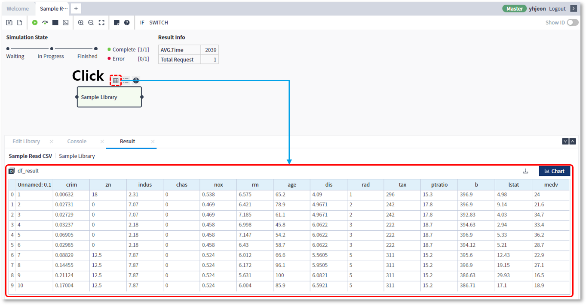
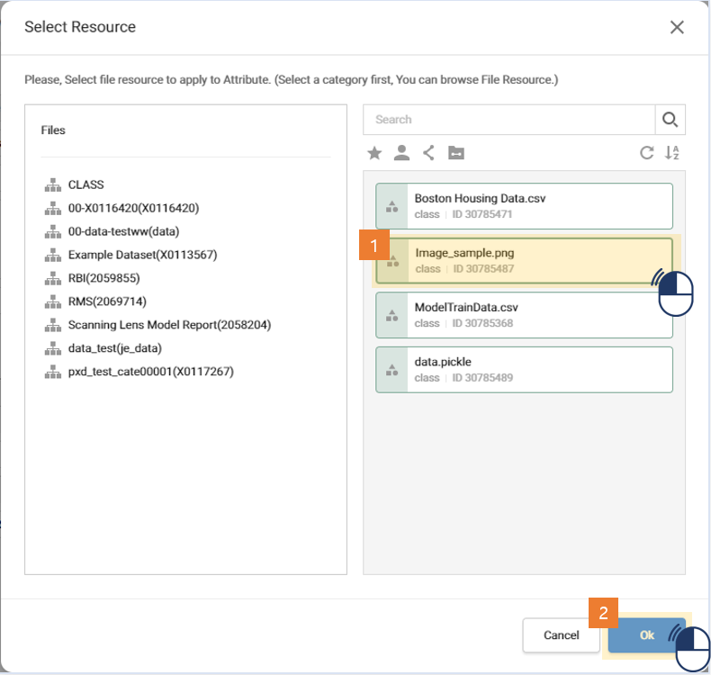
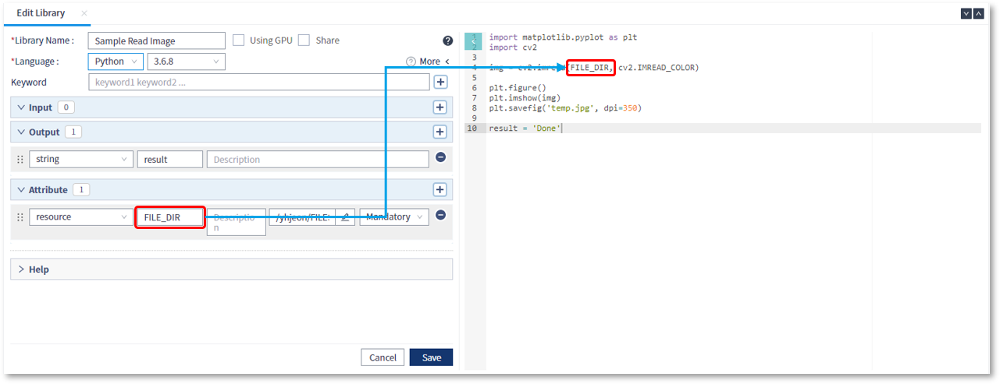
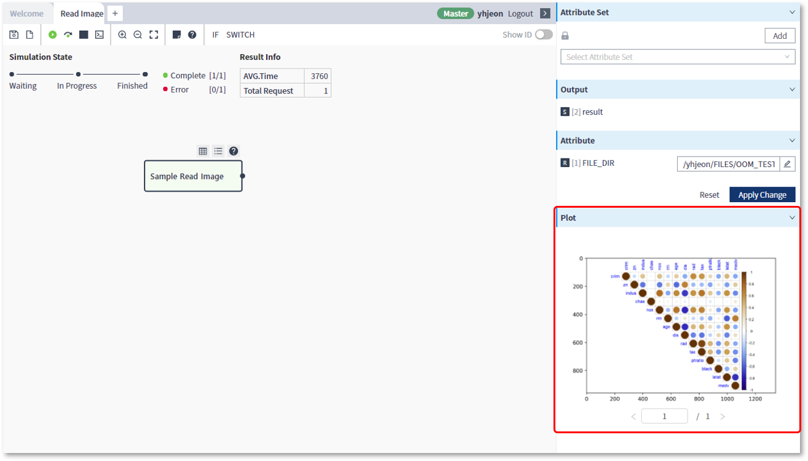
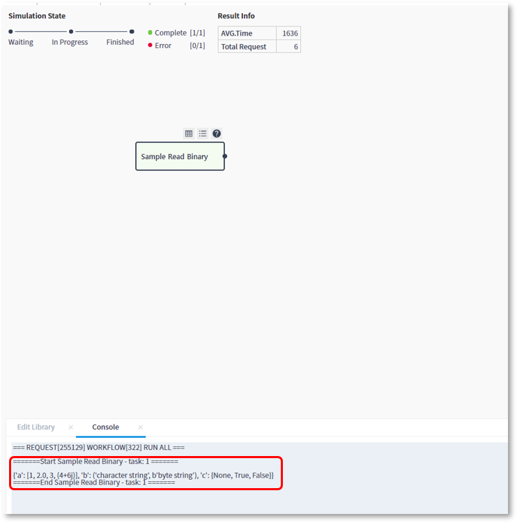

### 작성방법 > 리소스 > 스크립트 내에서 포맷별 리소스 읽기


------

#### 목록

------

1. 리소스 확인
2. Attribute Resource 설정
3. 실제 리소스 읽어오기


------

#### 1. 리소스 확인

BRIQUE Analytics 시스템에 등록된 리소스는, RES 탭의 카테고리 목록을 선택한 뒤, 하단 정보 영역을 통해서 확인할 수 있습니다




------

#### 2. Attribute resource 설정

리소스는 파일 또는 디렉토리의 경로 정보를 가지고 있는 것으로, 라이브러리에서 등록된 리소스를 사용하기 위해서는 resource 타입의 Attribute를 설정해야 합니다


- '+' 버튼을 클릭하여 새로운 Attribute를 추가하고, Attribute Type으로 resource를 선택한 뒤, 이름을 입력합니다

  

  

- Resource Path 부분의 버튼을 클릭하면, 리소스 카테고리의 목록이 담긴 팝업창이 나오고, 카테고리를 선택하면 오른쪽 영역에 카테고리에 포함된 리소스들이 표시됩니다

  

  

- 사용할 리소스를 선택한 후, Select 버튼을 클릭하면 선택된 리소스가 Resource Path에 설정된 것을 확인 할 수 있습니다

  

  

  

  

------

#### 3. 실제 리소스 읽어오기


resource 타입의 Attribute는 파일의 경로를 가지고 있는 변수로써, 이를 이용해서 스크립트 내부에서 파일을 불러오는 것과 동일하게 리소스를 불러와 활용할 수 있습니다


##### CSV 파일

CSV 형태의 파일을 리소스로 사용하는 경우의 예를 살펴보겠습니다


- resource 타입의 Attribute는 경로 값을 가지고 있는 변수이며, 이를 이용해서 스크립트 내부에서 csv파일을 DataFrame으로 읽어 옵니다

  

  

- 리소스로부터 읽어들인 내용을 DataFrame 타입의 출력변수에 설정할 수 있습니다

  

  

- 리소스를 읽어와 출력 변수에 할당하는 라이브러리가 포함된 워크플로우를 실행한 뒤, 해당 라이브러리의 실행결과 보기 아이콘을 클릭하면, 실행 결과가 하단의 정보 영역에 표시되는 것을 확인할 수 있습니다

  


##### 이미지 파일 (jpg, png)

이미지 형태의 파일을 리소스로 사용하는 경우의 예를 살펴보겠습니다


- resource 타입의 Attribute에 이미지 파일을 지정합니다

  

  

- 이미지 경로를 가지고 있는 Attribute를 이용해 이미지를 불러오는 스크립트를 작성합니다

  

  

- 워크플로우 실행 후, 이미지를 표시하고 싶은 경우, Plotting된 이미지를 BRIQUE Analytics에서 인식할 수 있도록 지정된 파일 (temp.jpg)로 저장해야만 합니다

  ```python
  # 이미지 표시 시작
  plt.figure()
  
  # 이미지 Plotting
  plt.imshow(img)
  
  # 이미지 표시를 위한 파일저장
  plt.savefig('temp.jpg', dpi=350)
  ```

  

- 해당 스크립트로 작성된 라이브러리를 포함하는 워크플로우를 실행하면, 실행 완료 후 우측 영역에 Plotting된 이미지가 표시되는 것을 확인 할 수 있습니다

  


##### Binary 파일

바이너리 형태의 파일을 리소스로 사용하는 경우의 예를 살펴보겠습니다


- 바이너리 파일 중 하나인 pickle 형태의 파일을 선택합니다

  

  

- pickle 파일을 읽어오는 스크립트를 작성합니다

  

  

- pickle 파일을 불러오는 스크립트로 작성된 라이브러리를 포함하는 워크플로우를 실행한 뒤, 하단의 정보 영역에 해당 리소스의 내용이 출력된 것을 확인 할 수 있습니다




