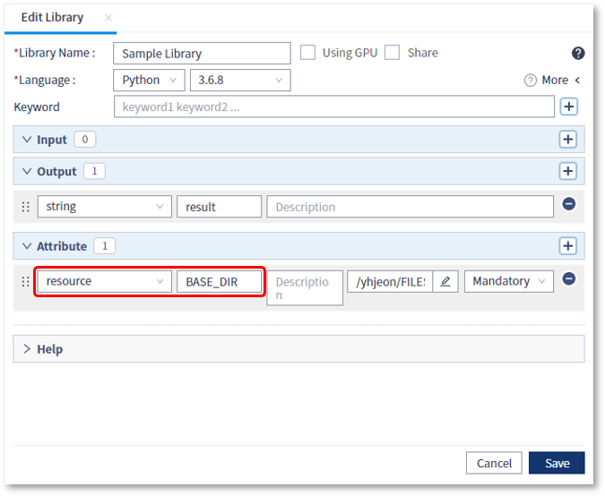
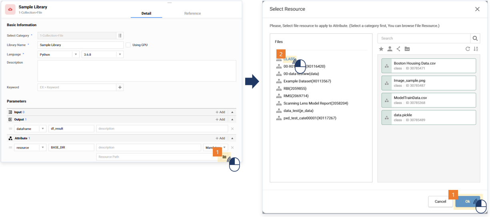
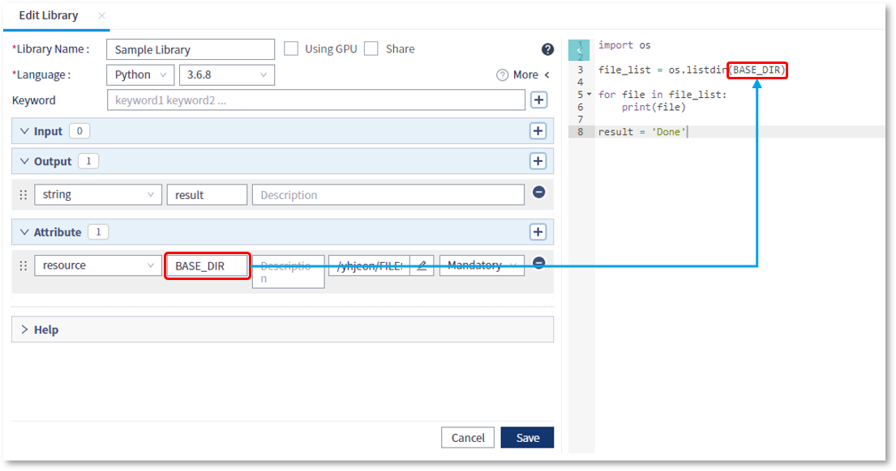

### 작성방법 > 리소스 > 스크립트 내에서 카테고리내의 파일목록 조회

------

#### 목록

------

1. Resource 설정
2. 카테고리 탐색

------

#### 1. Resource 설정

* resource 타입의 Attribute를 추가하고 이름을 지정합니다

  

  

* 리소스의 경로지정을 위해 탐색하고자 하는 카테고리를 선택한 후, Select 버튼을 클릭합니다

  (이때 주의할 점은, 루트 카테고리인 FILES는 선택할 수 없으며, FILES 하단의 사용자 카테고리부터 선택이 가능 합니다)

  

  

------

#### 2. 카테고리 탐색

- Attribute를 이용해 디렉토리를 탐색하는 Script를 작성합니다

  

  

- 해당 스크립트로 작성된 라이브러리를 포함하는 워크플로우를 실행한 결과, Attribute로 설정된 디렉토리 내의 파일 목록이 출력되는 것을 확인할 수 있습니다

  

