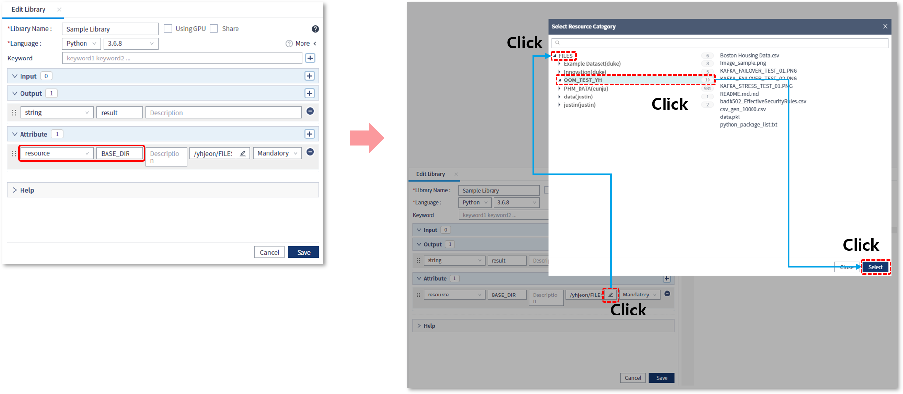
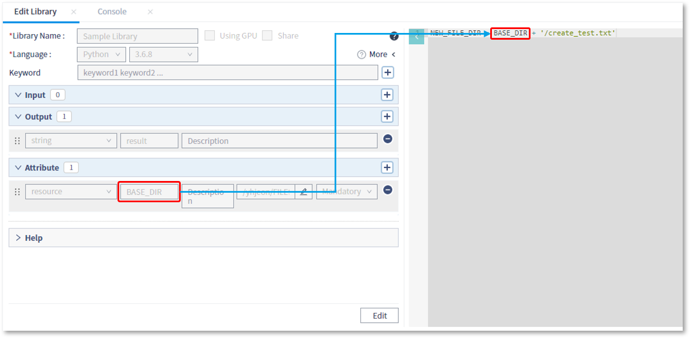
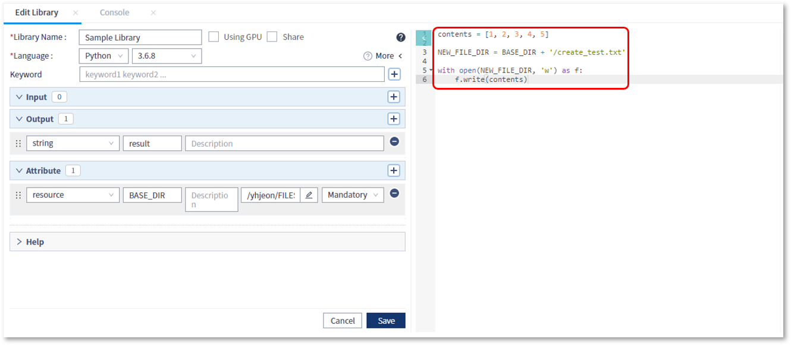
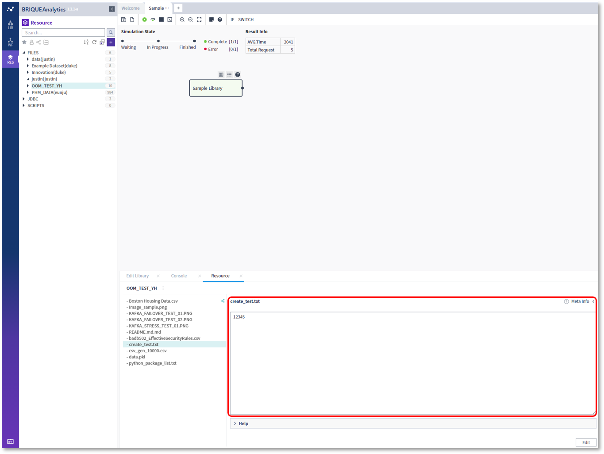
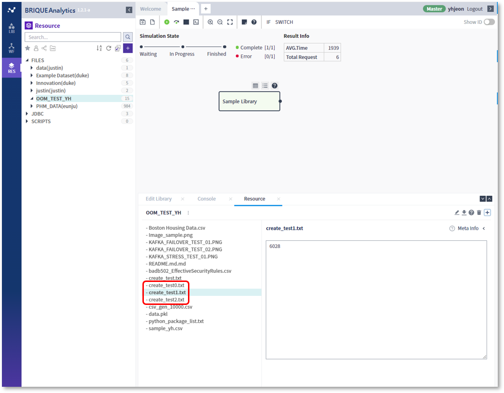

### 작성방법 > 리소스 > 스크립트 내에서 리소스 생성

------

#### 목록

------

1.  Attribute 설정
2. Script 작성
3. Output 지정
4. 주의 사항

------

#### 1. Attribute 설정

워크플로우 실행 결과로 생성된 파일을 리소스로 등록할 수 있으며, 이를 위해서는 resource 타입의 Attribute를 추가하고, 해당 Attribute에 저장될 카테고리를 지정해야 합니다

- resource 타입의 Attribute를 추가하고 카테고리를 지정합니다

  

  

- 추가한 Attribute를 이용하여 파일 경로를 포함하는 변수를 스크립트 내에서 생성합니다

  

------

#### 2. Script작성

* 변수에 설정된 파일 경로로 파일을 쓰기 위한 스크립트를 작성합니다

  

------

#### 3. Output 지정

생성한 파일을 리소스로 등록하여 UI에서 확인하기 위해서는 파일 경로 또는 디렉토리 경로를 Output으로 지정해야 합니다

##### 파일 경로를 Output으로 지정하는 경우

해당 파일에 대해 UI 업데이트가 반영되며,  한 개의 파일을 리소스로 등록할 때 사용할 수 있습니다

- 파일 경로를 가지고 있는 resource 타입의 Output 변수를 추가합니다

  

  

- 해당 라이브러리를 포함하는 워크플로우를 실행하면, RES 탭의 지정된 카테고리에 파일이 생성된 것을 확인 할 수 있습니다

  

##### 디렉토리를 Output으로 지정하는 경우

해당 디렉토리 내부에서 새로 생성된 파일이 있는 경우 UI 업데이트가 반영되며, 다수의 파일을 한번에 등록해야 할 경우에 사용할 수 있습니다

- 파일들이 저장되는 디렉토리 이름을 resource 타입의 Output 변수로 등록합니다

  

  

- 해당 라이브러리를 포함하는 워크플로우를 실행하면, 지정된 카테고리 내부에 리소스가 등록되었음을 확인 할 수 있습니다

  

------

#### 4. 주의 사항

스크립트를 이용해서 리소스를 삭제하는 것은 권장하지 않으며, 스크립트를 이용해서 삭제된 리소스는 UI와 동기화되지 않기때문에 조회 또는 다운로드시 오류가 발생할 수 있습니다

