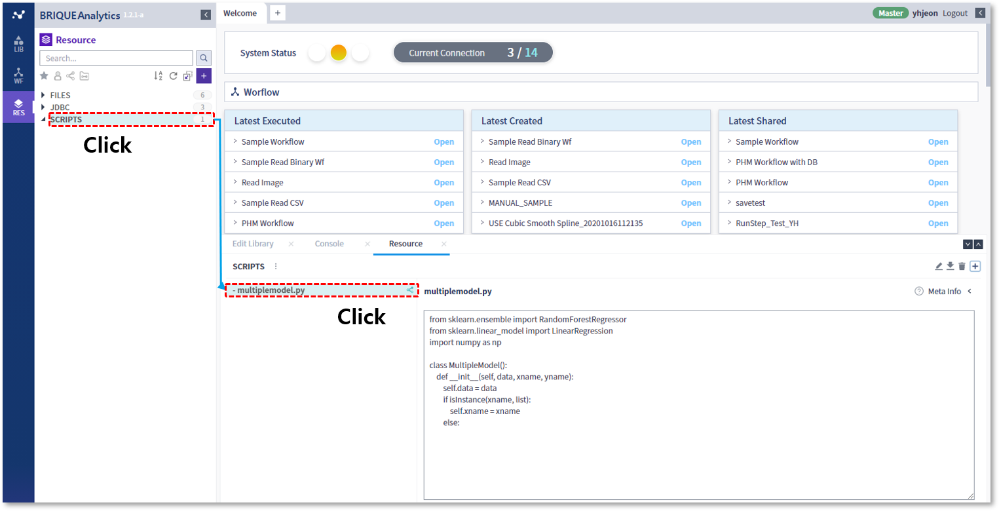

### 작성방법 > 리소스 > 사용자정의 Python 패키지 사용

------

#### 목록

------

1. 패키지 업로드
2. Script작성
3. 주의사항

------

사용자가 직접 적성한 패키지(.py)를 이용하여 라이브러리를 작성할 수 있습니다

#### 1. 패키지 업로드

사용자 패키지의 업로드 기능은 관리자에게만 허용되며, 업로드된 패키지는 RES 탭의 SCRIPTS 카테고리에서 확인이 가능합니다

------

#### 2. Script작성

사용자정의 Python 패키지는 로컬에서 사용하는 것과 마찬가지로 import 구문을 이용하여 패키지를 사용할 수 있습니다

------

#### 3. 주의사항

업로드된 패키지에 수정사항이 있을 시, RES에서 삭제 후 다시 등록해야만 수정된 내용이 반영됩니다

