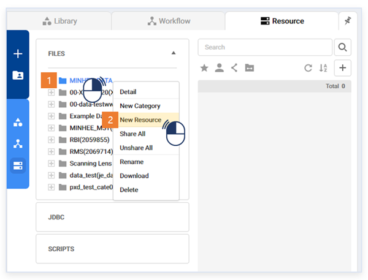
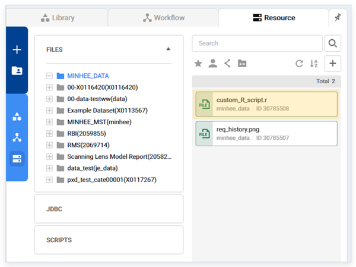
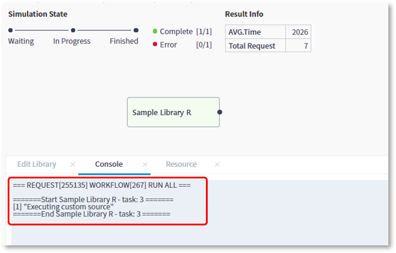

### 작성방법 > 리소스 > 사용자 정의 R 소스 사용

------

#### 목록

------

1. 소스 등록
2. 스크립트 작성

------

사용자가 작성한 R 소스를 라이브러리에서 사용할 수 있습니다

#### 1. 소스 등록

R 소스는 Python의 사용자 패키지와 다르게 직접 리소스에 등록해서 사용할 수 있습니다

- Resource 탭에서 카테고리를 선택한 뒤, 마우스 우측 버튼을 클릭하여 New Resource 메뉴를 선택합니다

  

  

- 사용자 소스인 .r 파일을 등록합니다

  

------

#### 2. Script작성

- Language는 R로 선택하고, 소스 경로를 담을 resource 타입의 Attribute를 추가합니다

  

  

- resource 선택에서 .R 파일을 선택합니다

  

  

- source 명령어를 이용하여 소스를 불러온 후, 로컬에서와 같이 사용합니다

  

  

- 워크플로우 실행 시 사용자 소스도 함께 실행됨을 확인 할 수 있습니다

