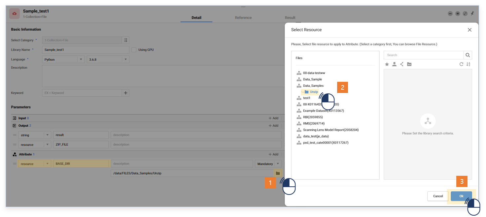
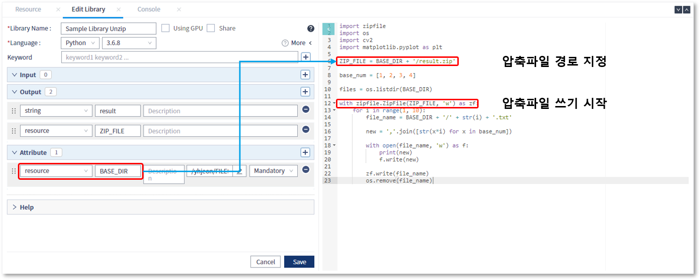
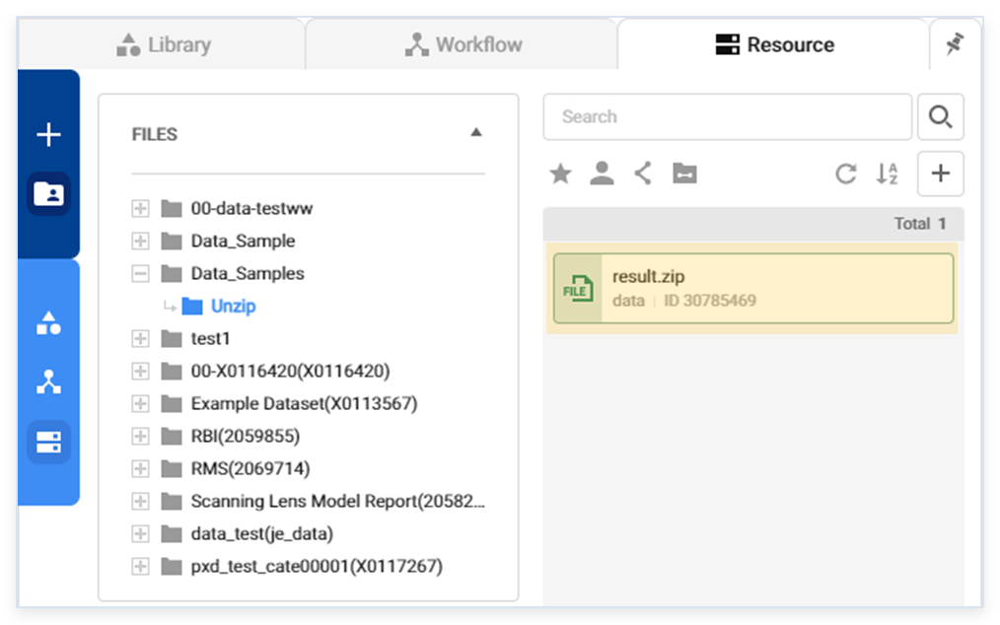

###  작성방법 > 리소스 > Zip 포맷의 리소스 생성

------

#### 목록

------

1. 스크립트 작성
2. 주의 사항

------

워크플로우 실행 시, 결과로 생성되는 다수 건의 파일을 압축하여 하나의 리소스로 업로드 할 수 있습니다

#### 1. Script 작성

- 압축파일을 저장 할 카테고리를 resource 타입의 Attribute로 추가합니다

  

  

- 추가한 Attribute를 이용하여 압축 파일 이름을 생성하고 쓰기를 시작합니다

  

  

- 분석 과정에서 생성하는 파일의 이름을 동적으로 생성하고, 지정된 카테고리에 파일로 씁니다

  

  

- Write한 파일을 열어 놓은 압축 파일에 추가 합니다

  

  

- 압축 파일에 추가된 파일은 리소스 관리 차원에서 삭제하도록 합니다

  

  

- 압축 파일이 위치할 경로를 저장하기 위해, resource 타입의 Output 변수를 추가합니다

  

  

- 실행 결과, 압축파일이 생성되었음을 확인 할 수 있습니다

  

------

#### 2. 주의 사항

압축 파일에 추가된 원본 리소스들은 동일 라이브러리에서 삭제하기를 권장합니다

