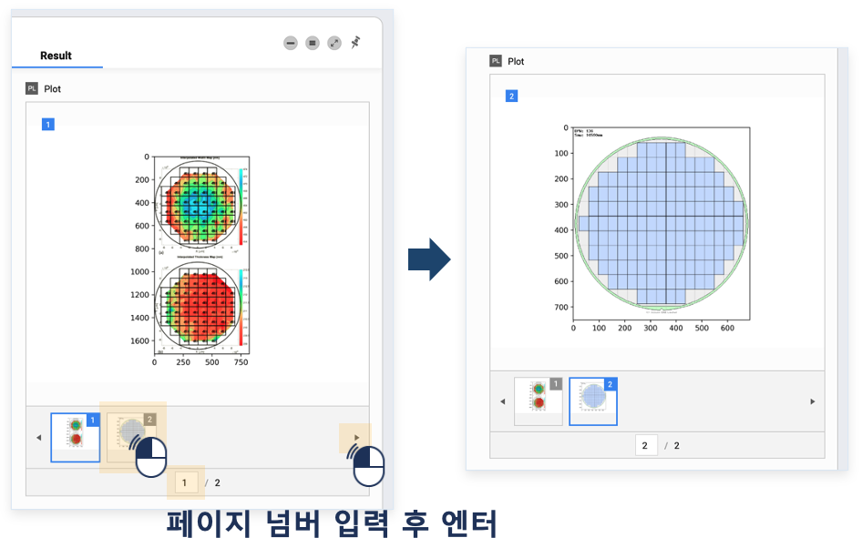

### 작성방법 > 라이브러리 > Plot 생성 라이브러리 작성


------

#### 목록

------

1. Plot 생성하는 스크립트 작성 방법
2. 단일 Plot 생성
3. 다수 Plot 생성


------

스크립트 내에서 생성된 Plot을 워크플로우 실행 결과로 확인 및 활용할 수 있습니다


#### 1. Plot 생성하는 스크립트 작성 방법

```python
# plot 1장의 시작 부분
plt.figure()

# 실제 Plot 작성하는 부분 (사용자가 직접 작성)

# 로컬과 다르게 이 부분은 작성하지 말 것
#plt.show()

# Plot 1장 종료부분, 'temp.jpg'와 dpi를 임의로 변경하지 말 것
plt.savefig('temp.jpg', dpi=350)
```


------

#### 2. 단일 Plot 생성


- csv 파일을 읽어, Plot을 생성하는 스크립트를 작성합니다

  

  

- 워크플로우의 실행이 종료되면 우측에 Plot이 생성되며, 라이브러리의 Result 버튼을 눌러 하단 영역에서 확인이 가능합니다

  

  

- 하단의 Plot 이미지를 클릭하면 큰 창에서 확인 가능합니다

  


#### 2. 다수 Plot 생성


- 반복문을 사용하는 경우, 반복문 내부에서 Plot의 생성시작 및 종료를 선언해야 각각의 Plot이 생성됩니다

  

  

- Plot이 여러개일 경우 하단 썸네일을 클릭하거나 화살표 버튼, 페이지 넘버 입력으로 쉽게 이동하며 확인할 수 있습니다

  

