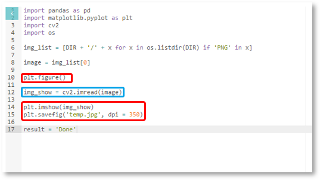
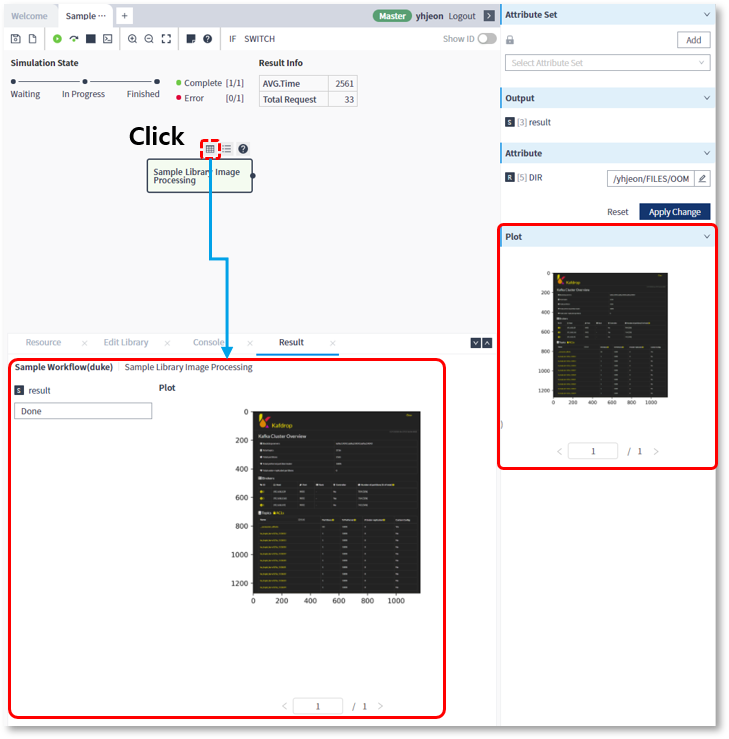
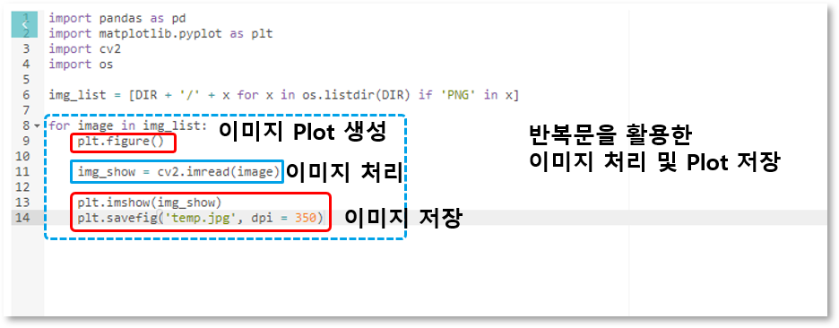

### 작성방법 > 라이브러리 > 이미지 생성 라이브러리 작성

---

#### 목록

---

1. 이미지 생성하는 스크립트 작성 방법
2. 단일 이미지 생성
3. 다중 이미지 생성

---

jpg 또는 png등 리소스의 이미지 파일을 워크플로우의 실행 결과로 확인 할 수 있습니다

#### 1. 이미지 생성하는 스크립트 작성 방법

```python
# 이미지 1장 시작 부분
plt.figure()

# 이미지 처리 및 표현 부분
# image = cv2.imread(file_dir)

# 이미지 1장 종료 부분
plt.imshow(image)

# 수정 없이 그대로 작성 해 주세요
plt.savefig('temp.jpg', dpi=350)
```

---

#### 2. 단일 이미지 생성

- 리소스 카테고리에서 이미지를 읽어, 첫 번째 이미지를 표현하는 스크립트를 작성합니다

  

- 워크플로우의 실행 후 라이브러리를 선택하면 표시되는 Result 버튼을 클릭하면 하단 정보 영역에서 확인이 가능합니다

  

- 이미지를 클릭하면 큰 화면으로 확인이 가능합니다

  

#### 3. 다중 이미지 생성

- 카테고리 내의 이미지 리스트를 읽어온 후, 반복문을 이용하여 한 장씩 이미지를 표현하는 스크립트를 작성합니다

  

- 워크플로우의 실행 후 라이브러리를 선택하면 표시되는 Result 버튼을 클릭하면 하단 정보 영역에서 확인이 가능합니다

  
