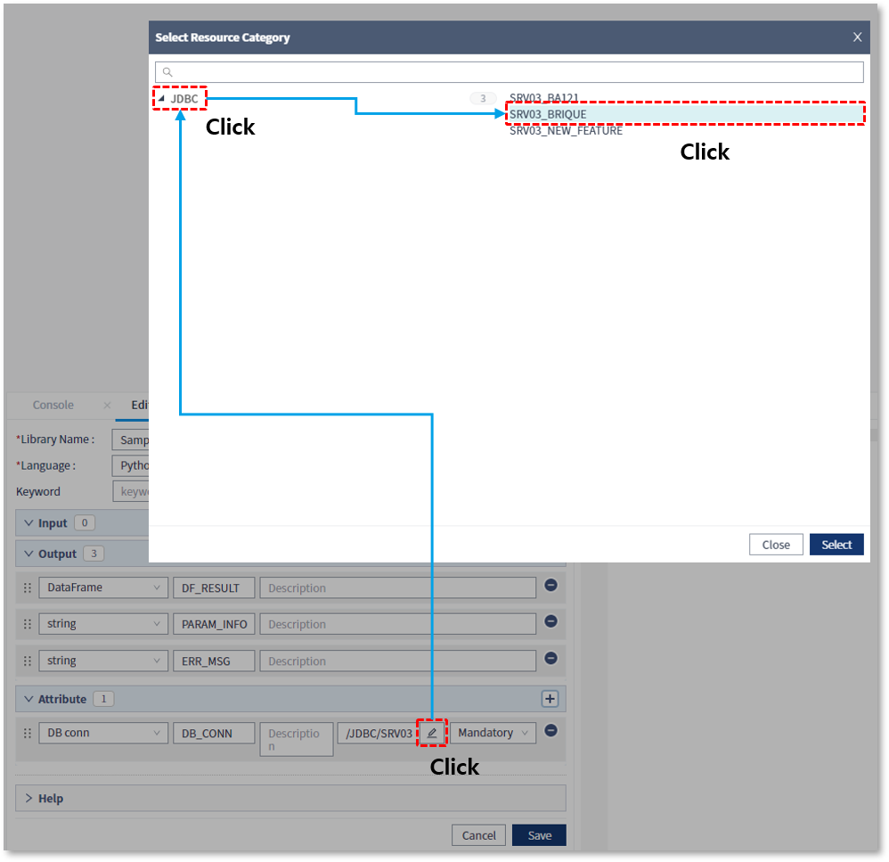
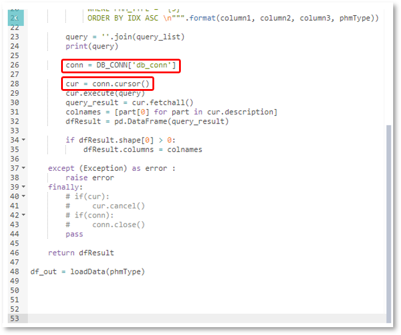

### 작성방법 > 라이브러리 > DB 접속 라이브러리 작성


------

#### 목록

------

1. DB conn Attribute 추가
2. 스크립트 작성


------

Database에 저장된 데이터를 리소스로 활용하는 라이브러리를 작성할 수 있으며, 해당 기능은 관리자에게만 허용되며, 일반 분석가들은 관리자에 의해 작성된 라이브러리를 활용하여 워크플로우를 작성할 수 있습니다


#### 1. DB conn Attribute 추가

- DB 접속을 위해 DB conn 타입의 Attribute를 추가하고 이름을 입력합니다

  

  

- 설정 메뉴를 선택하면 JDBC 카테고리가 나오며, 사전에 등록된 DB 연결 정보 중 사용할 항목을 선택합니다

  


------

#### 2. 스크립트 작성


- DB conn 타입의 속성은 DB연결 정보를 Key / Value 형식의 Map으로 가지고 있으며, 이 중 'db_conn'이라는 Key로 Value를 추출한 뒤, 스크립트에서 사용할 수 있습니다

  ```python
  커넥션 변수 = DB conn 타입의 Attribute 변수명['db_conn']
  ```

  

  

  

- 나머지 쿼리 작성 및 실행은 로컬에서 작성하는 것과 동일합니다


