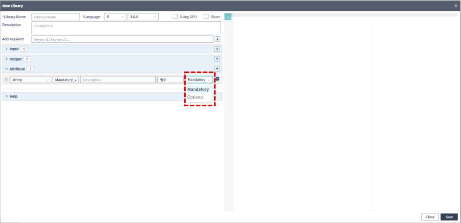

### 작성방법 > 워크플로우

------

#### 목록

------

1. 필수입력 항목 개념
2. 필수입력 항목 작성
3. 워크플로우 활용

------

#### 1. 필수입력 항목 개념

사용자 입력이 가능한 Attribute의 유형은 Optional과 Mandatory로 나뉘며, Mandatory는 라이브러리를 실행하기 위해 필수적으로 값이 필요한 속성입니다

------

#### 2. 필수입력 항목 작성

- 필수입력 항목은 새로운 라이브러리를 작성할 때 확인이 가능하며, 필수입력 항목이기 때문에 Default 값 또한 필수로 입력해야 합니다

  

  

- 기존의 Attribute도 Mandatory 또는 Optional로 변경이 가능합니다

  

------

#### 3. 워크플로우 활용

- 워크플로우 편집영역에서 빈곳을 클릭하면, 우측 속성 영역에 워크플로우의 실행을 위해 필수로 입력되어야 하는 Mandatory 종류의 속성들만 표시되며, 필요시 내용을 수정하고 Apply Change 버튼을 클릭하면, 수정된 값으로 워크플로우를 실행할 수 있습니다

  

  

- 각 Library를 선택해서 Mandatory 항목을 확인할 수도 있습니다

  

