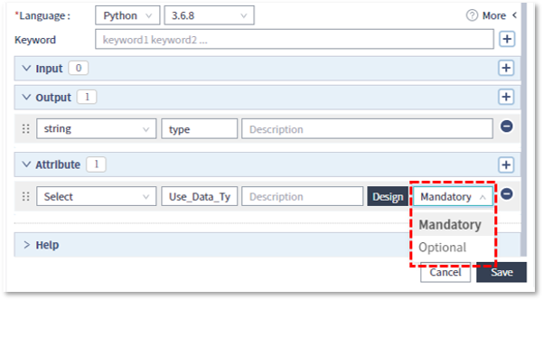
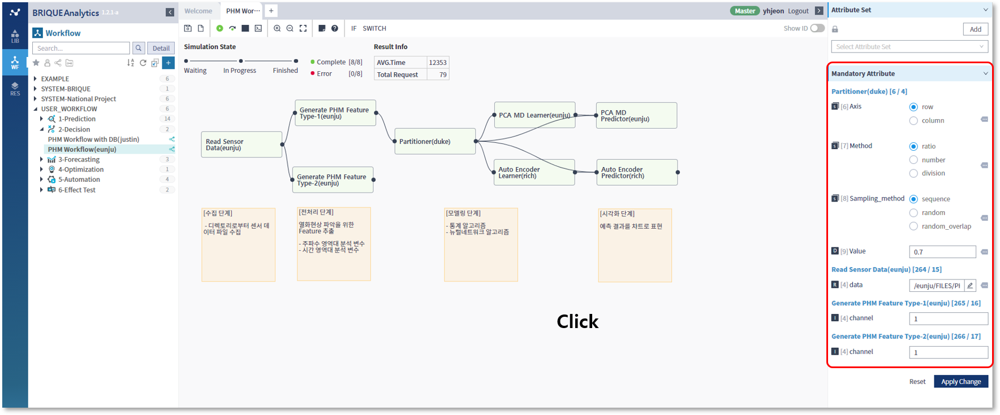

### 작성방법 > 워크플로우 > 워크플로우 테스트를 위한 필수입력항목

------

#### 목록

------

1. 필수입력 항목 개념
2. 필수입력 항목 작성
3. 워크플로우 활용

------

#### 1. 필수입력 항목 개념

사용자 입력이 가능한 Attribute의 유형은 Optional과 Mandatory로 나뉘며, Mandatory는 라이브러리를 실행하기 위해 필수적으로 값이 필요한 속성입니다

------

#### 2. 필수입력 항목 작성

- 필수입력 항목은 새로운 라이브러리를 작성할 때 확인이 가능하며, 필수입력 항목이기 때문에 Default 값 또한 필수로 입력해야 합니다

  

  

- 기존의 Attribute도 Mandatory 또는 Optional로 변경이 가능합니다

  

------

#### 3. 워크플로우 활용

- 편집영역 상단 ToolBar에서 Parameter아이콘 클릭 및 우측영역 Parameter탭 클릭으로 속성창을 오픈할 수 있습니다

  

  

- Parameter탭의 All, Attribute, Mandatory 옵션 선택으로 보고싶은 항목만 필터링하여 확인할 수도 있습니다

  * All
    각 라이브러리의 Input, Output, Attribute(Mandatory and Optional) 항목 모두를 확인할 수 있습니다

    

  * Attribute
    Attribute(Mandatory) 와 Optional 항목을 확인할 수 있습니다

    

  * Mandatory
    워크플로우를 실행하는데 필수적으로 값이 필요한 Mandatory항목만 확인할 수 있습니다

    

- 편집영역에서 라이브러리를 클릭하면 우측 Parameter탭의 해당 라이브러리 항목이 오픈되어 항목을 손쉽게 찾아볼 수 있습니다

  

- 마찬가지로 우측 Parameter탭에서 라이브러리 이름 영역 클릭 시, 편집영역에서 해당 라이브러리가 선택됩니다

  

- 필요시 내용을 수정하고 하단의 Apply Change 버튼을 클릭하여 수정된 값으로 워크플로우를 실행할 수 있습니다

  

- 수정된 내용을 되돌리고 싶을 경우 하단의 리셋 버튼을 클릭하여 값을 원복할 수 있습니다

  
