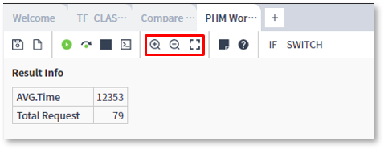
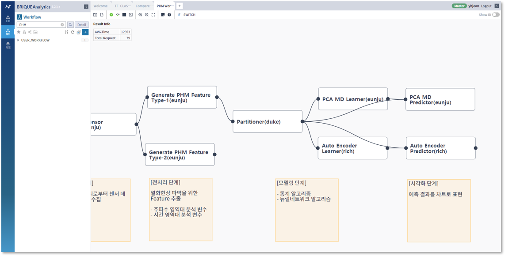
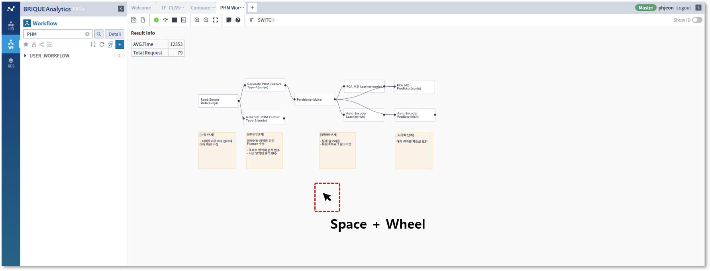
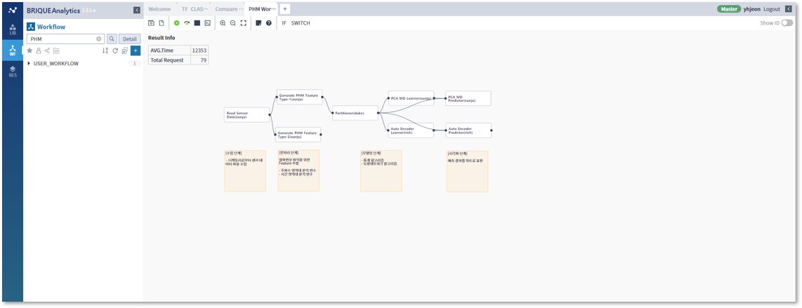
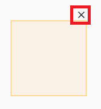

### 작성방법 > 워크플로우 > 워크플로우 편집기능활용

---

#### 목록

---

1. 작업 화면 이동
2. 미니맵 보이기 / 숨기기
3. Zoom In / Zoom Out / Zoom Fit
4. 메모 삽입
5. 라이브러리 그룹화

---

#### 1. 작업 화면 이동

워크플로우를 작성하다보면 작업화면에서 라이브러리를 넣을 공간이 없거나, 혹은 넣어놓은 라이브러리를 찾아야하는 경우가 있는데, 작업 화면을 이동시켜 공간을 확보할 수 있습니다

- 현재 보이는 편집 영역에서 이동 (Space key + Mouse Drag)

  

- 미니맵에서 이동

  **이동하고자 하는 영역 클릭**

  

  **현재 영역을 드래그로 이동**

  

---

#### 2. 미니맵 보이기 / 숨기기

Toolbar 영역에서 Minimap 아이콘을 클릭하면 미니맵을 보여주거나 숨길 수 있습니다

---

#### 3. Zoom In / Zoom Out / Zoom Fit

워크플로우를 작성하면서, 이동 외에 전체 모습을 보거나 일부분만을 확대하여 보고싶을 때 Space key + Mouse Wheel을 사용하면 Zoom In과 Zoom Out이 가능합니다

---

#### 4. 메모 삽입

- 메모 기능을 사용하여 Workflow 편집영역에 주석 또는 참고할 만한 내용을 삽입하여 활용할 수 있습니다

  

- 메모를 이동할 수 있습니다

  

- 메모 영역 크기를 조절할 수 있습니다

  

- 메모창 우측 상단의 X 버튼을 클릭하면, 메모가 삭제됩니다

  

---

#### 5. 라이브러리 그룹화

라이브러리를 그룹화해서 성격 별로 묶거나 라이브러리 동시 이동을 보다 쉽게 할 수 있습니다

- 그룹 생성

  라이브러리를 두 개 이상 선택했을 때 그룹 생성이 가능합니다

  

  

  

- 그룹 이름 변경

  그룹 이름을 더블 클릭하면 그룹 이름을 변경할 수 있습니다

  

- 그룹 해제

  컨텍스트 메뉴에서 Ungroup하거나 라이브러리가 삭제되어 그룹 내에 라이브러리가 하나만 남게 되는 경우 그룹이 해제됩니다

  
