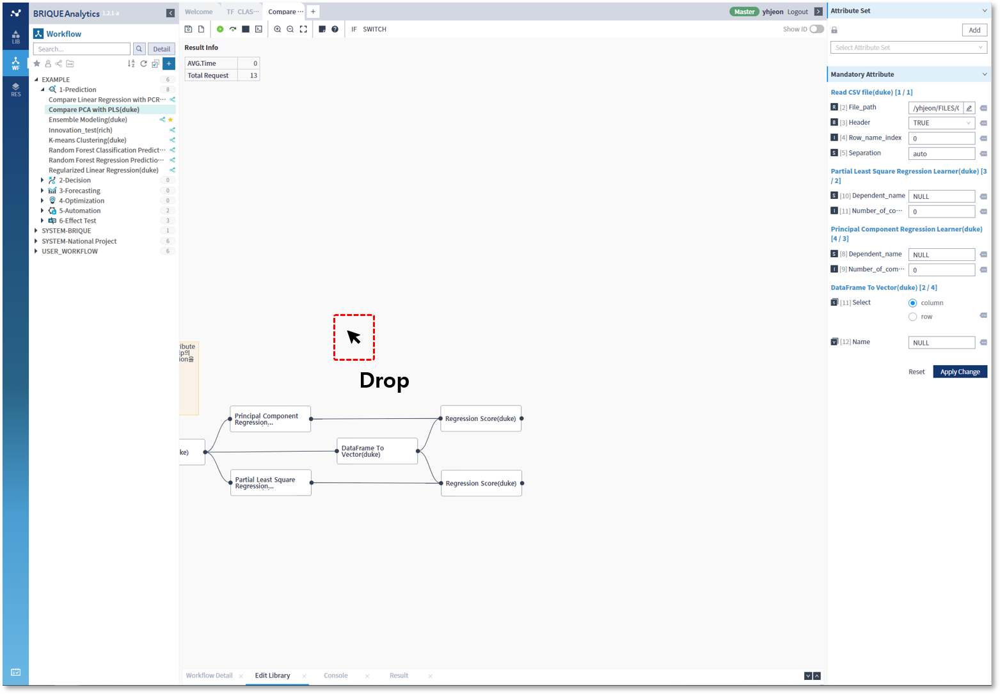

### 작성방법 > 워크플로우

------

#### 목록

------

1. 작업 화면 이동
2. Zoom In / Zoom Out / Zoom Fit
3. 메모 삽입

------

#### 1. 작업 화면 이동

워크플로우를 작성하다보면 작업화면에서 라이브러리를 넣을 공간이 없거나, 혹은 넣어놓은 라이브러리를 찾아야하는 경우가 있는데, 이 때는 Space key +  Mouse Drag를 활용하여 작업 화면을 이동하면서 찾아볼 수 있습니다

------

#### 2. Zoom In / Zoom Out / Zoom Fit

워크플로우를 작성하면서, 이동 외에 전체 모습을 보거나 일부분만을 확대하여 보고싶을 때 Space key +  Mouse Wheel을 사용하면 Zoom In과 Zoom Out이 가능합니다

- Tool Bar에 위치한 아이콘을 이용해서 Zoom In / Zoom Out / Zoom Fit 기능을 사용할 수 있습니다

  

  

- 작업 화면 이동과 마찬가지로 Space key +  Mouse Wheel을 사용하면 Zoom In과 Zoom Out이 가능합니다

  

  

- Zoom In (Space key +  Mouse Wheel Up)

  

  

- Zoom Out (Space key +  Mouse Wheel Down)

  

------

#### 3. 메모 삽입

- 메모 기능을 사용하여 Workflow 편집영역에 주석 또는 참고할 만한 내용을 삽입하여 활용할 수 있습니다

- 메모창 우측 상단의 X 버튼을 클릭하면, 메모가 삭제됩니다

  

