### 작성방법 > 워크플로우 > 워크플로우 IF문 사용

------

#### 목록

------

1. IF문 기본개념

2. IF 사용방법 

   1. IF 신규 생성
   2. 다른 라이브러리와 IF의 연결
   3. 결과 확인

3. 주의사항

4. 활용예시

   

------

#### 1. IF문 기본개념

- 특정 라이브러리의 Output에 따라 워크플로우의 진행을 분기할 수 있는 워크플로우의 기능입니다

- IF문 앞 라이브러리의 Output을 Input으로 받아 평가합니다

- IF에서는 새로운 Output을 생성할 수 없고 앞에서 받은 Input을 조건의 결과(True / False)에 따라 다음 라이브러리의 Input으로 넘길 수 있습니다

  

------

#### 2. IF 사용방법 

1. **IF 신규 생성**

   * IF를 드래그하여 삽입할 곳에 끌어넣습니다.

     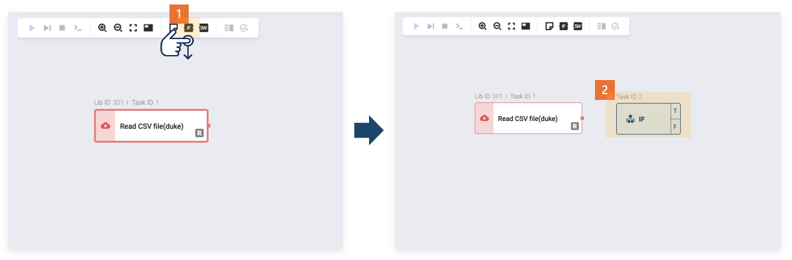

   * 편집창 내의 IF를 클릭하면 하단에 조건 편집창이 생성됩니다. Edit 버튼을 클릭하여 조건 편집창을 활성화 할 수 있습니다. 

     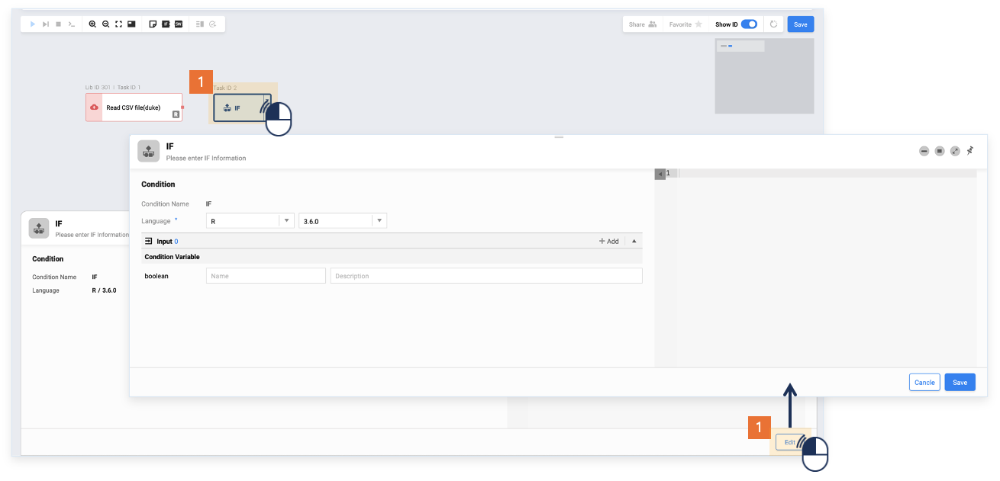

   * Input과 Condition Variable을 선언하고 스크립트를 작성합니다.예제에서는 DataFrame의 row 개수에 대한 조건절을 작성했습니다.

     * Input : 앞에서 연결되는 라이브러리의 Output중 조건절로 판단할 Output과 같은 변수 타입으로 선언합니다. 
     * Condition Variable : IF 실행의 결과로 True 또는 False 값이 담길 변수명입니다.

     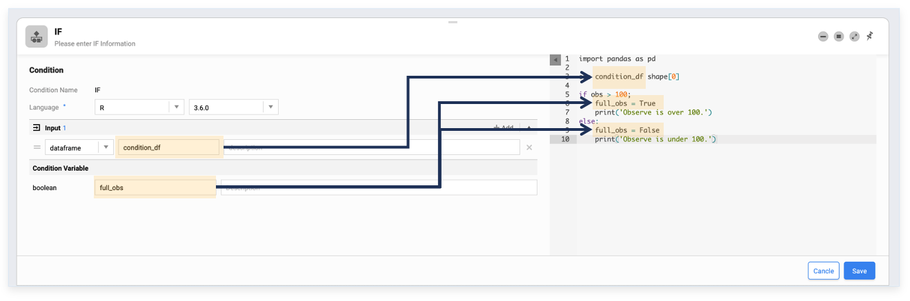

   * Save 버튼을 클릭하면 IF에 연결점이 생기는 것을 확인할 수 있습니다.

     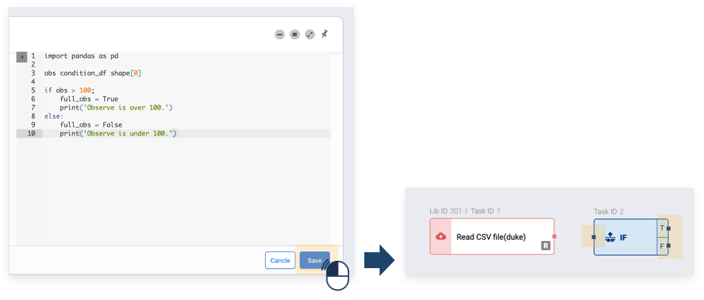

   * IF는 라이브러리가 아닌 워크플로우 기능이기 때문에 반드시 워크플로우 저장을 해 주셔야 IF의 수정사항이 저장이 됩니다.

     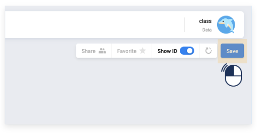

   

2. **다른 라이브러리와 IF의 연결**

   * IF 이전 라이브러리의 Output부분을 클릭하여 IF노드로 드래그하여 하단의 Connection Nodes에서 같은 타입의 데이터를 연결 해 줍니다.

     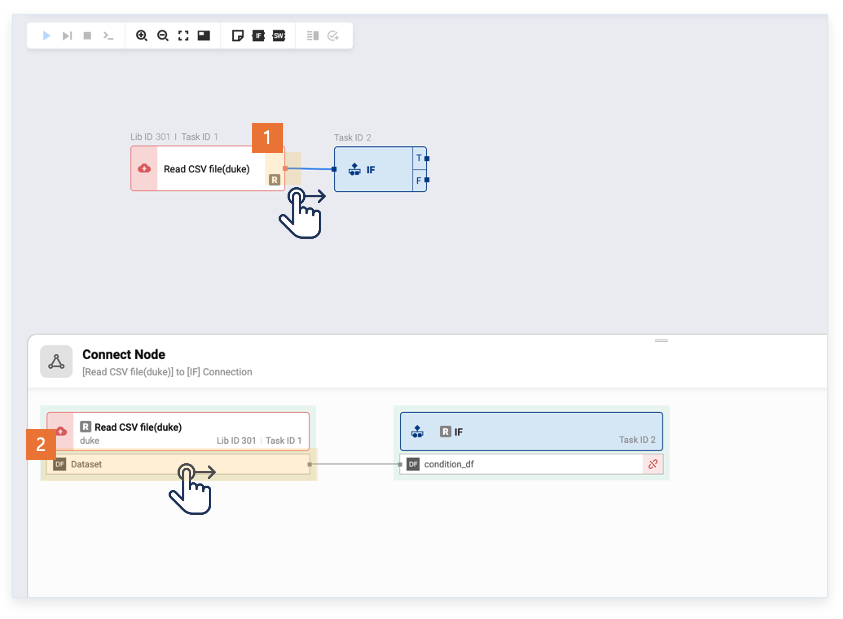

   * 예제에서는 조건절이 True일 때와 False일 때 다른 라이브러리가 실행되도록 하겠습니다. IF 이후 실행될 라이브러리를 삽입합니다.

     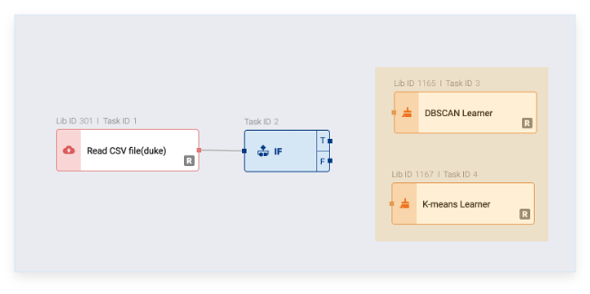

   * True일 경우 실행할 라이브러리로 IF의 Output을 연결해 줍니다.

     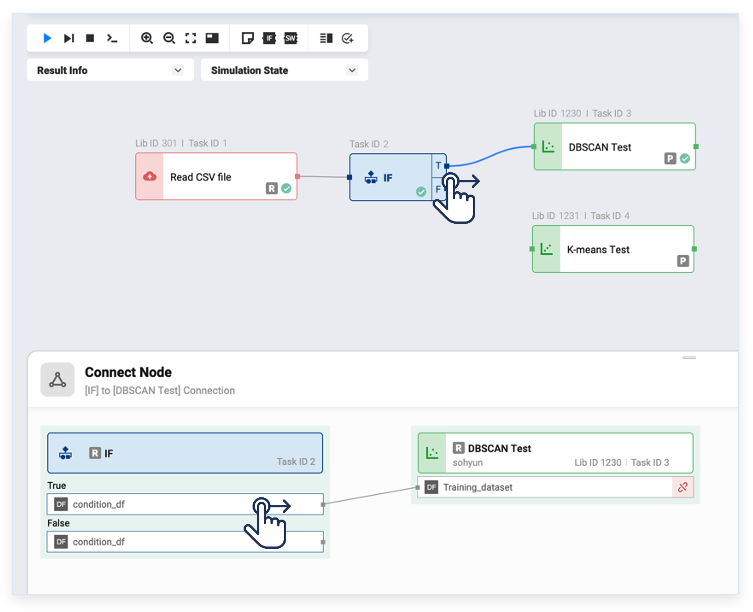

   * False일 경우 실행할 라이브러리로 IF의 Output을 연결해 줍니다. 

     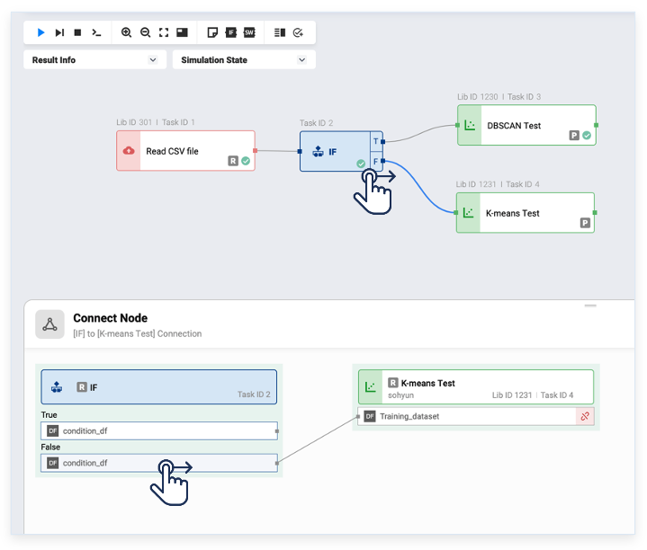

   * 워크플로우 저장 후 실행할 수 있습니다.

     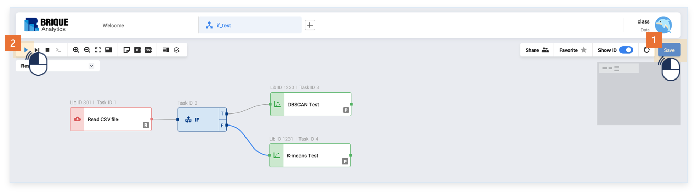

   

3. **결과 확인**

   * IF의 result를 클릭하면 Condition Variable의 이름과 결과값을 확인할 수 있습니다.

     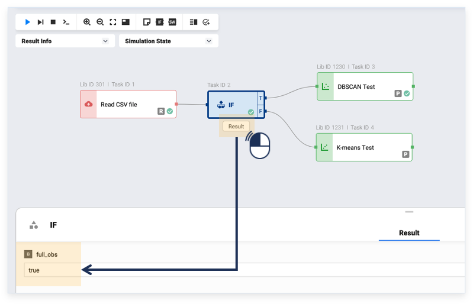

   * Request History : 워크플로우 목록에서 마우스 오른쪽 클릭으로 Request History에서 실행 기록을 클릭합니다. IF 및 각 라이브러리의 Output을 확인할 수 있습니다. (Output 확인 가능 기간: 1일)

     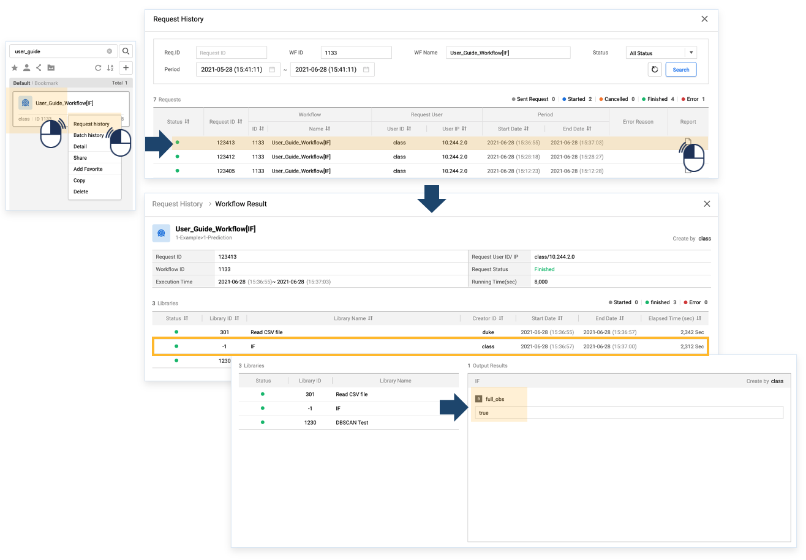

   * Report: Request History에서 실행 기록의 오른쪽 끝의 report를 클릭하면 해당 실행의 Input/Output/Attribute 설정값이 있는 Report를 확인할 수 있습니다. (Input/Output 확인 가능 기간: 1일)

     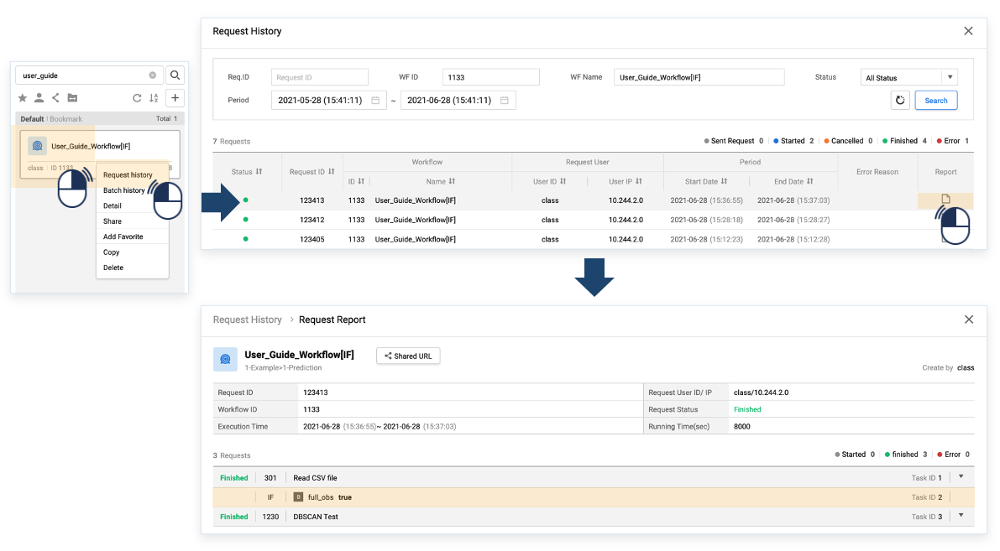

------

#### 3.주의사항

- IF문은 워크플로우의 기능이기 때문에 수정 사항이 있을 시 <u>워크플로우 저장</u>을 반드시 해 주셔야 합니다. 하단 Edit Condition의 Save만 클릭해도 워크플로우에 반영이 되지 않기때문에 1번 클릭 후, 2번 클릭까지 해 주신 후 실행하셔야 수정된 IF문이 적용이 됩니다.

  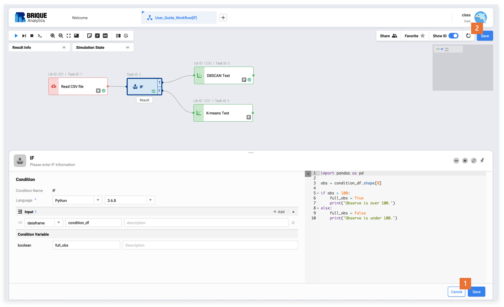

------

#### 4. 활용예시

* 데이터의 형태에 따라 다른 알고리즘을 적용시키거나, 데이터가 없을 시 별도 예외처리 없이 워크플로우를 종료하도록 작성할 수 있습니다.

  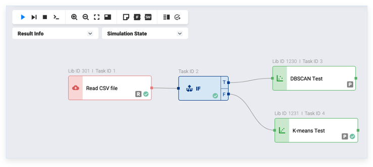