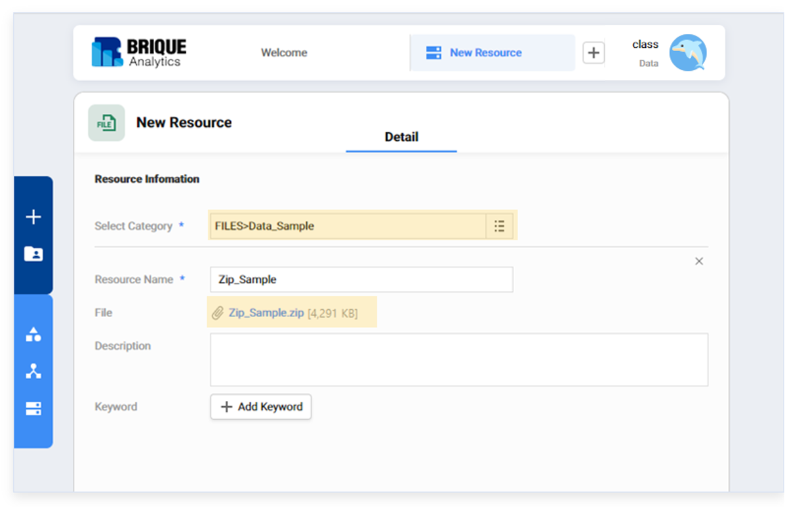
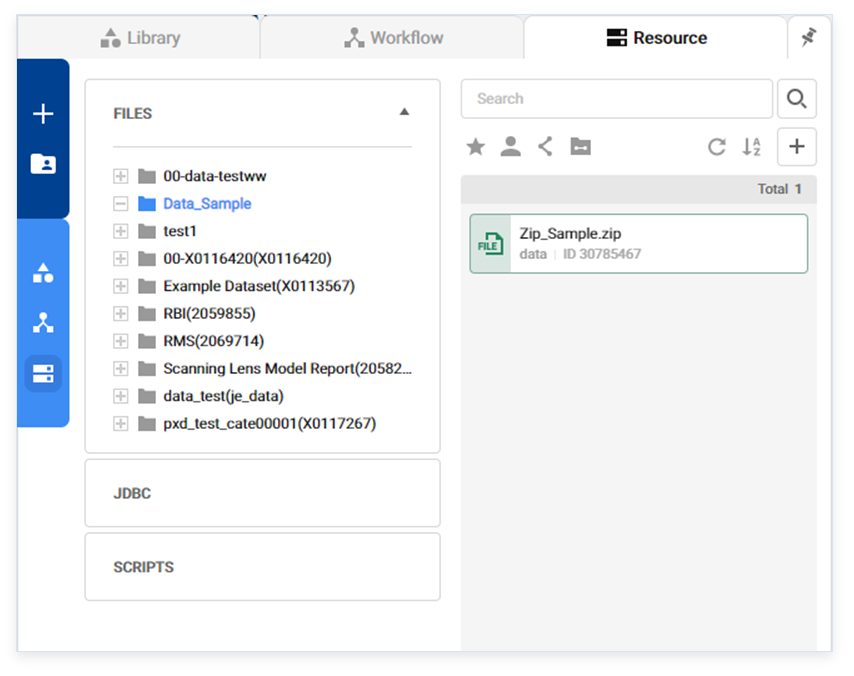
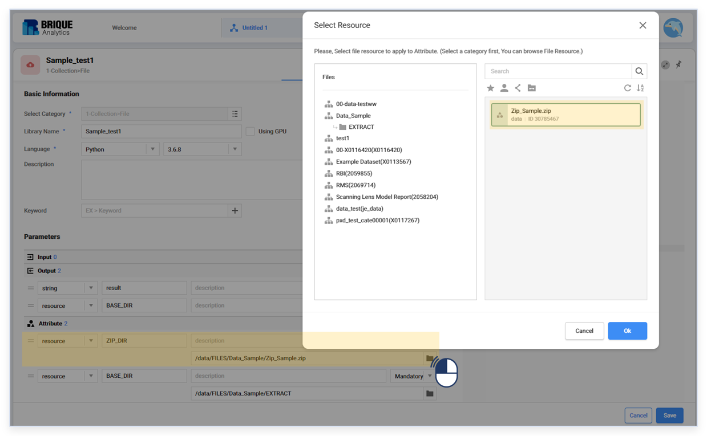
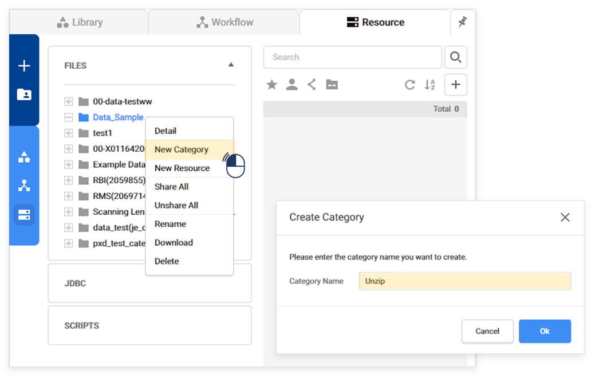
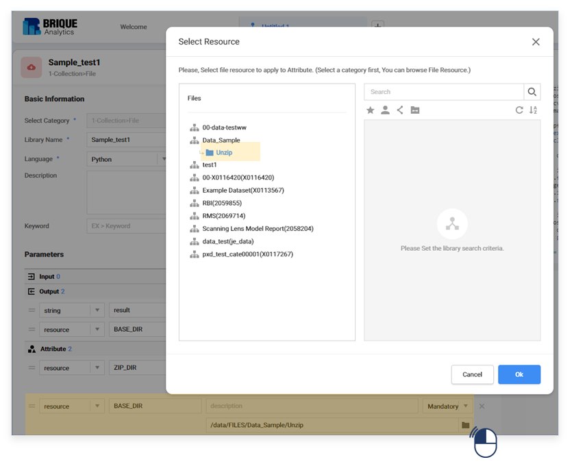
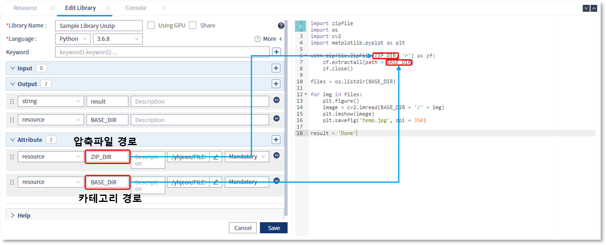
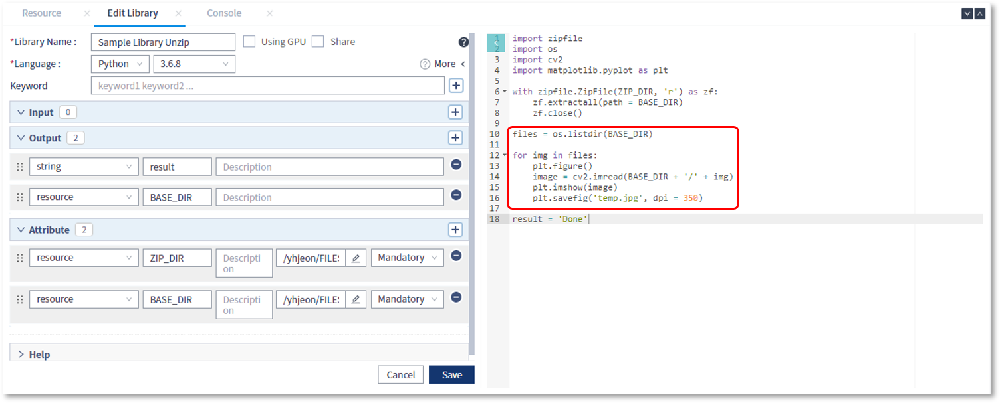
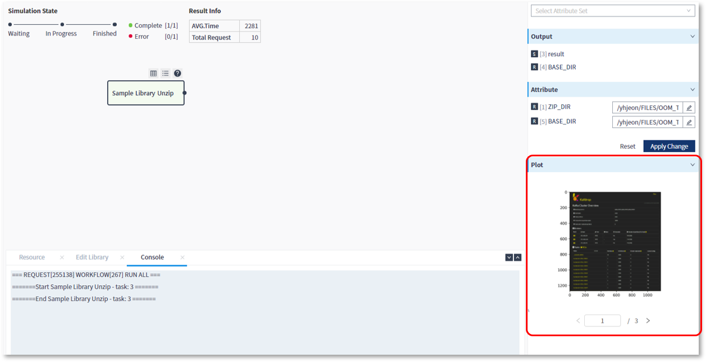

### 작성방법 > 리소스 > Zip 포맷의 리소스 사용

------

#### 목록

------

1. Zip 파일 등록
2. 스크립트 작성
3. 주의 사항

------

다수 건의 파일을 일일히 리소스로 올리지 않고, 하나의 압축(Zip)파일로 올린 뒤, 라이브러리에서 활용할 수 있습니다

#### 1. Zip 파일 등록

- RES 탭에서 New Resource 버튼(+)을 선택합니다

  

  

- Zip파일을 리소스로 등록할 카테고리를 선택한 후, Zip 파일을 리소스로 등록합니다

  

------

#### 2. 스크립트 작성

- 등록된 Zip파일 경로를 resource 타입의 Attribute로 추가합니다

  

  

- 압축 해제를 위한 카테고리를 생성하고, resource 타입의 Attribute로 추가합니다

  

  

  

  

- Attribute로 추가한 파일 경로와 디렉토리 경로를 이용하여, Zip 파일의 압축을 푸는 스크립트를 작성합니다

  

  

- 압축을 푼 파일을 이용하여 실제 작업을 하는 스크립트도 작성합니다

  

  

- 워크플로우 실행 시, 압축을 푼 파일로 작업한 내용을 확인할 수 있습니다

  

------

#### 3. 주의 사항

스크립트를 이용해 Unzip으로 생성된 파일은 리소스 관리 차원에서 사용 후, 삭제할 것을 권장합니다

- 파일을 삭제하는 스크립트를 작성합니다

  

  

- 실행 결과 파일이 삭제되었음을 확인 할 수 있습니다

  

