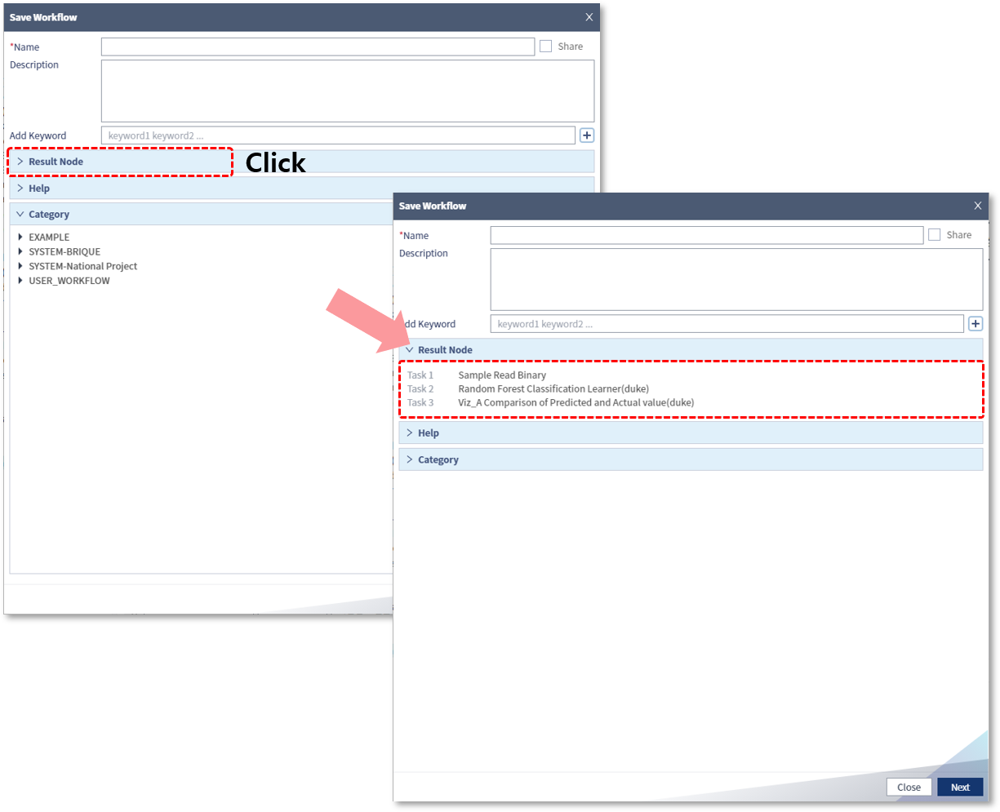
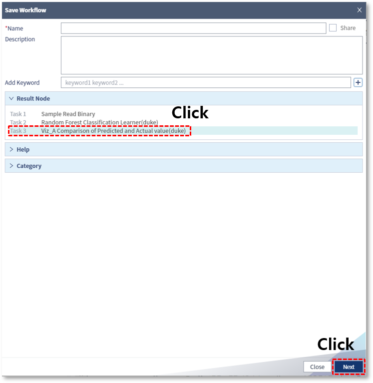
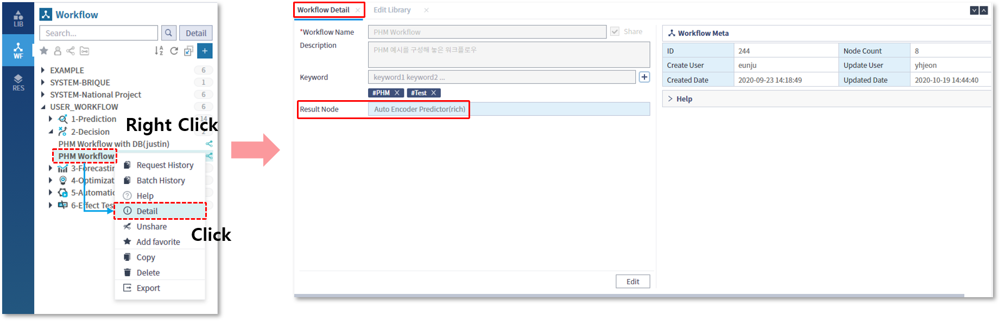
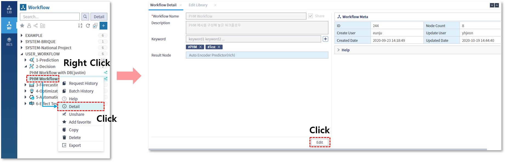
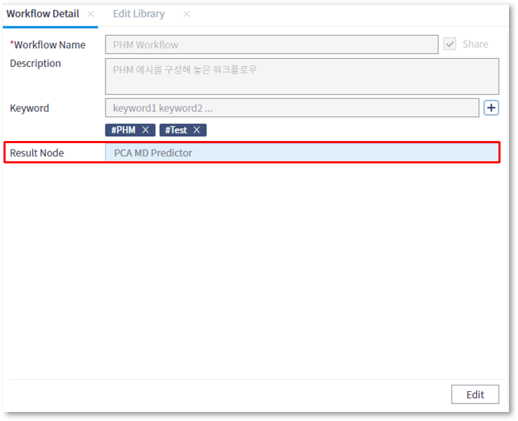
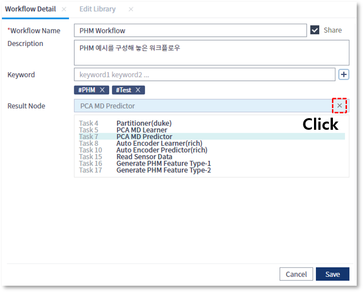
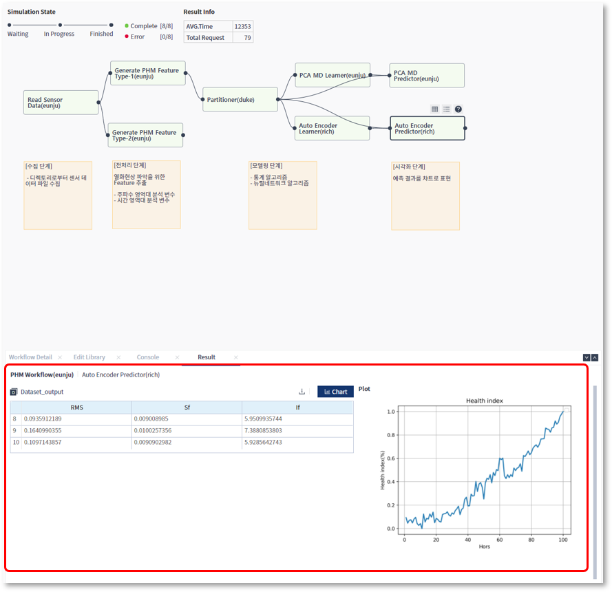
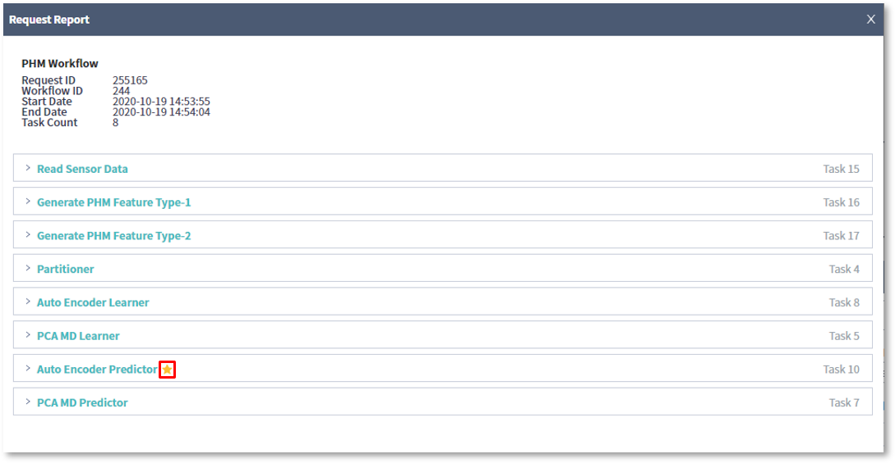
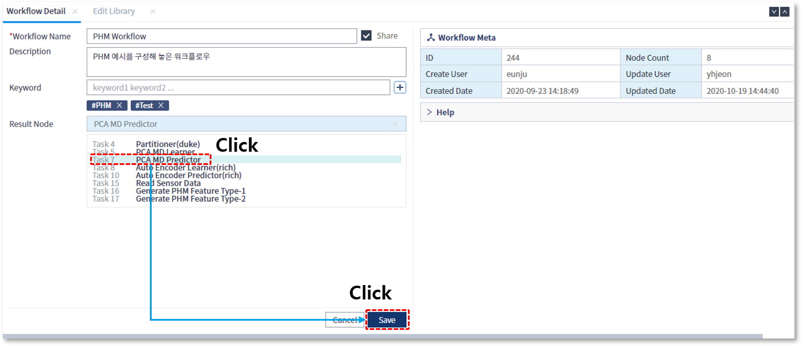

### 작성방법 > 워크플로우 > 워크플로우 작성시 결과노드 지정

------

#### 목록

------

1. 결과노드 개념
2. 결과노드 지정 방법
3. 결과노드 활용

------

#### 1. 결과노드 개념

워크플로우를 실행하고 난 뒤, 워크플로우를 구성하고 있는 각각의 라이브러리들을 선택하여 결과를 확인할 수도 있지만, 최종적인 결과를 포함하는 라이브러리의 결과만을 즉시 확인하고 싶은 경우 사용되는 기능입니다

워크플로우를 구성하는 라이브러리들 중 하나를 선택하여 결과노드로 지정하면, 워크플로우의 실행이 왼료된 직후, 해당 라이브러리의 실행결과가 하단 정보영역에 표시됩니다

------

#### 2. 결과노드 지정 방법

##### 워크플로우 생성 시 결과 노드를 지정하는 경우

- 워크플로우 저장 시, Result Node를 클릭하면 해당 워크플로우에 포함된 전체 라이브러리 목록이 펼쳐집니다

  

  

- 라이브러리 목록에서 결과노드로 지정할 라이브러리를 선택합니다

  

   

- 지정된 결과노드는 워크플로우의 Detail 메뉴를 선택하여 표시되는 하단의 정보 영역에서 확인할 수 있습니다

  
  

  

##### 워크플로우가 생성된 이후, 결과 노드를 지정 및 변경하는 경우

- 결과 노드를 지정할 워크플로우의 Detail 정보 창에서, Edit 버튼을 클릭합니다

  

  

- 구성하고 있는 라이브러리 목록 중 결과 노드로 지정할 라이브러리를 선택한 뒤 저장합니다
- 워크플로우 상세 정보를 통해 결과 노드가 지정된 것을 확인 할 수 있습니다

  
  

- 결과노드로 지정된 것을 삭제하기 위해서는, Result Node 영역의 우측 상단에 위치한 X 버튼을 클릭후 저장합니다

  

------

#### 2. 결과노드 활용

- 결과 노드로 지정된 라이브러리는 다음과 같이 표현됩니다
  

- 워크플로우의 실행이 완료되면 하단 정보 영역에 결과 노드의 실행 결과가 바로 출력됩니다

  

  

- Request Report에서는 결과노드로 지정된 라이브러리 이름 옆에 별도의 아이콘이 표시되어 해당 워크플로우의 결과노드로 지정된 라이브러리 임을 확인할 수 있습니다

  

