### 기능활용 > 검색

------

#### 목록

------

1. 워크플로우 상세검색 개념
2. 워크플로우 상세검색 방법

------

#### 1. 워크플로우 상세검색 개념

상세한 조건으로 워크플로우를 검색하고자 할 때 사용하는 기능으로써, 워크플로우 ID, 이름, 생성자, 또는 키워드를 이용한 세부적인 검색이 가능하도록 합니다

------

#### 2. 워크플로우 상세검색 방법

- 워크플로우 기본 검색 옆에 Detail 버튼을 클릭합니다

  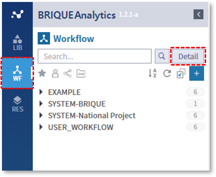

  

- 버튼을 클릭하면, 상세검색 페이지가 열립니다

  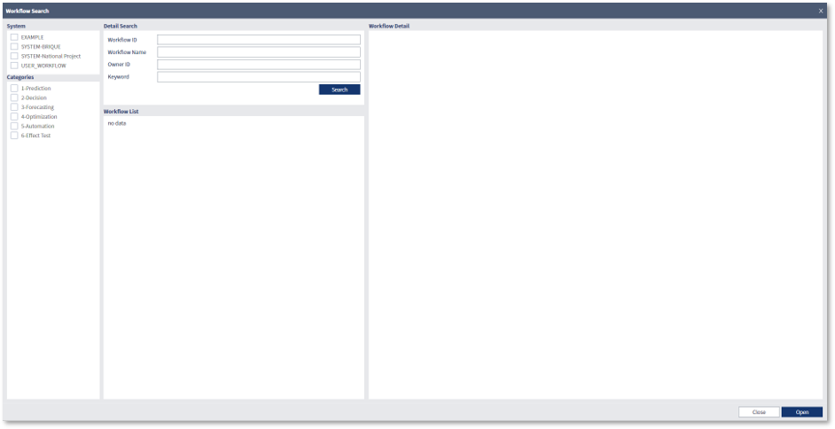

  

- 검색하고자 하는 시스템과 카테고리를 선택한 뒤, Search 버튼을 클릭하거나, 상세 검색 영역에서 워크플로우 ID, 워크플로우 이름, 생성자 또는 키워드를 입력한 뒤, Search 버튼을 클릭하여 검색 할 수 있습니다

  

- System / Categories

  관리자에 의해 생성된 기본 카테고리입니다

  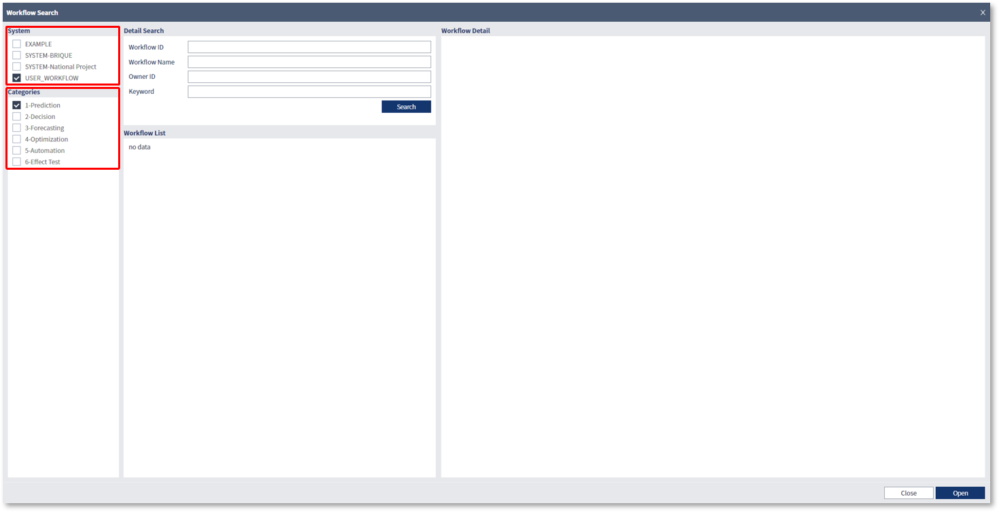

  

- Workflow ID

  시스템에 의해 자동으로 생성되는 숫자 형태의 고유한 ID로써, 사용자가 변경이 불가능 하며, ID 같은 경우는 워크플로우의 고유한 값으로, 검색 시 한 개의 결과만 조회됩니다

  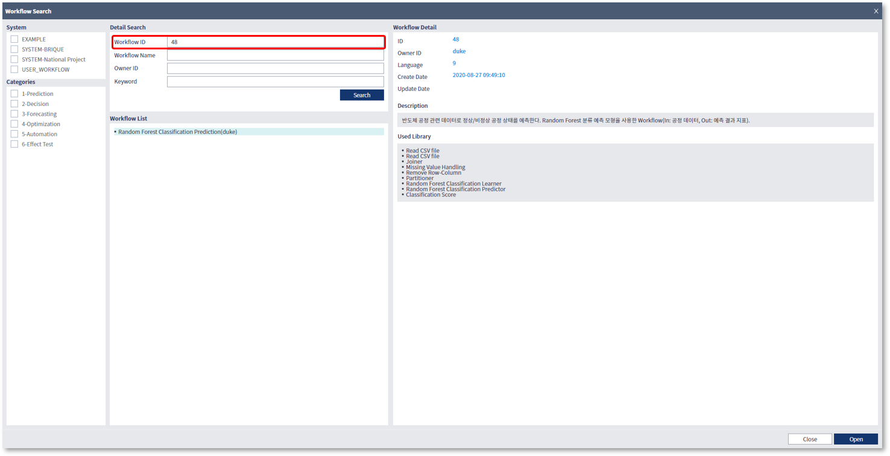

  

- Workflow Name

  사용자가 설정한 워크플로우의 이름으로써, 사용자 별로 같은 워크플로우 이름을 가질 수 있으며, 이름 검색은 검색하고자하는 내용이 이름에 포함된 항목들이 조회됩니다

  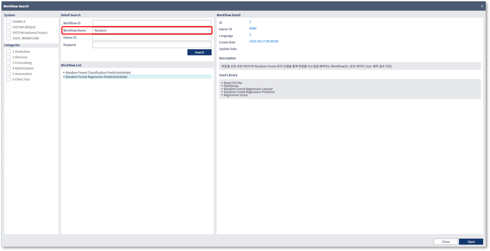

  

- Owner ID

  생성자의 ID로 검색을 수행하며, 검색 내용이 생성자의 ID와 일치하는 항목들이 조회됩니다

  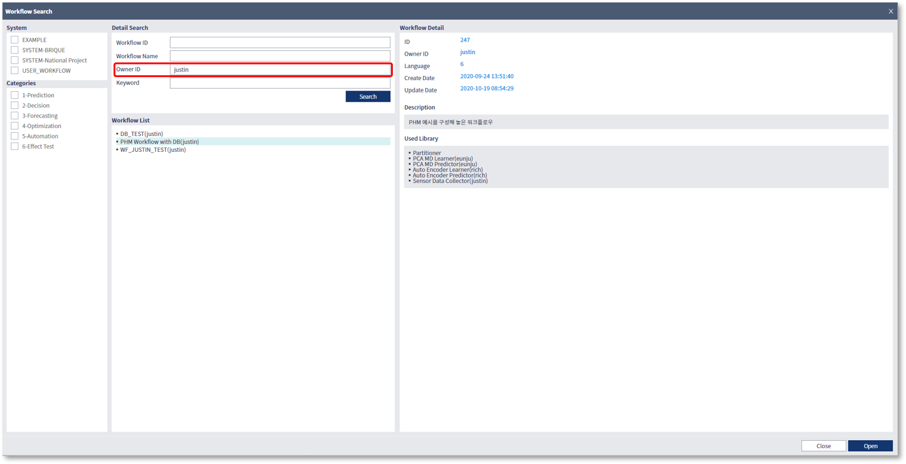

  

- Keyword

  워크플로우의 속성으로 저장된 키워드를 이용한 검색을 수행하며, 검색 내용이 키워드와 일치하는 항목들이 조회됩니다

  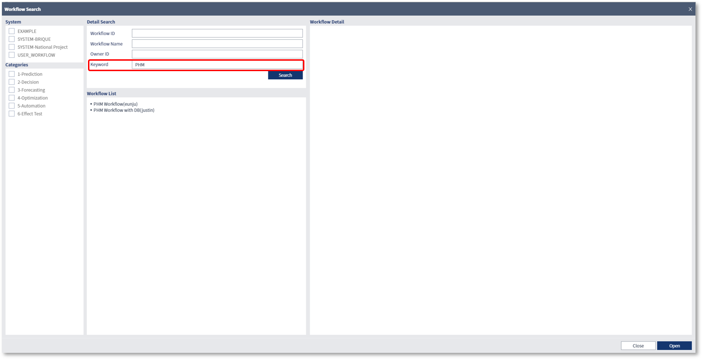

  

- Keyword는 워크플로우의 Detail 정보를 통해 추가 및 변경 할 수 있습니다

  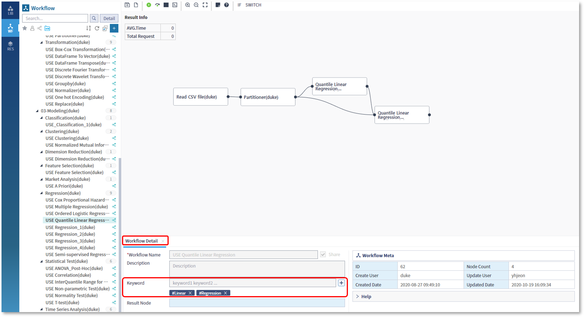

  

- Workflow 생성 시 또는 Detail 정보에서, Add Keyword를 이용해서 여러 건의 키워드를 입력할 수 있습니다

  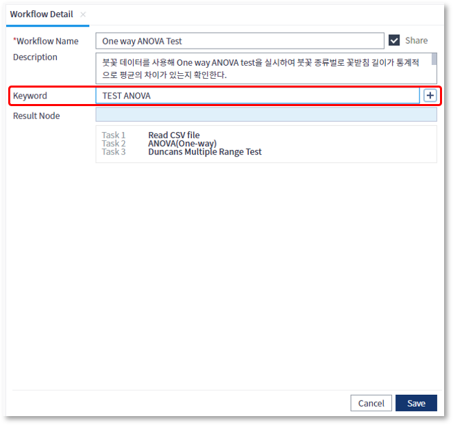

  

- '+' 버튼을 클릭하여, 여러 건의 키워드를 입력하면, 아래와 같이 Sharp(#)과 함께 추가된 Keyword가 보이고, 이것들이 상세검색의 검색 조건으로 사용됩니다

  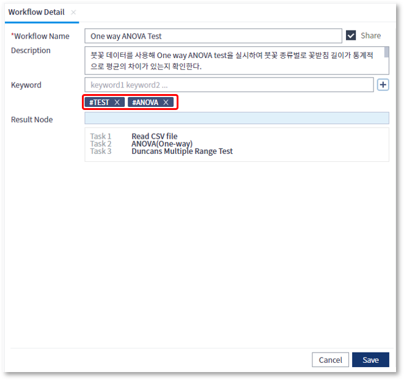

  

- 검색 조건으로 입력된 각 항목들은 AND 조건에 만족하는 결과들이 조회됩니다

  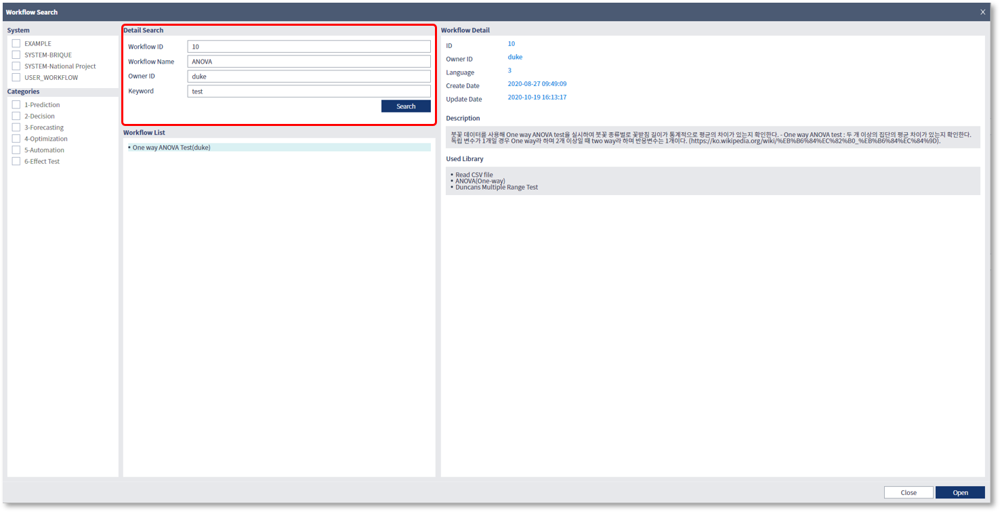

  

- 검색 결과로 조회된 목록에서 특정 워크플로우를 선택하면, 우측 Detail 영역에 워크플로우의 자세한 내용과 포함된 라이브러리 목록이 표시됩니다

  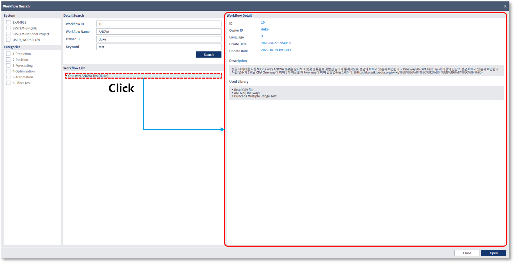

  

- 검색 결과로 조회된 목록에서 특정 워크플로우를 선택하고 Open 버튼을 클릭하면, WF 탭의 워크플로우 목록에 선택된 워크플로우가 표시되고, 편집 영역에 해당 워크플로우가 열립니다

  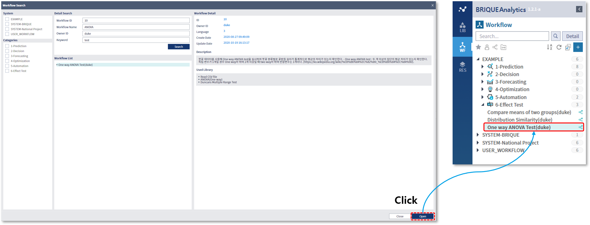

