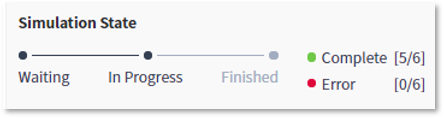

### 기능활용 > 실행 > 워크플로우 전체실행

------

#### 목록

------

1. 전체실행 개요
2. 전체실행 방법
3. Mandatory Attribute
4. 속성값 저장

------

#### 1. 전체실행 개요

선택된 워크플로우를 설정된 속성 값을 이용해서 실행하는 기능으로써, 편집된 워크플로우의 속성 값을 변경해가면서 실행하고 실행 결과를 바로 확인할 수 있습니다

------

#### 2. 전체실행 방법

- 편집이 완료된 워크플로우를 저장한 뒤, 편집 영역 상단의 실행 아이콘을 클릭하여 실행합니다

  

  

- 실행 시, Simulation State가 편집 영역의 상단에 표시되어 진척 내용을 확인 할 수 있습니다

  

  

- 실행 도중에 중지하고 싶을 때는, 중지 아이콘을 클릭하여 실행을 중지할 수 있습니다

  

------

#### 3. Mandatory Attribute

워크플로우의 실행을 위한 필수 속성을 의미하는 것으로써, 워크플로우를 구성하는 각 라이브러리들의 필수 속성들의 모음입니다

ToolBar의 Parameter 아이콘을 클릭하고 Mandatory 옵션을 선택하여 전체 필수 속성을 확인하고, 실행에 필요한 속성 값을 입력해야만 실행이 가능합니다

------

#### 4. 속성 값 저장

워크플로우를 구성하는 각 라이브러리들의 속성은 기본 값을 가지고 있으며, 워크플로우 실행 시 이 값들을 변경해가면서 실행할 수 있습니다

- 변경된 속성을 이용해서 워크플로우를 실행하기 위해서는, 변경된 값의 저장이 선행되어야 합니다

  

  

- 속성 영역 하단의 Appy Change 버튼을 클릭하여, 변경된 값을 저장할 수 있습니다

  

  

- 저장된 속성 값은 사용자 별로 저장되며, 해당 워크플로우를 불러올 때, 라이브러리에 설정된 기본 값이 아닌, 저장된 값을 불러와 기본 값으로 설정됩니다

  