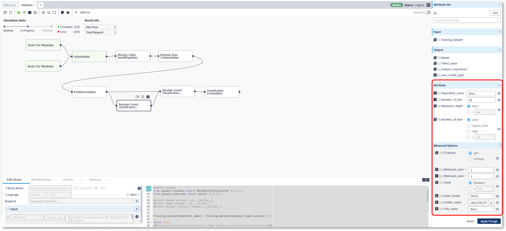

### 기능활용 > 실행

------

#### 목록

------

1. 단계별실행 개요
2. 단계별실행 방법
3. 속성 값 저장

------

#### 1. 단계별실행 개요

워크플로우를 구성하는 라이브러리들을 하나씩 실행하면서 디버깅하고자 할 때 사용하는 기능으로써, 선행 라이브러리의 실행 결과를 확인하고, 후행 라이브러리를 실행하기 전에 데이터를 변경해가면서 실행하고자 할 때 유용하게 사용할 수 있습니다

------

#### 2. 단계별실행 방법

- 편집이 완료된 워크플로우를 저장한 뒤, 편집 영역 상단의 단계별 실행 아이콘을 클릭하여 실행하면, 최초의 라이브러리가 실행되고 정지상태로 대기합니다

  

  

- 다음으로 실행하고자 하는 라이브러리를 선택한 후 단계별 실행 아이콘을 클릭하면, 선택된 라이브러리까지 실행이 진행됩니다.

  이는 반복 수행이 가능하고 결과보기 아이콘을 클릭하여 실행 결과도 확인 할 수 있습니다.

  

------

#### 3. 속성 값 저장

워크플로우를 구성하는 각 라이브러리들의 속성은 기본 값을 가지고 있으며, 워크플로우 실행 시 이 값들을 변경해가면서 실행할 수 있습니다

- 변경된 속성을 이용해서 워크플로우를 실행하기 위해서는, 변경된 값의 저장이 선행되어야 합니다

  

  

- 속성 영역 하단의 Appy Change 버튼을 클릭하여, 변경된 값을 저장할 수 있습니다

  

  

- 저장된 속성 값은 사용자 별로 저장되며, 해당 워크플로우를 불러올 때, 라이브러리에 설정된 기본 값이 아닌, 저장된 값을 불러와 기본 값으로 설정됩니다

