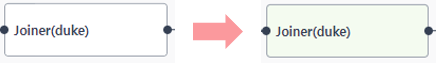

### 기능활용 > 결과 > 워크플로우 실행 후 라이브러리 별 결과조회

------

#### 목록

------

1. 라이브러리별 결과조회 방법
2. 결과 노드
3. 워크플로우 Requst History -> Report

------

#### 1. 라이브러리 별 결과조회 방법

- 워크플로우 실행 시, 실행이 완료된 라이브러리는 초록색 아이콘이 표시됩니다

  

  

- 수행이 완료된 라이브러리를 선택하면 하단에 결과보기 아이콘이 표시되고, 해당 아이콘을 클릭하면 해당 라이브러리의 실행 결과를 담은 Output 파라미터들의 값을 확인 할 수 있습니다

  

  

  

------

#### 2. 결과 노드

- 워크플로우의 실행이 완료되면, 하단 정보 영역에 결과노드의 실행 결과가 바로 표시 됩니다

  

  

------

#### 3. 워크플로우 Request History -> Report

Request History 기능을 이용해서 워크플로우의 실행된 이력을 확인 할 수 있습니다

- 실행 이력을 확인하고자 하는 워크플로우를 선택한 뒤, 마우스 우측 버튼을 클릭하여 Request History를 선택합니다

  

  

- 실행이력 목록에서 우측의 report 버튼을 클릭하면, 실행 시 사용된 입력 및 속성 값과 더불어 실행 결과 값들을 확인 할 수 있습니다

  

- 결과 값의 보존 기간은 1일 이며, 때문에 하루 이내의 데이터에 대해서만 조회가 가능합니다

  

