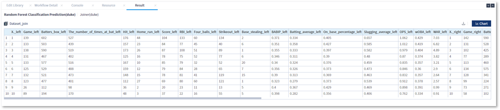
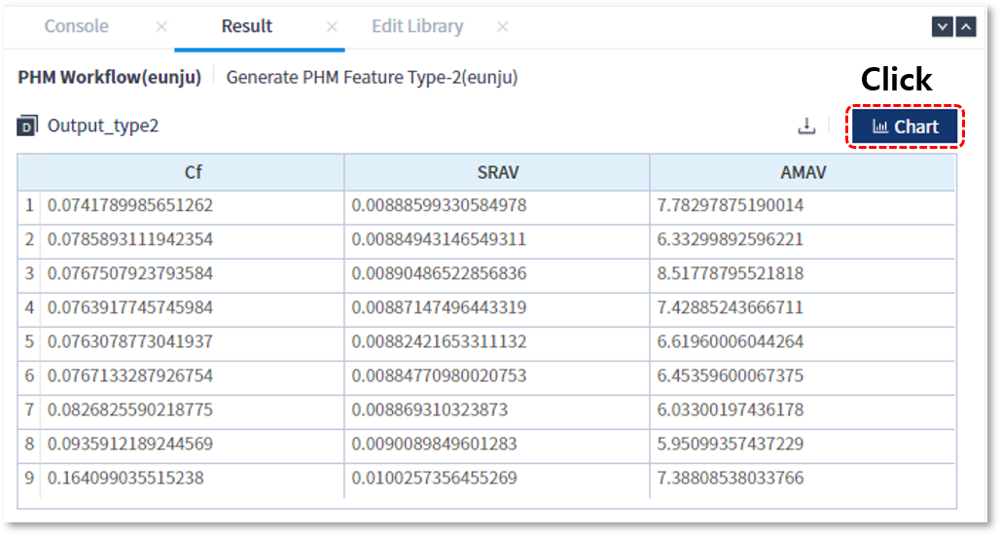
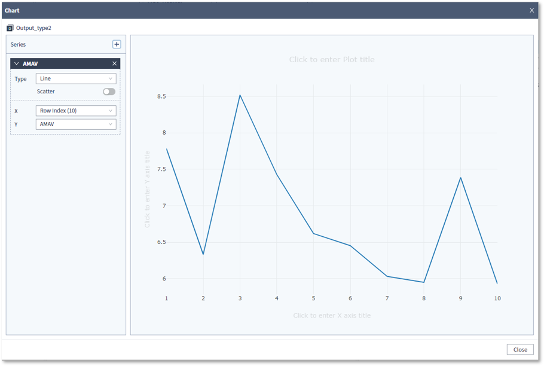

### 기능활용 > 결과 > 결과데이터 확인

------

#### 목록

------

1. Data Frame 결과 다운로드
2. Data Frame 결과 차트

------

#### 1. Data Frame 결과 확인

- 수행이 완료된 라이브러리를 선택하면, 상단에 결과보기 아이콘이 표시됩니다 
  해당 아이콘을 클릭하면, 해당 라이브러리의 결과를 담고 있는 Output 변수의 값을 볼 수 있습니다

  

  

  

  

- Data Frame 형태의 Output 변수는 다운로드가 가능하며, CSV 형태의 파일로 저장됩니다

  

------

#### 2. Data Frame 결과 차트

Data Frame 형태의 데이터는 차트로 표현이 가능합니다

- 결과 목록의 하단에 위치한 Chart 버튼을 클릭합니다

  

  

- 차트는 Data Frame에 포함된 값으로 표현이 되며, 아래와 같이 사용자가 차트의 유형 및 X, Y 좌표에 사용할 항목을 변경해 가면서 확인 할 수 있습니다

  

  

- 차트에 표현하고자 하는 Series는 + 버튼을 눌러 추가할 수 있고, X 버튼을 눌러 삭제 할 수 있습니다

  

  

- 차트의 유형은 Line(선), Bar(기둥), Scatter(점)를 제공하고 있습니다

  

  

- X, Y 좌표는 Data Frame의 Column 명을 지정하거나, Row Index를 지정할 수도 있습니다

  

