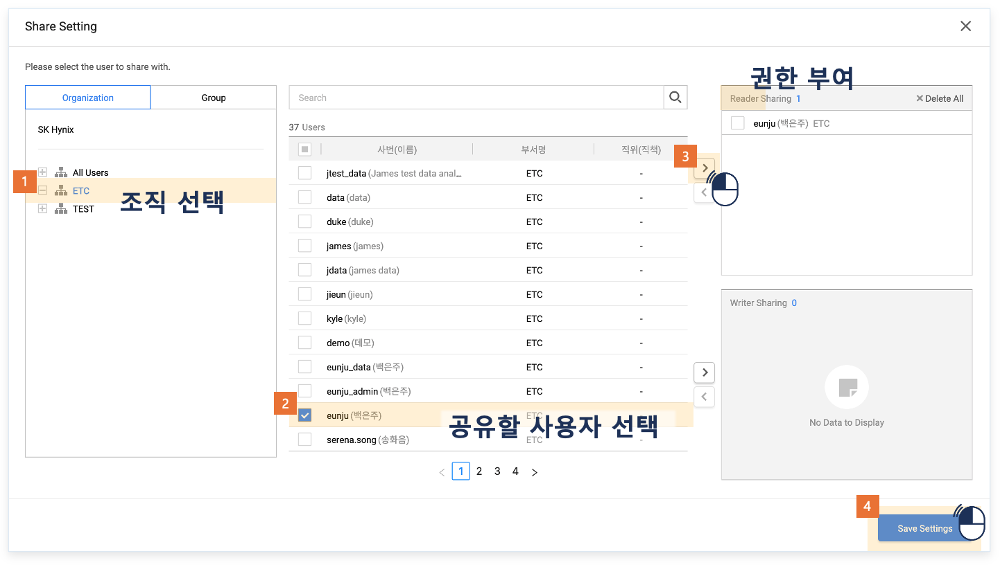
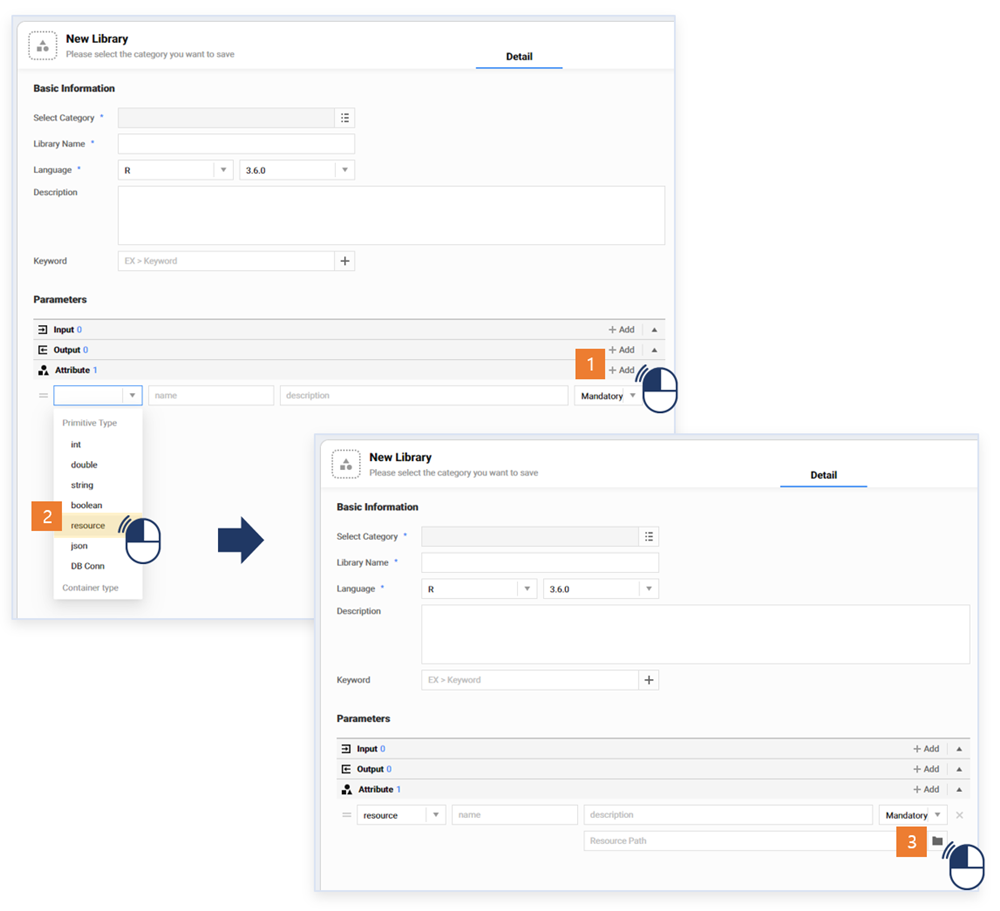
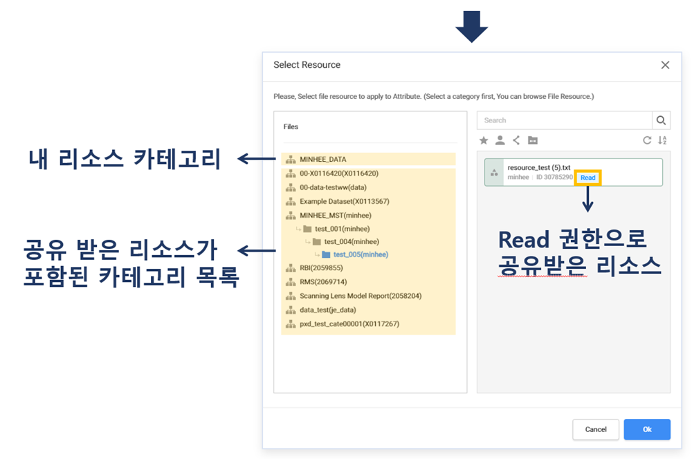

### 기능활용 > 공유 > 공유된 리소스 활용

---
#### 목록
---

1. 리소스 공유 개념
2. 리소스 공유 방법
3. 공유 리소스 활용

---

#### 1. 리소스 공유 개념

사용자가 업로드한 리소스를 다른 사용자가 조회하고 라이브러리를 작성하는데 사용할 수 있도록 허용하는 기능을 의미합니다

---

#### 2. 리소스 공유 방법

- 공유할 리소스를 선택한 뒤, 마우스 우측 버튼을 클릭하여 Share 메뉴를 선택합니다

	

- Share Setting 팝업에서 공유해줄 아이디를 선택 한 후, Reader 또는 Writer 권한을 선택하여 공유할 수 있습니다

	

	- Read 권한 : 읽기 및 실행 권한 부여
	- Write 권한 : 읽기 및 실행이 포함된 모든 편집 권한 부여

- 공유된 리소스의 Share Setting 팝업에서 권한을 해제할 수 있습니다

---

#### 3. 공유 리소스 활용

- 공유된 리소스는 다른 사용자들이 라이브러리를 작성할 때 본인의 리소스처럼 활용할 수 있습니다

	
	
	
	
	