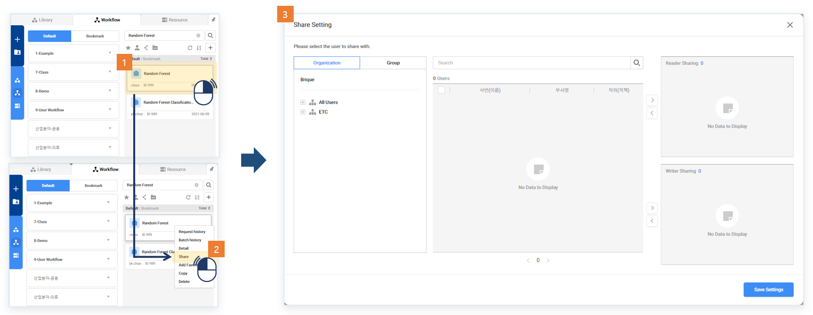
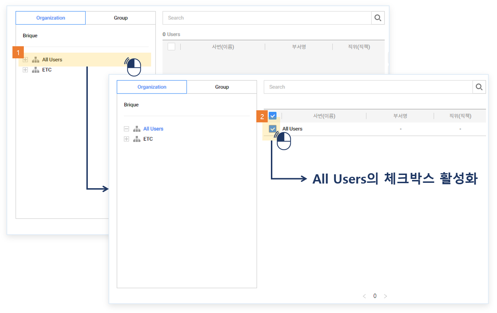
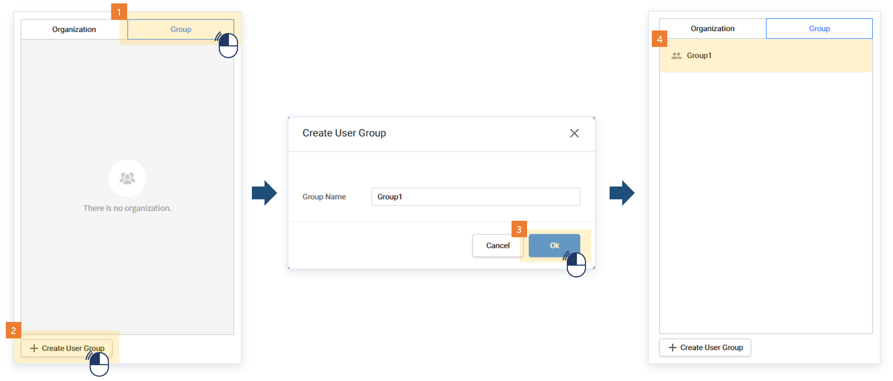
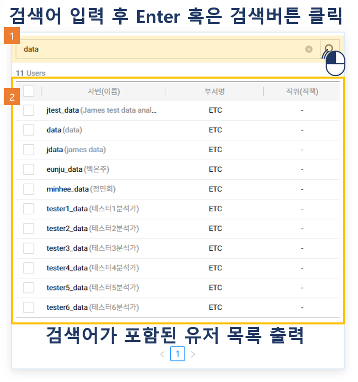
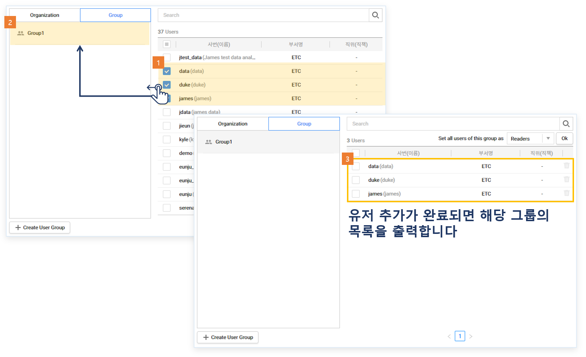
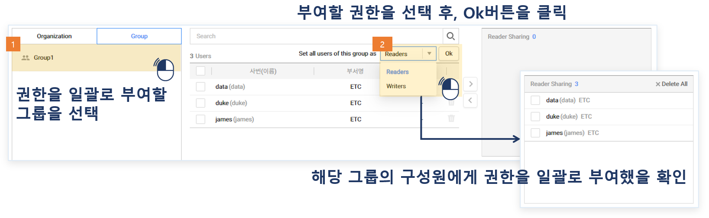
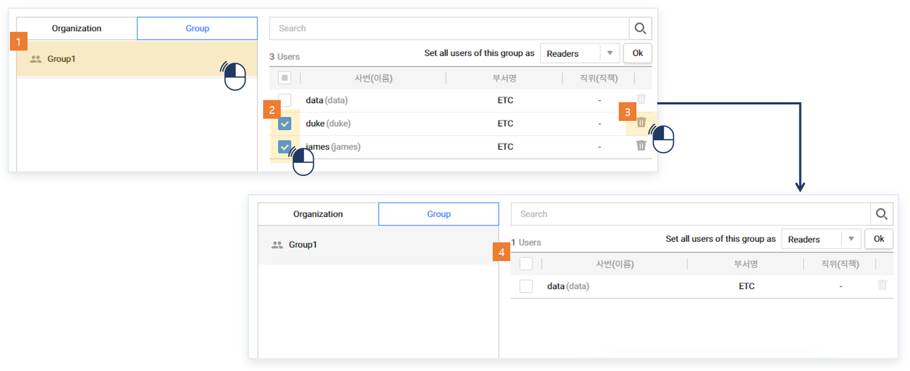
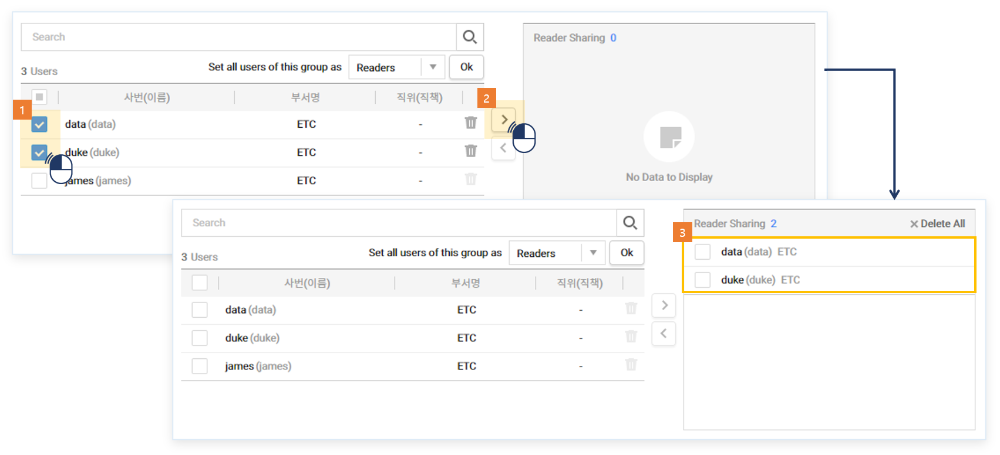
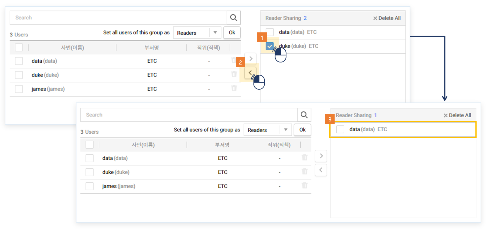
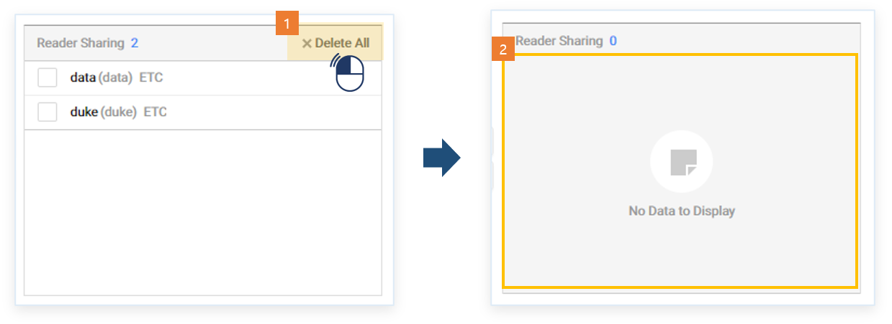

### 기능활용 > 공유 > Share Setting 조작법

------

#### 목록

------

1. 공유 및 권한 개념
2. 사용 방법

---

#### 1. 공유 및 권한 개념

- 특정 그룹 또는 사용자에게 Read 또는 Write 권한을 주어 공유하는 방법입니다

  

------

#### 2. 사용 방법

1. 공유하고자 하는 라이브러리/워크플로우/리소스를 우클릭해서 Share를 클릭해 Share Setting창을 엽니다

   

   

3. 좌측에 Organization은 부서(팀) 명을 클릭하면 해당 부서(팀)에 속해있는 사용자 리스트가 출력됩니다. 모든 유저에게 권한을 부여하려는 경우 All Users를 선택하면 됩니다.

   

   

4. Group은 특정 사용자들을 하나의 그룹으로 묶어서 권한을 부여하거나 관리하기 위해 사용합니다. 리스트는 생성일 순으로 나타납니다. 아래로 갈 수록 최근 생성된 그룹입니다. 하단에 Create User Group을 클릭한 후 그룹명을 입력하여 그룹을 생성합니다.

   

   

   그룹에 마오스 오버하면 두 개의 아이콘이 나타나는데, 그룹명 수정 아이콘과 그룹 삭제 아이콘입니다.

   

   

5. 중앙 상단에는 검색 기능이 있습니다. 사번(이름)의 일부 또는 전체를 입력하여 검색합니다. 언더바(_)를 제외한 특수문자는 입력할 수 없습니다.

   

   

6. 출력된 사용자 리스트에서 선택한 사용자를 생성한 그룹에 드래그 앤 드롭하면 선택한 사용자들이 그룹에 포함이 됩니다. 복수 선택이 가능하며 맨 위에 체크박스를 클릭하면 한 페이지에 나타난 사용자 전체 선택이 됩니다.

   

   

7. 그룹을 선택한 경우, 출력된 사용자 전체 대상 Read 또는 Write 권한 부여가 가능합니다.

   

   

8. 그룹을 선택한 경우, 사용자 정보 우측에 아이콘을 클릭하면 삭제됩니다. 복수 선택 시 아이콘을 클릭하면 선택한 사용자 전체가 삭제됩니다.

   

   

9. 선택한 사용자들을 > 버튼을 클릭하여 Read 또는 Write 권한을 부여합니다.

   

   

10. Reader Sharing 또는 Writer Sharing 리스트에서 선택한 사용자들을 < 버튼을 클릭하여 삭제합니다.

    

    

11. Delete All을 클릭하면 Read 또는 Writer 권한이 부여된 사용자를 전체 삭제합니다.

    

---

