### 기능활용 > 공유 > 속성 저장 및 공유

------

#### 목록

------

1. Attribute Set 개념
2. 사용 방법
3. 활용 방법
4. 주의사항

------

#### 1. Attribute Set 개념

- 기존에는 워크플로우를 실행해야 설정한 Attribute값이 저장이 되었습니다. 또한, 직전에 실행한 Attribute값만 저장이 되었고, 다른 사용자가 사용한 설정값을 사용할 수 없었던 불편함이 있었습니다.
- 이런 불편사항이 개선된 것이 Attribute Set입니다. 설정했던 Attribute값을 저장해서 이후에 사용할 수 있고, public 옵션을 통해 다른 사용자에게 공유도 할 수 있습니다. 

---

#### 2. 사용 방법 

1. Attirbute값 변경

   * Attribute값을 입력할 라이브러리를 클릭 하여 값을 입력 후 Apply Change를 클릭합니다. 
   
     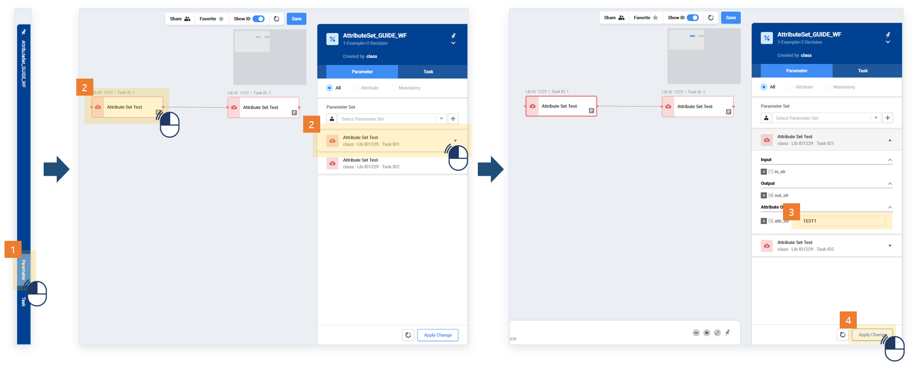
   
   * Attribute 값을 변경 할 다른 라이브러리가 있으면 마찬가지로 값을 수정 후 Apply Change 버튼을 눌러 적용 해 줍니다.
   
     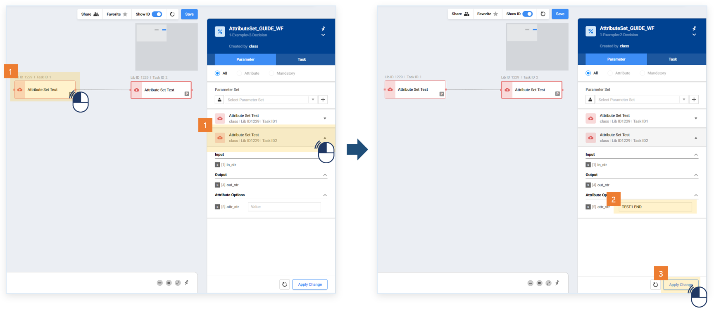
   
   
   
2. Attribute Set 등록

   * 변경 할 모든 Attribute 값의 설정을 마쳤으면 우측 상단 Attribute Set메뉴에서 Add 버튼을 클릭합니다.

     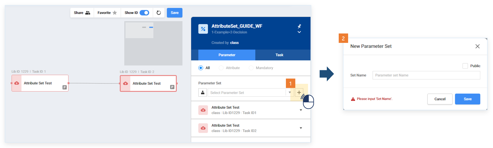

   * Attribute Set의 이름을 입력합니다. 이때 한글, 공백은 허용되지 않습니다. 또한 공유된 워크플로우에서 다른 사람에게도 Attribute Set을 보이게 하고 싶으면 public을 체크합니다.

     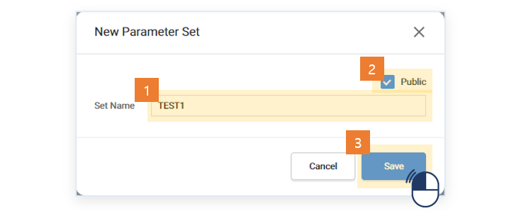

   * Attribute Set이 생성되었음을 확인할 수 있습니다.

     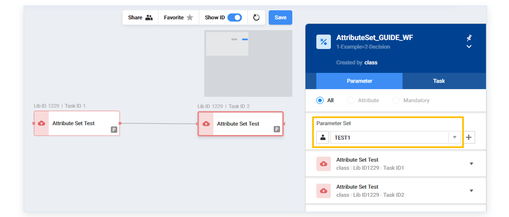

   * 복수의 Attribute Set을 등록하면 다음과 같이 확인할 수 있습니다. 해당 아이콘 표시가 있는 Set은 본인만 확인할 수 있는 Private입니다.

     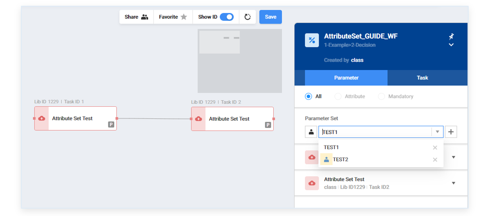

   

3. Attribute Set 적용

   * 실행 이력이 없는 워크플로우를 열어보면 Attribute 값이 default로 설정되어 있는 것을 확인할 수 있습니다.

     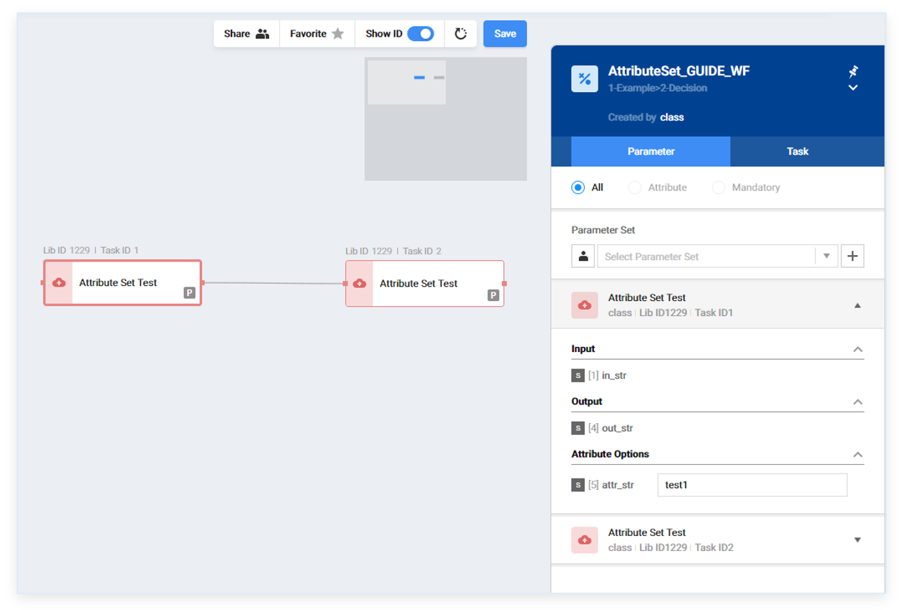
     
   * Select Attribute Set을 클릭하여 적용을 원하는 Attribute Set을 선택합니다.

     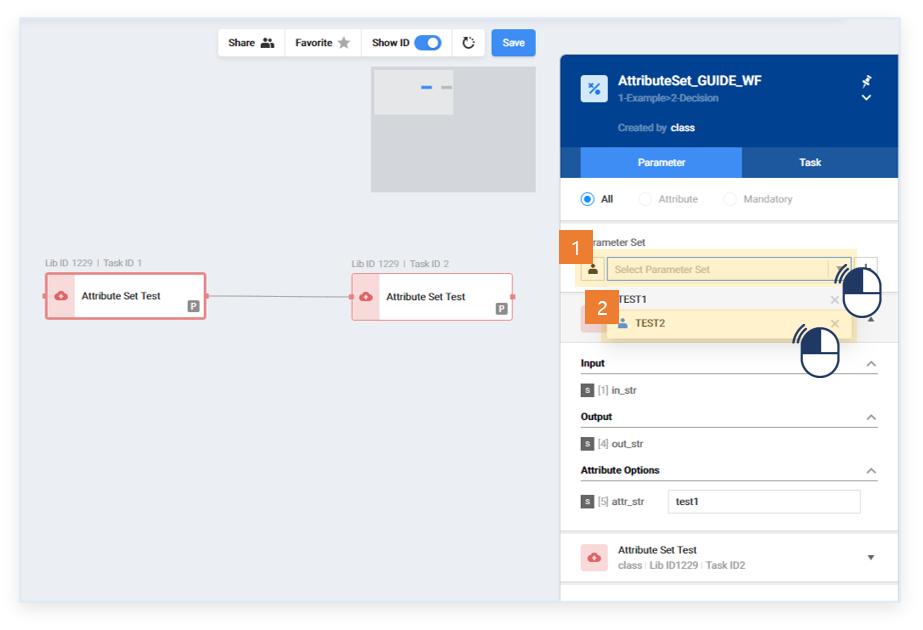

   * 선택한 Attribute Set의 값으로 설정이 바뀌고 자동 적용 됩니다.

     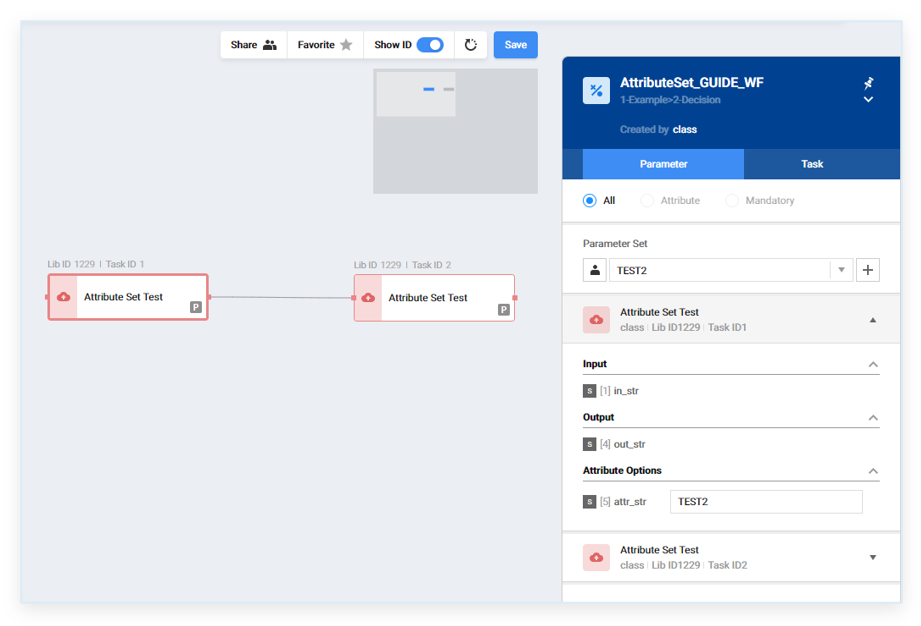

   * 그대로 실행하면 선택한 Attribute Set의 값이 적용되었음을 확인할 수 있습니다.

     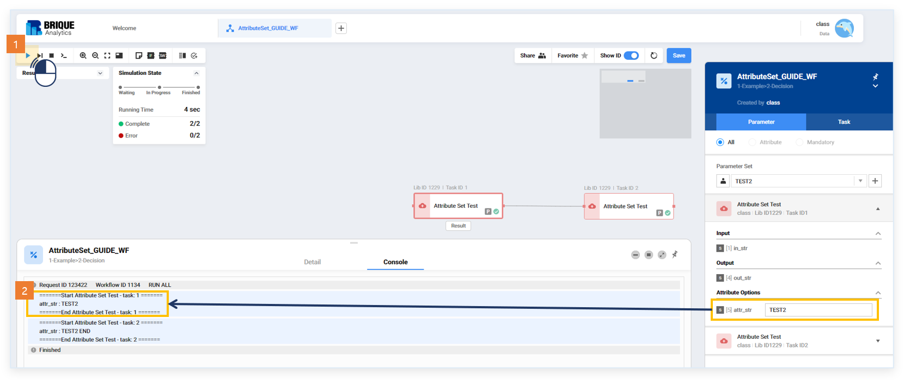

     

4. Attribute Set 삭제

   * 등록한 Attribute Set은 수정은 되지 않습니다. 삭제만 가능합니다.

     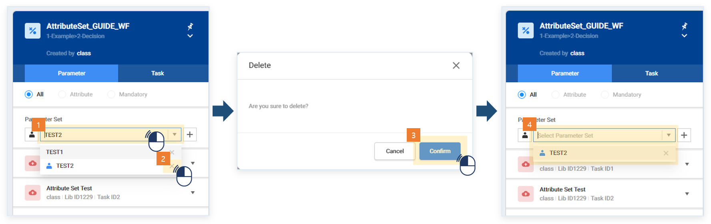

   

---

#### 3. 활용 방법

- 유효한 Attirbute 값을 설정하여 공유하여도 다른사람이 워크플로우를 처음 열면 모든 Attribute 값이 기본값으로 설정되어 있습니다. 원하는 동작을 하기 위해 실행되는 Attribute Set 값을 public으로 설정하면 다른 이용자도 손쉽게 실행 해 볼 수있습니다. 

- 동일한 워크플로우라도 다양한 설정값을 기록해 놓고 싶을 때 사용할 수 있습니다.

  

---

#### 4. 주의사항

- Attribute Set은 속성 수정이 되지 않습니다. 일부만 변경하고 싶을 경우 기존 저장된 Set을 불러와서 원하는 값을 수정 후 새로운 Set으로 등록하는 방법으로 이용할 수 있습니다.

