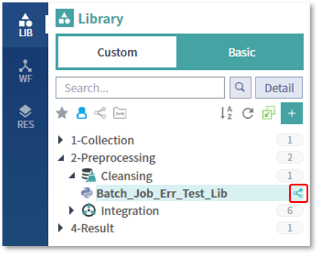
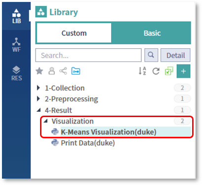
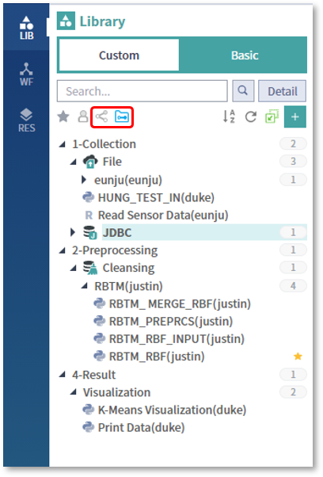
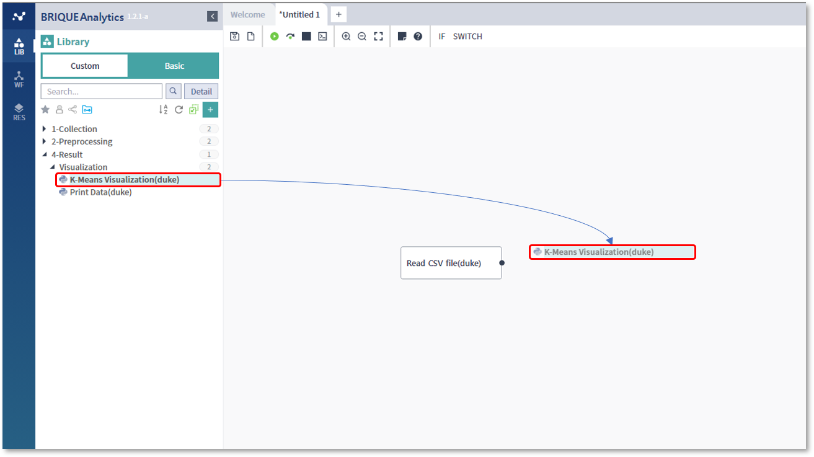
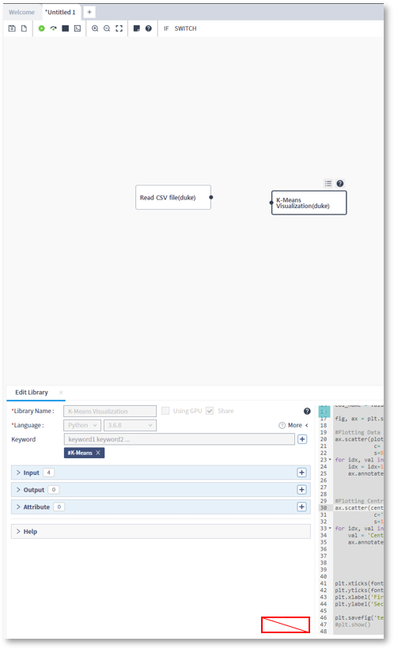

### 기능활용 > 공유

------

#### 목록

------

1. 라이브러리 공유 개념
2. 라이브러리 공유 방법
3. 공유 라이브러리 활용

------

#### 1. 라이브러리 공유 개념

사용자가 작성한 라이브러리를 다른 사용자가 조회하고 워크플로우를 작성하는데 사용할 수 있도록 허용하는 기능을 의미합니다

내가 만든 라이브러리를 다른 사용자와 공유하거나 다른 사용자가 공유한 라이브러리를 참조하고 복사하여 새로운 라이브러리를 작성할 수도 있습니다

------

#### 2. 라이브러리 공유 방법

- 공유하고자 하는 라이브러리를 선택한 후, 마우스 우측 버튼을 클릭하여 Share를 선택합니다

  

  

- 공유된 라이브러리는 라이브러리 이름의 우측에 공유 아이콘이 표시됩니다

  

  

- 다른 사용자로부터 공유된 라이브러리는 라이브러리 이름 옆에 공유한 사용자의 이름이 같이 표시되며, 해당 라이브러리를 포함하는 카테고리와 함께 공유됩니다

  

  

- LIB 탭의 상단에 공유 아이콘 (Sharing, Shared)을 클릭하면, 공유하거나 공유된 라이브러리들만 필터링해서 볼 수 있습니다

  

------

#### 3. 공유 라이브러리 활용

- 공유된 라이브러리는 다른 사용자들이 워크플로우를 작성할 때, 본인의 라이브러리 처럼 활용할 수 있습니다

  

  

- 다른 사용자로부터 공유된 라이브러리는 조회 및 실행만 허용되며, 수정 및 삭제는 허용되지 않습니다

  

  

- 공유된 라이브러리를 수정해서 사용하고 싶은 경우, 복사 기능을 이용해서 본인의 라이브러리로 새롭게 생성한 후 사용이 가능합니다

  

