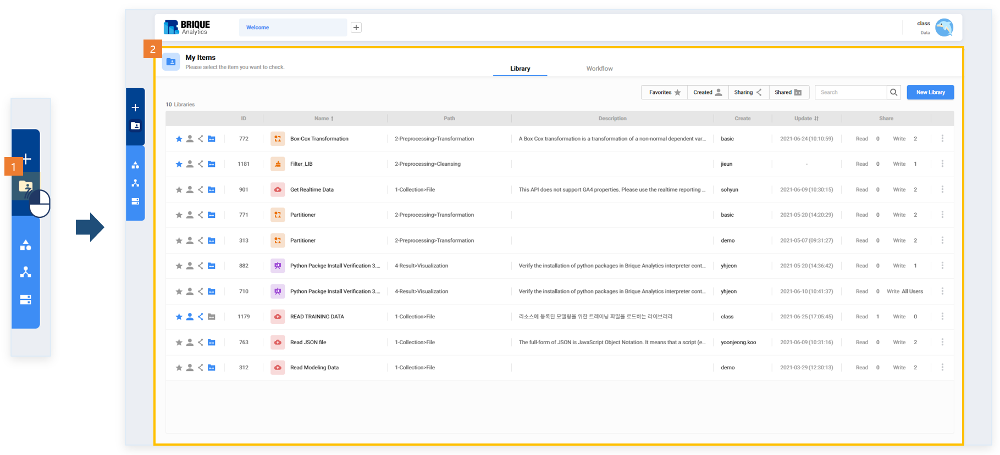
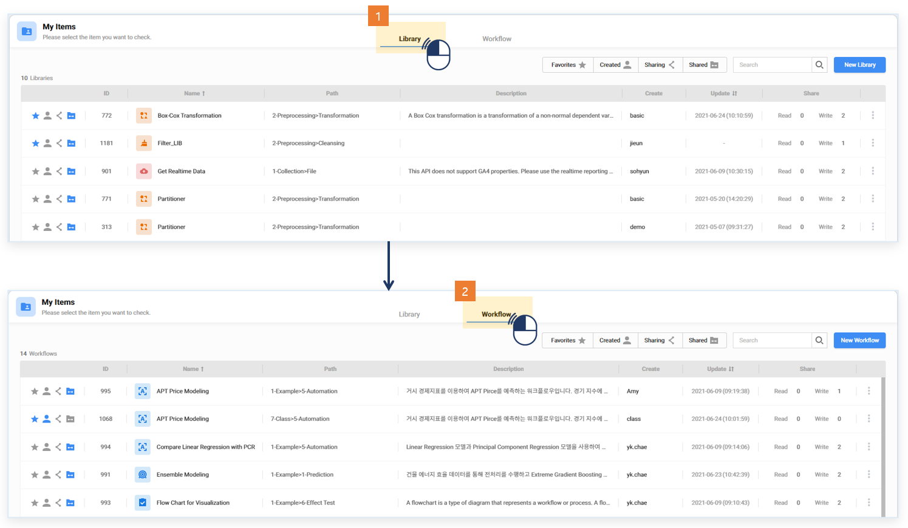
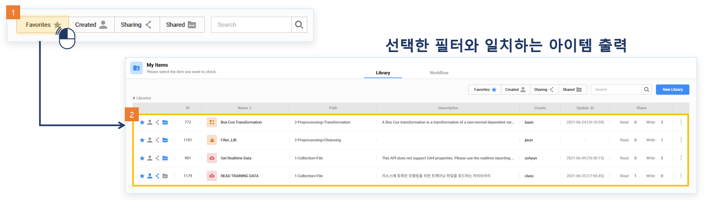
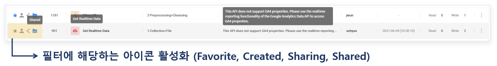
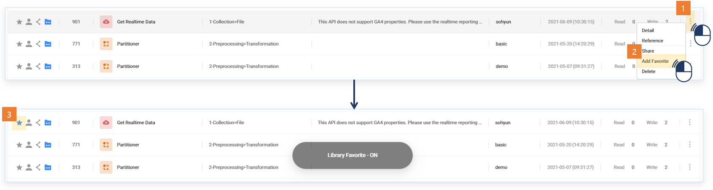
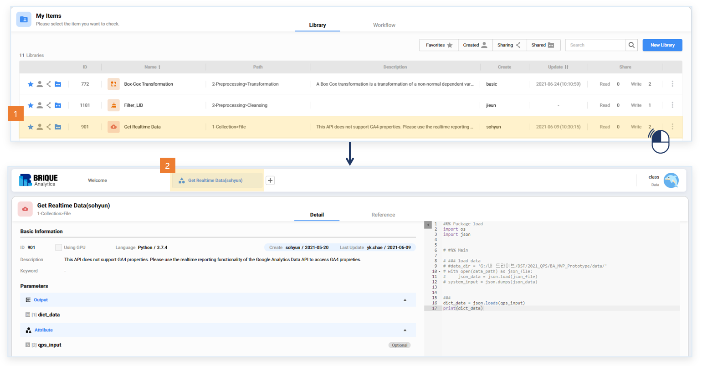

### 기능활용 > 마이 아이템 > 마이 아이템 활용

------

#### 목록

------

1. 마이 아이템 개념
2. 마이 아이템 사용 방법

------

#### 1. 마이 아이템 개념

사용자에게 수정 권한이 있는 라이브러리와 워크플로우를 통합 관리할 수 있는 화면입니다

------

#### 2. 마이 아이템 사용 방법

- 좌측메뉴에서 마이 아이템 메뉴를 선택해 마이 아이템 화면을 엽니다
- 사용자에게 수정 권한이 있는 라이브러리, 워크플로우가 출력됩니다

- 상단의 탭으로 라이브러리와 워크플로우 목록을 확인할 수 있습니다

- 상단의 필터 혹은 키워드 검색을 통해서 아이템 필터링이 가능합니다

- Name, Description은 마우스 호버시 툴팁이 나옵니다

- 아이템 개별의 메뉴를 통해 업데이트를 진행할 수 있습니다

- 아이템 더블클릭시, 라이브러리는 하단 정보영역이 워크플로우는 중앙 편집영역이 열립니다

