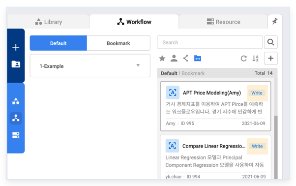
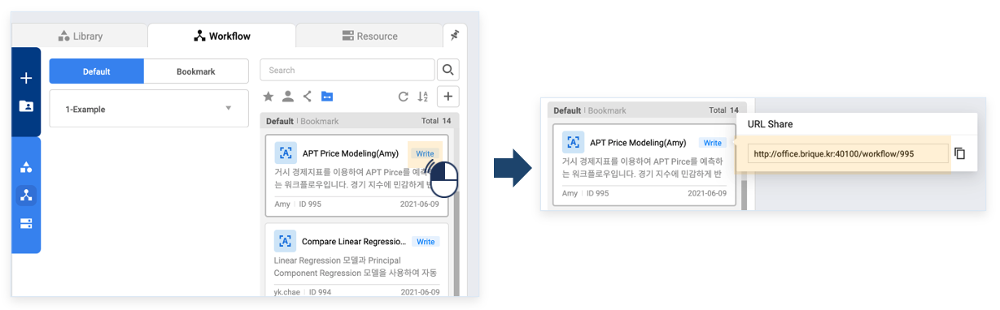
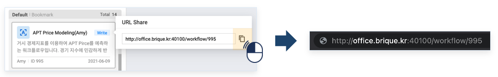
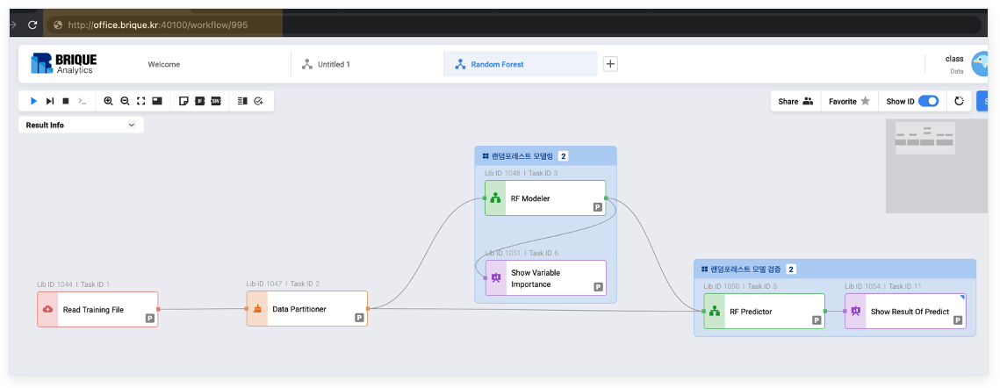

### 기능활용 > 공유 > URL 기반 워크플로우 공유

------

#### 목록

------

1. URL 기반 워크플로우 공유 개념
2. 사용 방법
3. 활용 방법
4. 주의사항

---

#### 1. URL 기반 워크플로우 공유 개념

- URL을 이용하여 워크플로우를 나 외의 사용자에게 공유하는 방법입니다

  

------

#### 2. 사용 방법 

1. 공유가 되어있는 워크플로우만 Url을 이용하여 공유할 수 있습니다

   

2. 워크플로우 이름 옆에 공유 아이콘을 클릭하면 URL을 확인할 수 있습니다

   

3. URL 드래그 후 Ctrl+C 또는 아이콘을 클릭하여 URL을 복사하여 웹브라우저에 붙여넣기 합니다

   

5. 해당 워크플로우로 바로 접근이 되는것을 확인할 수 있습니다.

   

---

#### 3. 활용 방법

- 워크플로우 URL을 복사하여 다른 사용자에게 보내면, 다른 사용자는 해당 워크플로우로 바로 접근할 수 있습니다.

---

#### 4. 주의사항

- Share한 워크플로우만 URL 공유가 가능합니다.
- 해당 워크플로우가 존재하지 않을 시, "Workflow does not exist"라는 알림창이 뜨고 메인화면이 보여집니다.

