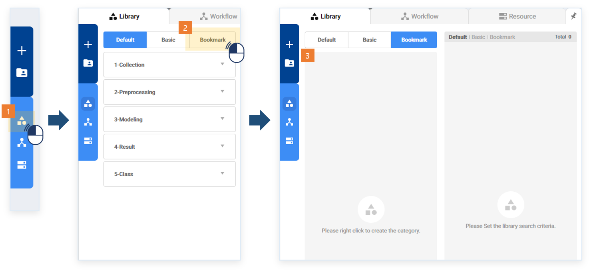
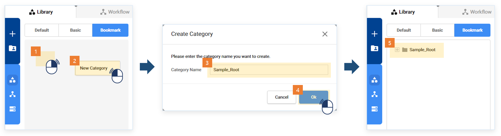
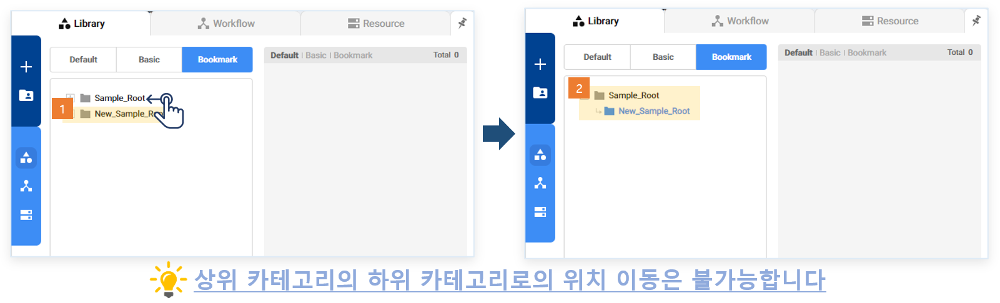
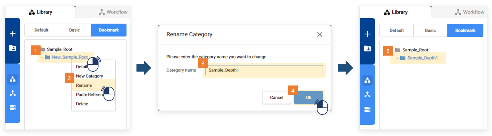
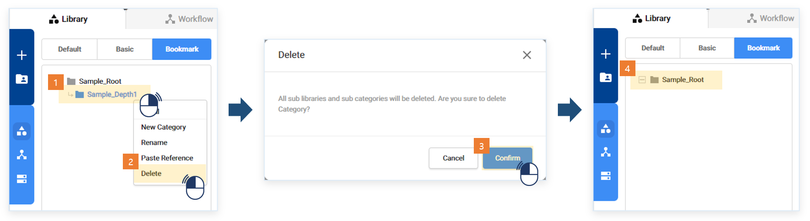
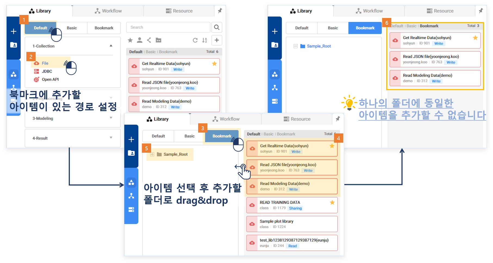
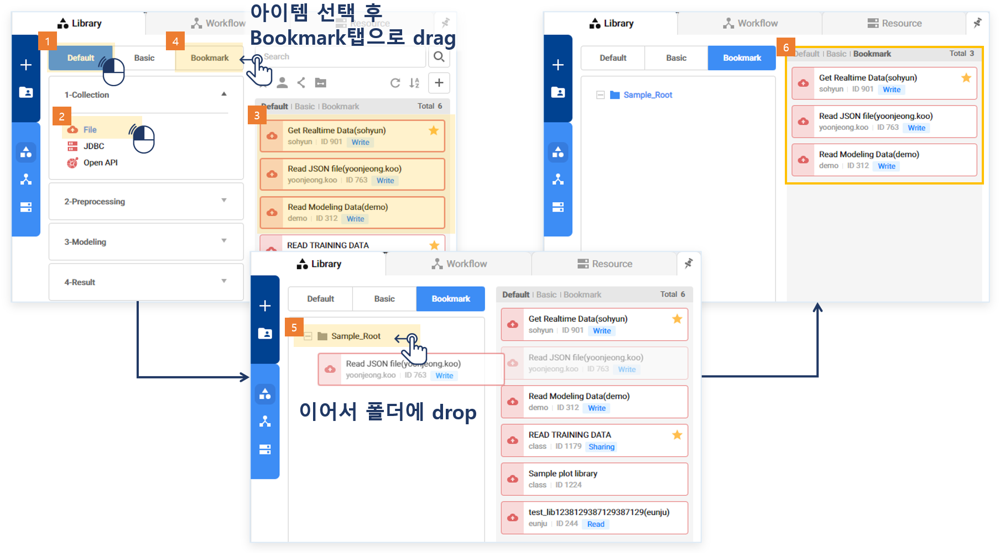
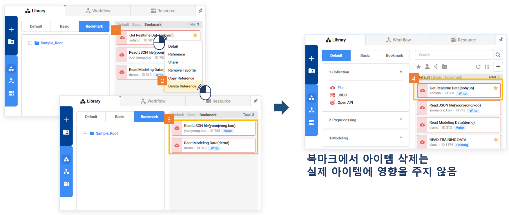

### 기능활용 > 북마크 > 북마크 활용

------

#### 목록

------

1. 북마크 개념
2. 북마크 사용 방법

------

#### 1. 북마크 개념

사용자는 북마크 기능을 통해 자주 사용하는 라이브러리, 워크플로우를 주제별로 폴더화를 진행해 나만의 정보 트리를 구축할 수 있습니다

------

#### 2. 북마크 사용 방법

##### 북마크 폴더 생성, 수정, 삭제

- 왼쪽 메뉴에서 라이브러리 메뉴를 선택해 좌측 검색영역을 엽니다
- Bookmark 탭을 선택합니다

- 트리 영역에서 우클릭 후, New Category를 선택해 새로운 카테고리를 생성합니다

- 폴더는 드래그와 드랍으로 위치 이동이 가능합니다

- 폴더명 변경은 폴더 우클릭 후, Rename을 선택해 수정 가능합니다

- 폴더 삭제는 폴더 우클릭 후, Delete를 선택해 삭제 가능합니다

##### 북마크 폴더에 아이템 추가

- 추가할 아이템의 목록을 먼저 띄운 뒤, Bookmark탭을 선택합니다
- 폴더에 추가할 아이템을 드래그해, 폴더로 드랍합니다
- 아이템 추가가 완료되면 해당 폴더에 속한 아이템 목록이 출력됩니다

- 혹은 추가할 아이템의 목록에서 폴더에 추가할 아이템을 드래그해, Bookmark탭으로 올립니다
- Bookmark탭으로 전환되면 폴더로 드랍합니다
- 아이템 추가가 완료되면 해당 폴더에 속한 아이템 목록이 출력됩니다

##### 북마크 폴더에서 아이템 삭제

- 폴더에서 삭제할 아이템 우클릭 후, Delete Reference를 선택합니다
- 목록에서 삭제됬음을 확인할 수 있습니다
- 북마크 목록에서만 삭제된 것이지, 실제로 아이템이 삭제된 것은 아닙니다

