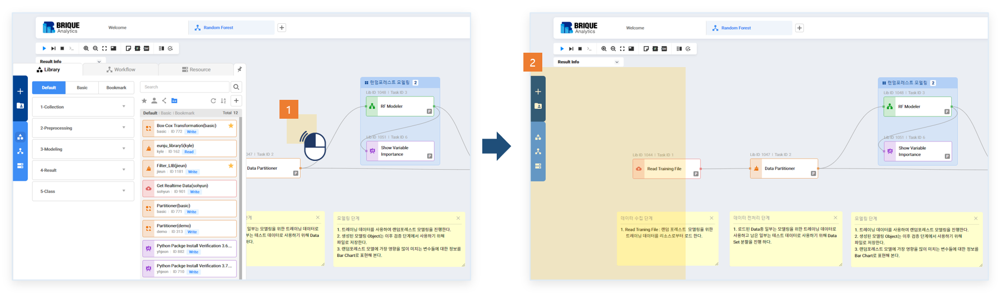
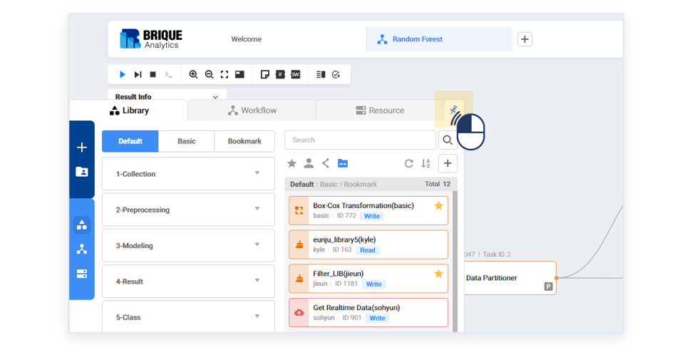
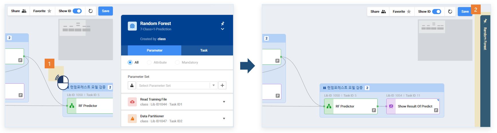
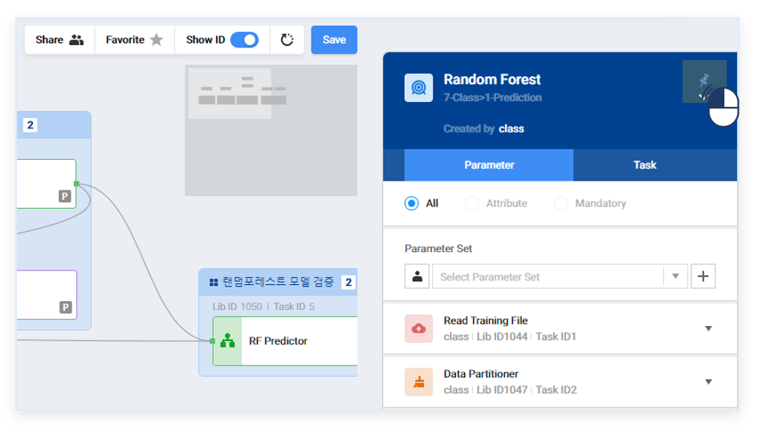
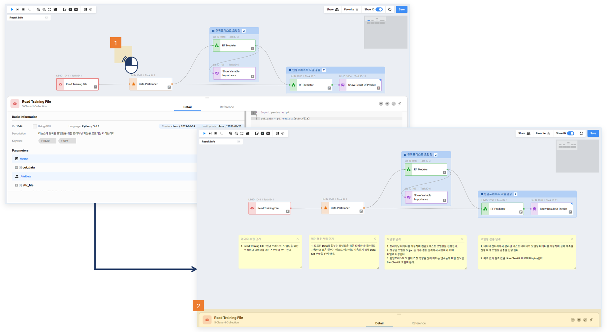
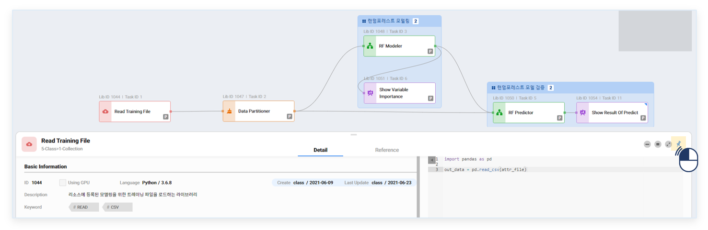

### 기능활용 > 핀기능 > 핀기능 활용

------

#### 목록

------

1. 핀기능 개념
2. 핀기능 사용 방법

------

#### 1. 핀기능 개념

사용자가 고정을 원하는 화면의 핀을 활성화하여, 핀이된 화면 이외에서 동작을 진행하여도 해당 화면이 닫히지 않도록 하는 기능입니다 

해당 기능은 좌측 검색영역, 우측 속성영역, 하단 정보영역에서 사용할 수 있습니다

------

#### 2. 핀기능 사용 방법

##### 좌측 검색영역

- 좌측 검색영역의 핀기능을 활성화하지 않은 상태에서 중앙 편집영역 클릭 시, 좌측 검색영역이 닫힙니다

- 좌측 검색영역 상단의 핀기능을 활성화하면 화면이 유지됩니다

##### 우측 속성영역

- 우측 속성영역의 핀기능을 활성화하지 않은 상태에서 중앙 편집영역 클릭 시, 우측 속성영역이 최소화됩니다

- 우측 속성영역 상단의 핀기능을 활성화하면 화면이 유지됩니다
- 최소화 상태에서 핀기능 활성화하면 화면이 최소화 상태로 유지됩니다

##### 하단 정보영역

- 하단 정보영역의 핀기능을 활성화하지 않은 상태에서 중앙 편집영역 클릭 시, 하단 정보영역이 최소화됩니다

- 하단 정보영역 상단의 핀기능을 활성화하면 화면이 유지됩니다
- 최소화 상태에서 핀기능 활성화하면 화면이 최소화 상태로 유지됩니다

