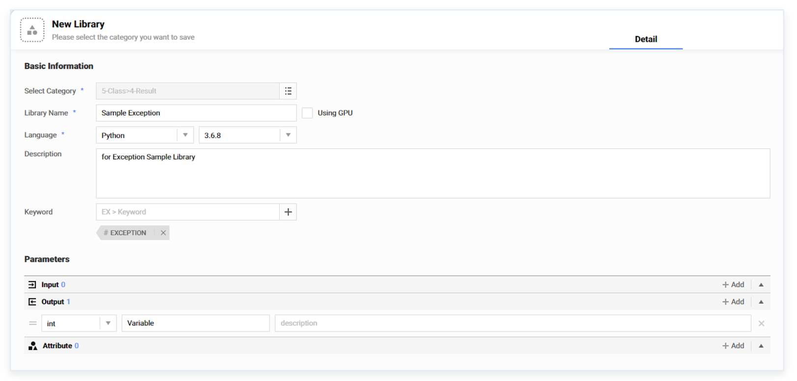
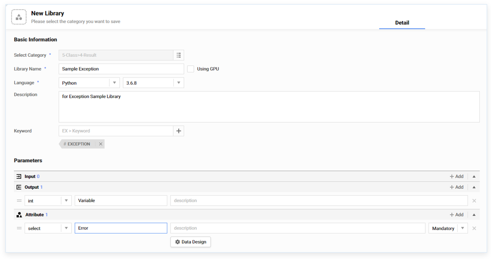
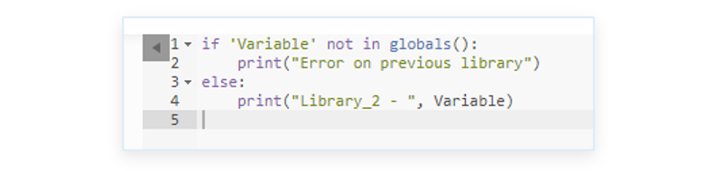
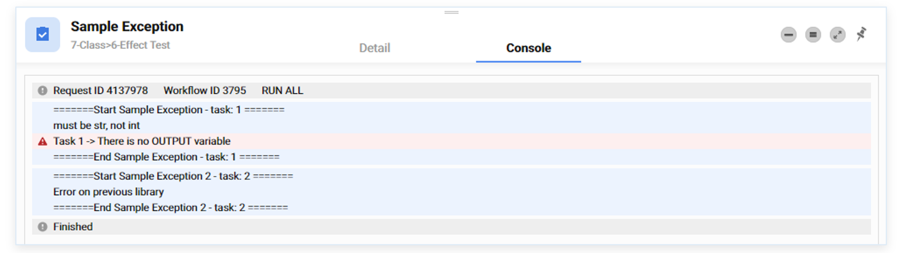
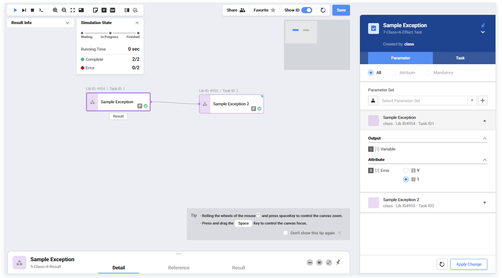

### 사용툴팁 > 예외처리 워크플로우 작성


------

#### 목록

------

1. 설명
2. 사용방법


------

#### 1. **설명**

이전 라이브러리 노드의 Output 변수에 값이 없는 경우, 다음 라이브러리 노드의 Input 변수에 값이 전달되지 않게되는데, Python 및 R에서 제공되는 globals() 함수와 ls() 함수를 이용해서 데이터의 존재 유무를 확인하여 처리하는 워크플로우를 작성합니다


------

#### 2. 사용방법 

```python
# Python 스크립트
if 'Input' not in globals():
   # 예외처리

# R 스크립트
if(!('Input' %in% ls())) {
   # 예외처리
}
```


- 신규 라이브러리를 생성하여 Output 변수를 추가하고, 이름을 'Variable' 이라고 설정합니다

  

  

- 오류를 발생시켜 Output 데이터가 생성되지 않는 경우를 만들기 위해,  Select 타입의 Attribute를 추가하고 이름을 'Error' 라고 설정한 뒤, Design 버튼을 클릭하여 Select 옵션을 설정하기 위한 창을 열어줍니다

  

  

- Select의 기본 옵션으로 문자형의 'Y'와 숫자형의 1을 설정합니다

  

  

- Attribute로 선언된 Error의 값이 'Y'인 경우, 오류가 발생하여 Output 변수에 값이 할당되지 않도록 스크립트를 작성합니다

  

  

- 또 새로운 라이브러리를 생성하여 Input 변수를 추가하고, 이름을 'Variable' 이라고 설정합니다

  

  

- Input 변수에 값이 없는 경우, "Error on previou library"를 출력하고, 값이 있는 경우, 값을 출력하도록 스크립트를 작성합니다

  

  

- 새로운 워크플로우를 생성하여 앞서 생성한 라이브러리를 연결하여 저장합니다.

  

  

- Attribute로 선언된 Error의 값을 바꿔가면서, 예외처리가 적용되는지 확인합니다

   - Error의 값이 'Y'인 경우를 확인하기 위해, 첫 번째 라이브러리 노드를 선택한 뒤, Attribute 목록에서 Error의 값을 'Y'로 설정하고, Apply Change 버튼을 클릭하여 변경된 내용을 저장합니다

     
     
     
     
   - 워크플로우를 실행하면 첫 번째 라이브러리 노드에서 에러가 발생하여 오류 메세지가 출력되고, 두 번째 라이브러리 노드에서 Input 변수 Variable에 값이 없으므로, "Error on previous library"가 출력되는 것을 확인 할 수 있습니다

     

     

   - Error의 값이 1인 경우를 확인하기 위해, 첫 번째 라이브러리 노드를 선택한 뒤, Attribute 목록에서 Error의 값을 1로 설정하고, Apply Change 버튼을 클릭하여 변경된 내용을 저장합니다

     

     

   - 워크플로우를 실행하면 첫 번째 라이브러리 노드의 Attribute 변수 Error의 값에 1을 더한 결과가 출력되고, 두 번째 라이브러리 노드의 Input 변수 Variable에 존재하는 값이 출력되는 것을 확인 할 수 있습니다

     


  
