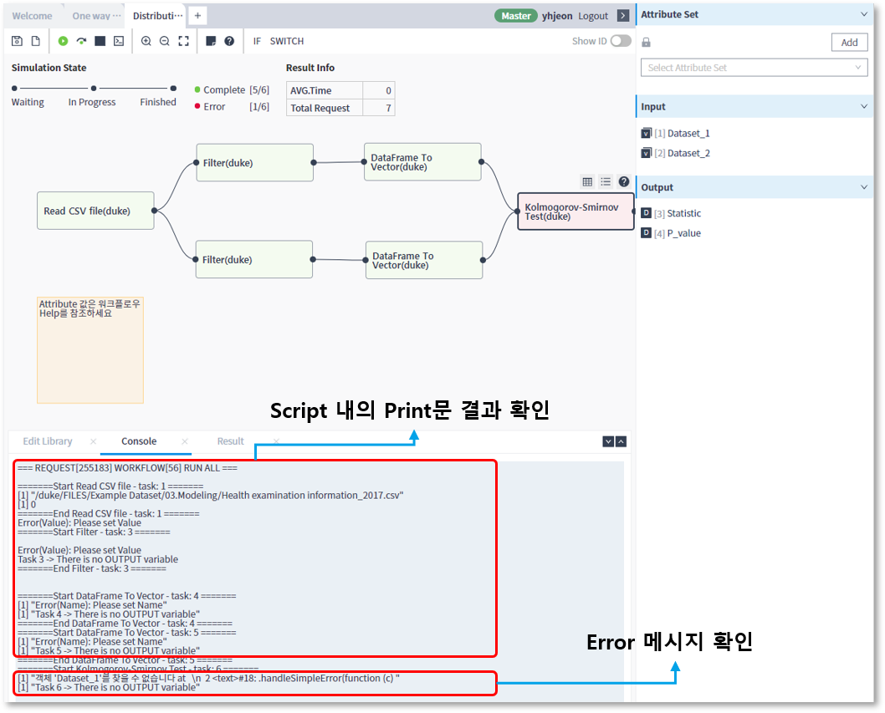
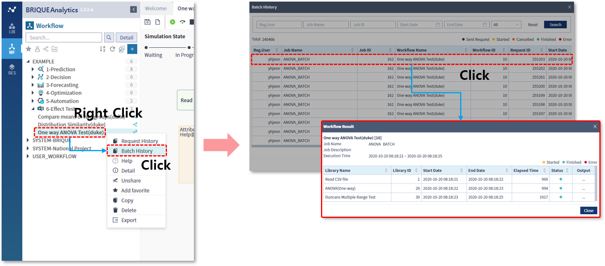
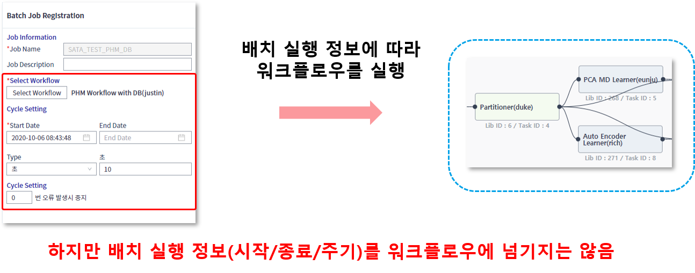
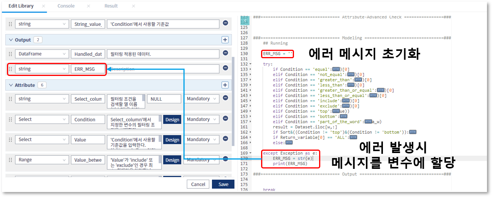
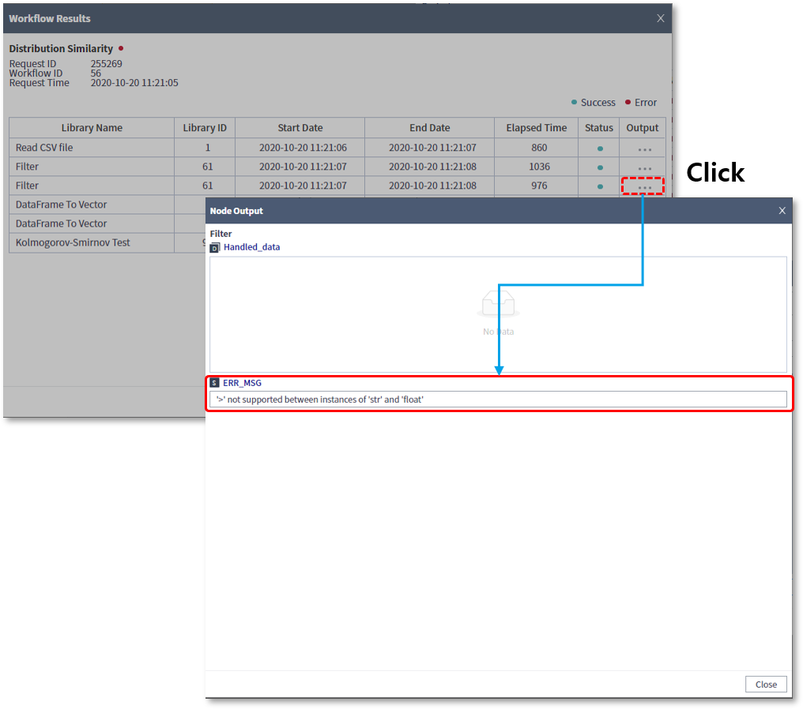

### 사용툴팁 > 배치에 사용될 워크플로우 작성

------

#### 목록

------

1. 배치 워크플로우 개념
2. 배치로 워크플로우 실행 시 제약사항
3. 제약 사항을 대비한 워크플로우 수정 가이드

------

#### 1. 배치 워크플로우 개념

작성된 워크플로우를 특정 주기 (일, 시, 분)에 지속적으로 실행시켜 원하는 결과를 얻기 위해서는 배치 기능을 활용할 수 있습니다

배치 잡으로 등록된 워크플로우 내에서 분석에 필요한 데이터를 가변적으로 수집하고자 할 때나 워크플로우의 실행 정보를 이용하여 라이브러리의 실행에 활용하고자 할 때는 별도의 추가 작업을 필요로 합니다

즉, 별도의 인자 값을 통해서 워크플로우의 실행을 온라인과 배치로 구분하고, 실행 시 워크플로우의 흐름 및 스크립트의 동적인 실행을 가능하게 할 수 있습니다

------

#### 2. 배치로 워크플로우 실행 시 제약 사항

##### 콘솔 메시지 확인  불가능

워크플로우 편집기를 통한 실행의 경우, 하단 정보영역에 print문과 에러 메시지 등으로 출력되는 콘솔 메시지를 확인 할 수 있지만

배치로 실행되는 경우, 메시지의 확인이 불가능하고 단지 라이브러리에 선언된 Output 변수의 값만 확인이 가능합니다

* 워크플로우 편집기를 통한 결과 확인

  오류가 발생한 라이브러리는 아이콘으로 표시되며, 하단 정보영역에서 콘솔 메시지를 확인 할 수 있습니다

  

  

* 배치 실행이력을 통한 결과 확인

  Batch History 기능을 통한 실행 결과의 확인만 가능하며, 콘솔 메시지를 확인할 수 없습니다

  

##### 워크플로우 내에서의 배치실행정보 확인 불가능

배치 잡은 설정된 주기에 따라 워크플로우를 실행시키는 역할만을 수행하며, 배치 잡과 관련된 정보를 워크플로우에 넘겨줄 수 없습니다

##### 워크플로우는 단지 실행될 뿐

사용자에 의해 작성된 워크플로우는 온라인으로 실행될 지 배치로 실행될 지 구분되지 않으며, 이를 구분하기 위해서는 별도의 동작구분을 위한 Attribute를 설정하고, 스크립트 내에서 조건문을 통해 구분되도록 구현할 수 있습니다

------

#### 3. 제약 사항을 대비한 워크플로우 수정 가이드

##### Output 변수를 이용한 라이브러리의 상태나 오류 확인

- 스크립트 내에서 예외처리를 적용하는 구문을 작성하고 오류 메세지를 Output 변수에 할당합니다.

  

  

- 예외 처리를 했기 때문에, 오류가 발생하더라도 실행 결과의 상태는 정상 종료(Finished)로 표시되며, 개별 라이브러리의 Output 변수의 값을 통해서 오류 메시지를 확인할 수 있습니다

  

##### now() 함수를 이용한 배치 실행시간 추출

- datetime.now() 함수를 이용해서 날짜 정보를 추출한 후, 이 값을 Output 변수에 할당하여, 다음 실행되는 라이브러리에서 활용하게 할 수 있습니다

  

  

- 다음 라이브러리에서는 전달받은 날짜 정보를 이용해서, 데이터를 수집하기 위한 조건문 등에 활용할 수 있습니다

##### 온라인과 배치를 구분하기 위한 Attribute 설정

- 온라인과 배치를 구분하기 위한 boolean 타입의 Attribute 추가하여, 스크립트 내에서 동작을 구분하도록 할 수 있습니다

  예를 들어, Attribute 명을 'IS_BATCH'로 지정하고 이 값이 True일 경우 배치로, False일 경우 온라인으로 실행하도록 스크립트를 작성하면 됩니다

